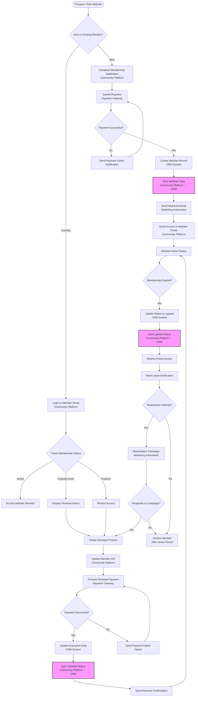
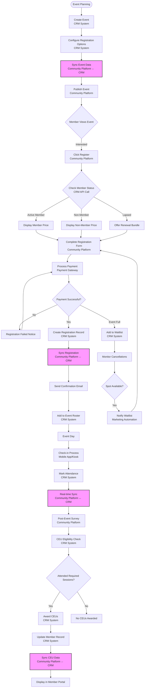
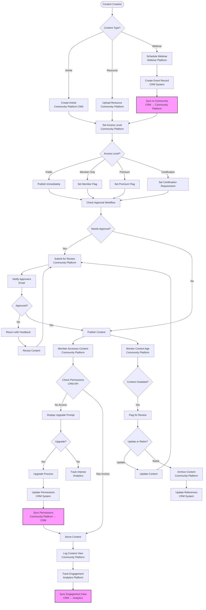
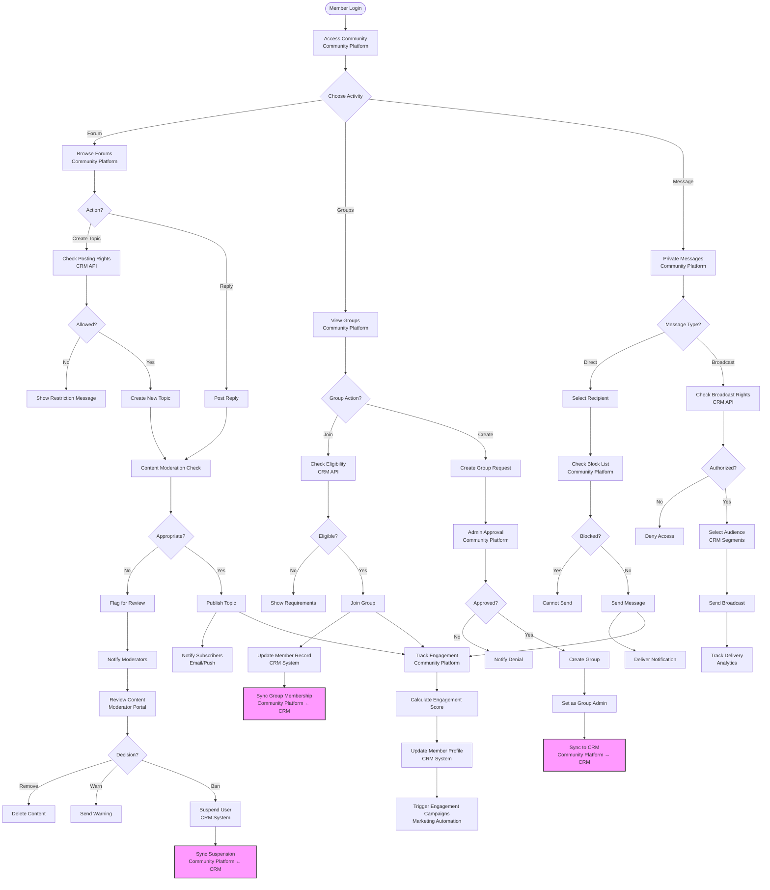
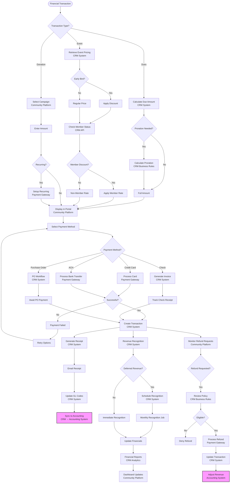
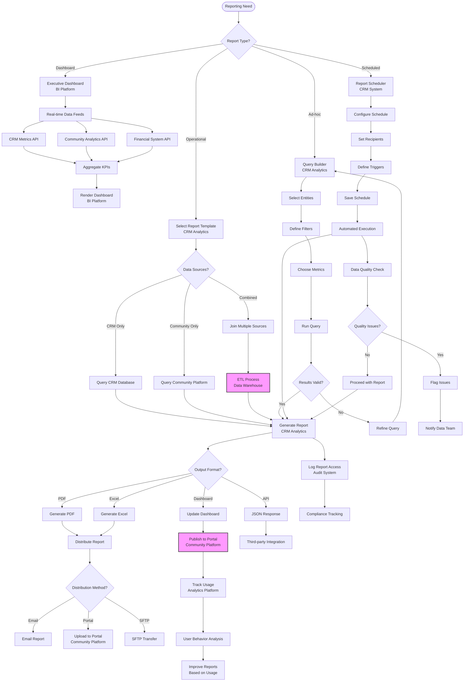
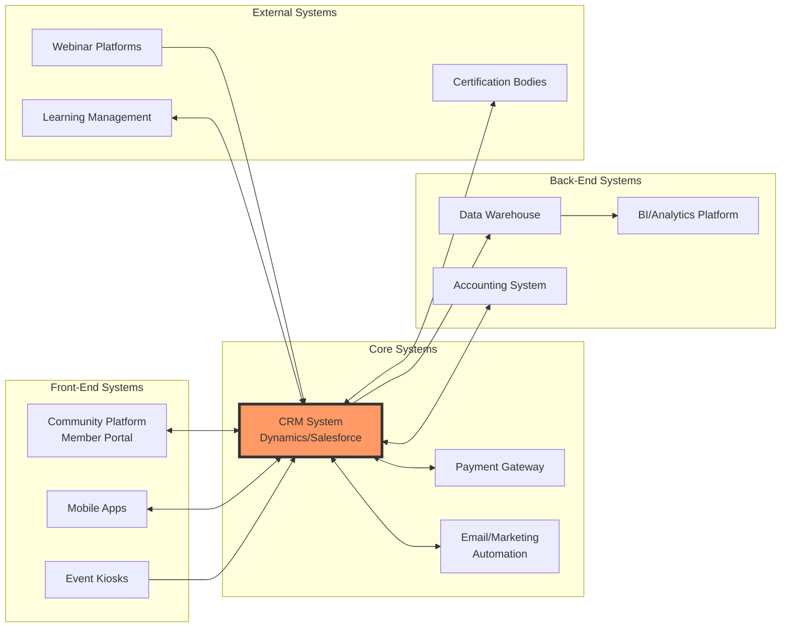

# Association Management Platform - Business Process Documentation

## Overview
This document outlines the key business processes for an association management platform, detailing the integration between the legacy community platform and CRM system. Each process includes decision points, system handoffs, and data synchronization requirements.

## 1. Member Lifecycle Management

### Process Overview
The member lifecycle encompasses the complete journey from initial application through renewal, lapse, and potential reactivation.

### Key Integration Points
- **Initial Registration**: Data flows from Community Platform → CRM
- **Status Updates**: Bi-directional sync between systems
- **Payment Processing**: Integrated with both platforms
- **Access Control**: Community Platform reads from CRM

## 2. Event Management

### Process Overview
Event management covers the full lifecycle from event creation through post-event CEU tracking.

### Key Integration Points
- **Event Creation**: CRM → Community Platform sync
- **Registration Status**: Real-time API calls
- **Attendance Tracking**: Mobile app → CRM → Community Platform
- **CEU Management**: CRM calculates, Community Platform displays

## 3. Certification/Credentialing Workflows

### Process Overview
Managing professional certifications from application through renewal and continuing education requirements.

```mermaid
flowchart TD
    Start([Certification Interest]) --> A{Member Status Check<br/>CRM API}
    A -->|Non-Member| B[Prompt Membership<br/>Community Platform]
    A -->|Active Member| C[View Certification Requirements<br/>Community Platform]
    
    B --> D{Join Association?}
    D -->|Yes| E[Membership Process]
    D -->|No| F[Non-Member Application Path]
    
    E --> C
    C --> G[Start Application<br/>Community Platform]
    F --> G
    
    G --> H[Upload Documents<br/>Community Platform]
    H --> I[Submit Application<br/>& Payment]
    I --> J{Payment Successful?}
    J -->|No| K[Payment Failed]
    K --> I
    J -->|Yes| L[Create Application Record<br/>CRM System]
    
    L --> M[Sync Application Data<br/>Community Platform → CRM]
    M --> N[Initial Review<br/>CRM Workflow]
    N --> O{Documents Complete?}
    O -->|No| P[Request Additional Info<br/>Email]
    P --> Q[Update Application<br/>Community Platform]
    Q --> N
    
    O -->|Yes| R[Schedule Exam<br/>Third-Party System]
    R --> S[Take Exam]
    S --> T[Receive Exam Results<br/>Third-Party API → CRM]
    T --> U{Pass Exam?}
    
    U -->|No| V[Notify Failure<br/>Email]
    V --> W{Retake?}
    W -->|Yes| X[Schedule Retake<br/>After Waiting Period]
    X --> S
    W -->|No| Y[Close Application]
    
    U -->|Yes| Z[Award Certification<br/>CRM System]
    Z --> AA[Generate Certificate<br/>CRM System]
    AA --> AB[Update Member Profile<br/>CRM System]
    AB --> AC[Sync Certification Status<br/>Community Platform ← CRM]
    AC --> AD[Display Badge/Certificate<br/>Community Platform]
    
    %% Renewal Process
    AD --> AE[Monitor Expiration<br/>CRM System]
    AE --> AF{Renewal Period?}
    AF -->|90 Days Out| AG[Send Renewal Notice<br/>Marketing Automation]
    AG --> AH[Check CE Requirements<br/>CRM System]
    AH --> AI{CE Complete?}
    AI -->|No| AJ[Show CE Gap<br/>Community Platform]
    AJ --> AK[Complete CE Activities]
    AK --> AH
    
    AI -->|Yes| AL[Enable Renewal<br/>Community Platform]
    AL --> AM[Pay Renewal Fee]
    AM --> AN{Payment Successful?}
    AN -->|No| AO[Payment Failed]
    AO --> AM
    AN -->|Yes| AP[Extend Certification<br/>CRM System]
    AP --> AQ[Sync New Expiration<br/>Community Platform ← CRM]
    
    %% CE Tracking
    AK --> AR[Log CE Activity<br/>Community Platform]
    AR --> AS[Validate CE<br/>CRM Business Rules]
    AS --> AT{Valid CE?}
    AT -->|Yes| AU[Update CE Record<br/>CRM System]
    AT -->|No| AV[Reject with Reason]
    AU --> AW[Sync CE Balance<br/>Community Platform ← CRM]
    
    style M fill:#f9f,stroke:#333,stroke-width:2px
    style AC fill:#f9f,stroke:#333,stroke-width:2px
    style AQ fill:#f9f,stroke:#333,stroke-width:2px
    style AW fill:#f9f,stroke:#333,stroke-width:2px
```

### Key Integration Points
- **Application Submission**: Community Platform → CRM
- **Exam Results**: Third-party → CRM → Community Platform
- **CE Tracking**: Bi-directional sync
- **Renewal Status**: CRM controls, Community Platform displays

## 4. Content Management

### Process Overview
Managing articles, resources, and gated content with appropriate access controls.

### Key Integration Points
- **Access Control**: Real-time CRM permission checks
- **Content Tracking**: Community Platform → Analytics → CRM
- **Webinar Integration**: Third-party → CRM → Community Platform
- **Engagement Metrics**: Consolidated in CRM

## 5. Community Engagement

### Process Overview
Managing forums, groups, and messaging to foster member interaction.

### Key Integration Points
- **Permission Checks**: Real-time CRM API calls
- **Group Membership**: Bi-directional sync
- **Engagement Scoring**: Community Platform → CRM
- **Moderation Actions**: Sync to CRM for record keeping

## 6. Financial Processes

### Process Overview
Managing dues, event fees, donations, and other financial transactions.

### Key Integration Points
- **Pricing Logic**: CRM calculates, Community Platform displays
- **Payment Processing**: Gateway → CRM → Accounting
- **Revenue Recognition**: CRM manages timing
- **Financial Reporting**: Real-time sync to dashboards

## 7. Reporting and Analytics

### Process Overview
Comprehensive reporting for association staff covering all aspects of operations.

### Key Integration Points
- **Data Warehouse**: ETL from multiple sources
- **Real-time APIs**: Live data feeds
- **Distribution**: Multi-channel delivery
- **Usage Analytics**: Track report effectiveness

## System Integration Architecture

### Overall Data Flow

## Key Success Factors

### Data Synchronization
1. **Real-time Sync**: Critical member status, permissions, and financial data
2. **Batch Sync**: Historical data, analytics, and reporting
3. **Conflict Resolution**: CRM as system of record for member data
4. **Error Handling**: Automated retry with manual intervention options

### Performance Considerations
1. **API Rate Limiting**: Implement throttling for high-volume operations
2. **Caching Strategy**: Cache member status and permissions
3. **Async Processing**: Queue long-running operations
4. **Database Optimization**: Index key lookup fields

### Security Requirements
1. **Authentication**: SSO between platforms
2. **Authorization**: Role-based access control
3. **Data Encryption**: In transit and at rest
4. **Audit Logging**: Complete trail of all operations

### Business Rules Engine
1. **Centralized Logic**: Business rules in CRM
2. **Version Control**: Track rule changes
3. **Testing Framework**: Validate rule changes
4. **Override Capability**: Manual intervention when needed

## Conclusion

This comprehensive process documentation provides the foundation for implementing an integrated association management platform. The key to success lies in:

1. **Clear Integration Points**: Well-defined APIs and data contracts
2. **Consistent Data Model**: Shared understanding across systems
3. **Robust Error Handling**: Graceful degradation and recovery
4. **User Experience**: Seamless transitions between systems
5. **Operational Excellence**: Monitoring, alerting, and continuous improvement

Regular review and updates of these processes ensure they remain aligned with evolving business needs and technology capabilities.