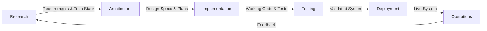

# Phase Transition Quick Reference Guide

## 🔄 Phase Flow Overview



---

## 📊 Phase Transition Matrix

| From Phase | To Phase | Key Handoffs | Critical Requirements |
|------------|----------|--------------|----------------------|
| **Research** | Architecture | • Requirements doc<br>• Tech recommendations<br>• Risk matrix<br>• Constraints | • All unknowns resolved<br>• Stack validated<br>• Budget approved |
| **Architecture** | Implementation | • System design<br>• API specs<br>• DB schema<br>• Task breakdown | • Design reviewed<br>• APIs defined<br>• Team assigned |
| **Implementation** | Testing | • Complete code<br>• Unit tests<br>• Documentation<br>• Deploy scripts | • Features complete<br>• CI/CD ready<br>• >80% coverage |
| **Testing** | Deployment | • Test reports<br>• Fixed bugs<br>• Perf metrics<br>• Sign-offs | • Zero critical bugs<br>• UAT passed<br>• Runbooks ready |
| **Deployment** | Operations | • Live system<br>• Monitoring<br>• Procedures<br>• Training | • Health checks OK<br>• Team trained<br>• SLAs defined |

---

## 🎯 Phase Entry Gates

### 🔍 Research Phase - Can Start When:
- [ ] Problem statement defined
- [ ] Stakeholders identified
- [ ] Budget range known
- [ ] Timeline established

### 🏗️ Architecture Phase - Can Start When:
- [ ] Research deliverables complete
- [ ] Technology choices validated
- [ ] Requirements signed off
- [ ] Team available

### 💻 Implementation Phase - Can Start When:
- [ ] Architecture approved
- [ ] Development environment ready
- [ ] APIs documented
- [ ] Sprint plan created

### 🧪 Testing Phase - Can Start When:
- [ ] Code feature-complete
- [ ] Test environment ready
- [ ] Test data available
- [ ] Test plan approved

### 🚀 Deployment Phase - Can Start When:
- [ ] All tests passed
- [ ] Infrastructure ready
- [ ] Deployment plan approved
- [ ] Rollback plan ready

### 🔧 Operations Phase - Can Start When:
- [ ] System is live
- [ ] Monitoring active
- [ ] Support team ready
- [ ] Documentation complete

---

## 📋 Universal Transition Checklist

Before ANY phase transition, verify:

### ✅ Completeness
- [ ] All phase deliverables completed
- [ ] Documentation up to date
- [ ] Known issues documented
- [ ] Dependencies identified

### 👥 Stakeholders
- [ ] Reviews conducted
- [ ] Approvals obtained
- [ ] Team briefed
- [ ] Handoff meeting held

### 📊 Metrics
- [ ] Success criteria met
- [ ] Quality gates passed
- [ ] Risks reassessed
- [ ] Lessons learned captured

### 🔄 Readiness
- [ ] Next team prepared
- [ ] Resources allocated
- [ ] Tools/access ready
- [ ] Schedule confirmed

---

## 🚨 Red Flags - Do NOT Transition If:

### ❌ From Research → Architecture
- Unresolved technical questions
- No stakeholder alignment
- Budget not approved
- Key requirements missing

### ❌ From Architecture → Implementation
- Design not reviewed
- APIs undefined
- Team not ready
- Dependencies unavailable

### ❌ From Implementation → Testing
- Features incomplete
- No test environment
- Critical bugs unfixed
- Documentation missing

### ❌ From Testing → Deployment
- Failing tests
- Performance issues
- Security vulnerabilities
- No deployment plan

### ❌ From Deployment → Operations
- System unstable
- No monitoring
- Team untrained
- No support process

---

## 💡 Pro Tips

1. **Document Everything**: Future you will thank present you
2. **Over-Communicate**: Transitions fail on assumptions
3. **Verify Twice**: Check deliverables before and after handoff
4. **Keep Artifacts**: Version control all transition documents
5. **Learn & Adapt**: Update templates based on experience

---

## 📄 Transition Document Template

```markdown
# Phase Transition: [From] → [To]
Date: [YYYY-MM-DD]
Project: [Name]

## Deliverables Handoff
| Item | Location | Status | Verified By |
|------|----------|--------|-------------|
| [Deliverable 1] | [Path/URL] | ✅ | [Name] |
| [Deliverable 2] | [Path/URL] | ✅ | [Name] |

## Key Decisions Made
1. [Decision]: [Rationale]
2. [Decision]: [Rationale]

## Outstanding Items
1. [Item]: [Owner] - [Due Date]
2. [Item]: [Owner] - [Due Date]

## Next Phase Risks
1. [Risk]: [Mitigation Plan]
2. [Risk]: [Mitigation Plan]

## Approval
- From Phase Lead: [Name] - [Date]
- To Phase Lead: [Name] - [Date]
- Project Manager: [Name] - [Date]
```

---

**Remember**: Smooth transitions = Successful projects! 🎯