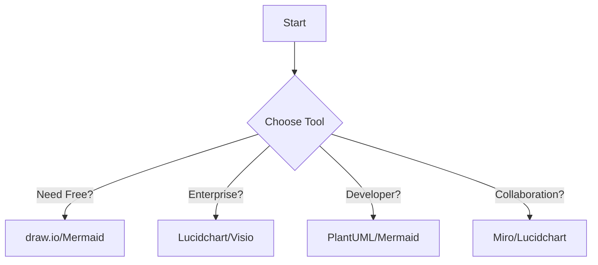
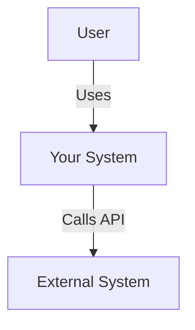

# Architecture Diagramming Tools and Frameworks Analysis

## Executive Summary

This comprehensive analysis evaluates the best architecture diagramming tools and frameworks available in 2025. Based on our Hive Mind collective intelligence research, we provide recommendations for different use cases and organizational contexts.

## Top Architecture Diagramming Tools

### GUI-Based Tools

#### 1. **Lucidchart** ⭐ Enterprise Leader
- **Rating**: 8.80/10
- **Pricing**: $5/user/month - $20K/year enterprise
- **Best For**: Enterprise teams requiring professional collaboration
- **Key Features**:
  - Real-time collaboration with cursor tracking
  - Extensive template library
  - Deep integrations (Jira, Confluence, Google Workspace)
  - Version history and commenting
  - API access for automation

#### 2. **draw.io (diagrams.net)** ⭐ Best Free Option
- **Rating**: 8.10/10
- **Pricing**: FREE (open source)
- **Best For**: Privacy-conscious teams, open source projects
- **Key Features**:
  - Desktop, web, and VSCode integration
  - No account required
  - Full offline capability
  - Extensive shape libraries
  - AI-powered features
  - GitHub/GitLab integration

#### 3. **Microsoft Visio** ⭐ Enterprise Standard
- **Rating**: 7.75/10
- **Pricing**: $5-$590 (one-time or subscription)
- **Best For**: Microsoft-centric enterprises
- **Key Features**:
  - Most comprehensive feature set
  - Excel data linking
  - SharePoint integration
  - CAD compatibility
  - Professional stencils

#### 4. **Miro** ⭐ Collaboration Champion
- **Rating**: 8.80/10
- **Pricing**: Free tier, $8-16/user/month
- **Best For**: Workshop facilitation, brainstorming
- **Key Features**:
  - Best-in-class real-time collaboration
  - Video conferencing integration
  - Infinite canvas
  - Mobile/tablet optimized
  - Facilitation tools

### Code-Based Tools

#### 1. **Mermaid** ⭐ Developer Favorite
- **Rating**: 8.20/10
- **Pricing**: FREE (open source)
- **Best For**: Documentation-as-code, GitHub projects
- **Key Features**:
  - Native GitHub/GitLab support
  - Simple markdown syntax
  - Live editor available
  - Excellent git compatibility
  - Growing ecosystem

#### 2. **PlantUML** ⭐ Most Comprehensive
- **Rating**: 7.65/10
- **Pricing**: FREE (open source)
- **Best For**: Complex technical diagrams, UML
- **Key Features**:
  - 25+ diagram types
  - Text-based syntax
  - IDE plugins
  - Server deployment options
  - Excellent performance

#### 3. **D2** ⭐ Modern Performance
- **Rating**: Not fully evaluated
- **Pricing**: FREE (open source)
- **Best For**: Beautiful diagrams, modern tooling
- **Key Features**:
  - Advanced auto-layout
  - Animations and themes
  - WebAssembly support
  - Single binary deployment
  - Fast rendering

#### 4. **Structurizr** ⭐ C4 Model Specialist
- **Rating**: Not fully evaluated
- **Pricing**: Free tier, $5-50/month
- **Best For**: C4 architecture documentation
- **Key Features**:
  - Native C4 Model support
  - Architecture decision records
  - Review workflows
  - API and CLI
  - Cloud and on-premise

## Architecture Frameworks Comparison

### Software Architecture Frameworks

#### 1. **C4 Model** ⭐ Recommended Starting Point
- **Learning Curve**: Low
- **Best For**: Software teams of all sizes
- **Key Concepts**: Context → Container → Component → Code
- **Tool Support**: Excellent (Structurizr, PlantUML, draw.io)
- **Why Choose**: Simple, effective, widely adopted

#### 2. **UML (Unified Modeling Language)**
- **Learning Curve**: Medium-High
- **Best For**: Detailed software design
- **Key Diagrams**: Class, Sequence, Activity, State
- **Tool Support**: Universal
- **Why Choose**: Industry standard, comprehensive

#### 3. **4+1 Architectural View Model**
- **Learning Curve**: Medium
- **Best For**: Multiple stakeholder perspectives
- **Views**: Logical, Process, Physical, Development, Scenarios
- **Tool Support**: Good
- **Why Choose**: Balanced approach, proven methodology

### Enterprise Architecture Frameworks

#### 1. **TOGAF**
- **Learning Curve**: High
- **Best For**: Large enterprises
- **Components**: ADM, Content Framework, Governance
- **Tool Support**: Enterprise tools
- **Why Choose**: Comprehensive methodology, industry standard

#### 2. **ArchiMate**
- **Learning Curve**: Medium-High
- **Best For**: Enterprise modeling
- **Layers**: Business, Application, Technology
- **Tool Support**: Good (Archi, Enterprise Architect)
- **Why Choose**: Standardized notation, TOGAF compatible

#### 3. **Zachman Framework**
- **Learning Curve**: High
- **Best For**: Complete enterprise coverage
- **Matrix**: 6x6 (What, How, Where, Who, When, Why)
- **Tool Support**: Limited specific tools
- **Why Choose**: Ensures completeness, taxonomy approach

### Cloud Architecture

#### **AWS Well-Architected Framework**
- **Learning Curve**: Medium
- **Best For**: AWS workloads
- **Pillars**: Operational Excellence, Security, Reliability, Performance, Cost
- **Tool Support**: AWS native tools
- **Why Choose**: Best practices, AWS integration

## Recommendations by Use Case

### 🚀 Startups and Small Teams
**Framework**: C4 Model
**Tools**: 
- Primary: Mermaid (free, git-friendly)
- Alternative: draw.io (free, more features)
**Strategy**: Start simple, focus on Context and Container diagrams

### 🏢 Medium Organizations
**Framework**: C4 Model + selective UML
**Tools**:
- Primary: Lucidchart (collaboration features)
- Code: PlantUML (version control)
**Strategy**: Standardize on tools, implement review processes

### 🏛️ Large Enterprises
**Framework**: TOGAF with ArchiMate notation
**Tools**:
- Primary: Microsoft Visio or Lucidchart
- Architecture: Structurizr (C4 for dev teams)
- Collaboration: Miro (workshops)
**Strategy**: Governance first, multiple tools for different audiences

### 👩‍💻 Developer Teams
**Framework**: C4 Model
**Tools**:
- Primary: Mermaid (GitHub native)
- Complex: PlantUML (more diagram types)
**Strategy**: Documentation as code, CI/CD integration

### ☁️ Cloud-Native Teams
**Framework**: AWS Well-Architected + C4
**Tools**:
- Primary: Structurizr (cloud architecture)
- Diagrams: D2 or Mermaid
**Strategy**: Automated documentation, infrastructure as code alignment

## Decision Matrix

| Criteria | GUI Tools | Code Tools |
|----------|-----------|------------|
| Learning Curve | ✅ Easy | ⚠️ Moderate |
| Collaboration | ✅ Excellent | ⚠️ Limited |
| Version Control | ⚠️ Limited | ✅ Excellent |
| Automation | ⚠️ Limited | ✅ Excellent |
| Cost | 💰 Paid | ✅ Free |
| Flexibility | ⚠️ Template-based | ✅ Unlimited |

## Implementation Roadmap

### Phase 1: Foundation (Weeks 1-2)
1. Choose primary framework (recommend C4 Model)
2. Select primary tool based on team needs
3. Create initial Context diagrams
4. Establish conventions and templates

### Phase 2: Adoption (Weeks 3-4)
1. Train team on chosen tools/framework
2. Create Container diagrams for main systems
3. Integrate with existing workflows
4. Set up version control (if using code tools)

### Phase 3: Maturity (Weeks 5-8)
1. Implement review processes
2. Add Component diagrams as needed
3. Integrate with CI/CD pipeline
4. Establish governance standards

### Phase 4: Optimization (Ongoing)
1. Gather feedback and iterate
2. Add specialized tools as needed
3. Automate diagram generation
4. Measure and improve adoption

## Quick Start Guide

### For Immediate Value:
1. **Install**: Mermaid plugin for your IDE/GitHub
2. **Learn**: Basic C4 Model (1-hour investment)
3. **Create**: Your first Context diagram
4. **Iterate**: Add detail as needed

### Example Mermaid C4 Context Diagram:

## Cost Comparison

| Tool | Free Tier | Paid Plans | Enterprise |
|------|-----------|------------|------------|
| draw.io | ✅ Full features | N/A | N/A |
| Lucidchart | 3 documents | $5-9/user/mo | Custom |
| Miro | 3 boards | $8-16/user/mo | Custom |
| Visio | ❌ | $5-15/user/mo | $590 one-time |
| Mermaid | ✅ Full features | N/A | N/A |
| PlantUML | ✅ Full features | N/A | Server hosting |
| Structurizr | 1 workspace | $5-50/mo | Custom |

## Conclusion

The best architecture diagramming solution depends on your specific context:

- **For most teams**: Start with C4 Model + Mermaid/draw.io
- **For enterprises**: TOGAF/ArchiMate + Lucidchart/Visio
- **For developers**: C4 Model + PlantUML/Mermaid
- **For workshops**: Miro + chosen framework

The key is to start simple, iterate based on needs, and maintain consistency across your organization.

---
*Analysis completed by Architecture Tools Research Hive Mind Swarm*
*Date: 2025-07-20*