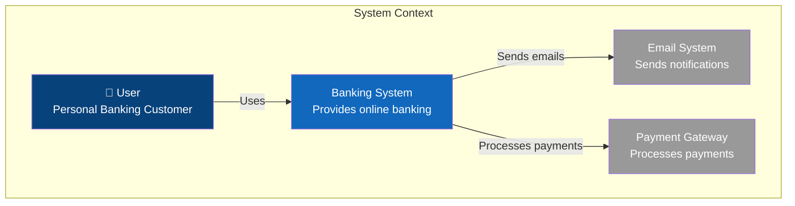
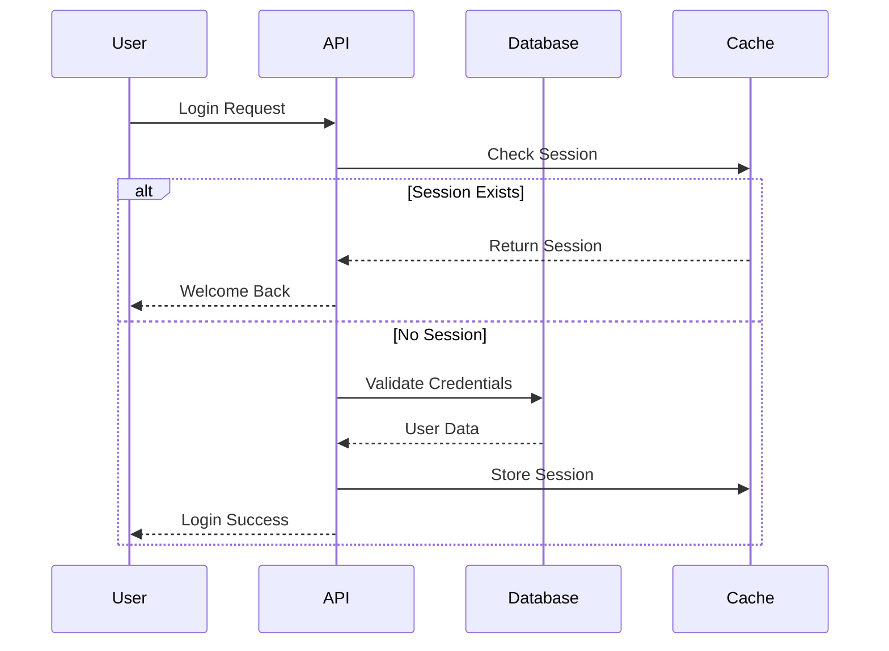
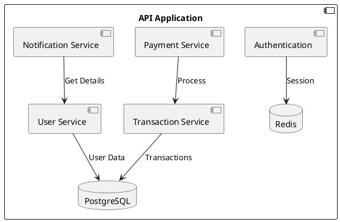

# Architecture Diagramming Tools - Implementation Guide

## Quick Start Examples

### 1. Mermaid - Getting Started

#### Installation
```bash
# For npm projects
npm install -g @mermaid-js/mermaid-cli

# For documentation sites
# Already integrated in GitHub, GitLab, Notion, Obsidian
```

#### Basic C4 Context Diagram


#### Sequence Diagram


### 2. PlantUML - Advanced Diagrams

#### Installation
```bash
# Using Docker
docker run -d -p 8080:8080 plantuml/plantuml-server

# Using jar file
wget https://github.com/plantuml/plantuml/releases/download/v1.2024.0/plantuml.jar
java -jar plantuml.jar -tpng diagram.puml
```

#### C4 Container Diagram
```plantuml
@startuml C4_Container
!include https://raw.githubusercontent.com/plantuml-stdlib/C4-PlantUML/master/C4_Container.puml

Person(user, "User", "Banking customer")
System_Boundary(bank, "Banking System") {
    Container(web, "Web Application", "React", "Provides banking UI")
    Container(api, "API Application", "Node.js", "Provides banking API")
    Container(db, "Database", "PostgreSQL", "Stores user and transaction data")
    Container(cache, "Cache", "Redis", "Session and data cache")
}

System_Ext(email, "Email System", "SendGrid")
System_Ext(payment, "Payment Gateway", "Stripe")

Rel(user, web, "Uses", "HTTPS")
Rel(web, api, "Makes API calls", "JSON/HTTPS")
Rel(api, db, "Reads/Writes", "SQL")
Rel(api, cache, "Reads/Writes", "Redis Protocol")
Rel(api, email, "Sends email", "SMTP")
Rel(api, payment, "Processes payment", "HTTPS")
@enduml
```

#### Component Diagram


### 3. D2 - Modern Approach

#### Installation
```bash
# macOS
brew install d2

# Linux
curl -fsSL https://d2lang.com/install.sh | sh -s --

# Windows
# Download from https://github.com/terrastruct/d2/releases
```

#### Beautiful Architecture Diagram
```d2
# Banking System Architecture

user: User {
  shape: person
  style.fill: "#08427b"
  style.font-color: "#ffffff"
}

banking: Banking System {
  web: Web App {
    shape: hexagon
    style.fill: "#1168bd"
  }
  
  api: API Server {
    shape: rectangle
    style.fill: "#0b5394"
  }
  
  services: {
    auth: Auth Service
    payment: Payment Service
    notification: Notification Service
  }
  
  data: {
    postgres: PostgreSQL {
      shape: cylinder
    }
    redis: Redis Cache {
      shape: cylinder
      style.fill: "#dc382d"
    }
  }
}

external: External Systems {
  style.fill: "#cccccc"
  email: Email Provider
  payment_gw: Payment Gateway
}

# Connections
user -> banking.web: Uses (HTTPS)
banking.web -> banking.api: API Calls
banking.api -> banking.services.*: Internal calls
banking.api -> banking.data.*: Read/Write
banking.services.notification -> external.email: Send
banking.services.payment -> external.payment_gw: Process

# Styling
user.style.bold: true
*.shape: rectangle
```

### 4. Structurizr - C4 Model DSL

#### Workspace Definition
```dsl
workspace "Banking System" "C4 model for online banking" {

    model {
        # People
        customer = person "Customer" "A customer of the bank"
        
        # Software Systems
        bankingSystem = softwareSystem "Internet Banking System" "Allows customers to manage accounts" {
            webApp = container "Web Application" "Delivers the banking SPA" "React" {
                tags "Web Browser"
            }
            
            apiApp = container "API Application" "Provides banking functionality via API" "Node.js" {
                authComponent = component "Authentication Service" "Handles user authentication"
                accountComponent = component "Account Service" "Manages bank accounts"
                paymentComponent = component "Payment Service" "Processes payments"
            }
            
            database = container "Database" "Stores user and account information" "PostgreSQL" {
                tags "Database"
            }
            
            cache = container "Cache" "Caches session and frequently accessed data" "Redis" {
                tags "Database"
            }
        }
        
        emailSystem = softwareSystem "Email System" "Sends emails to customers" "External"
        paymentGateway = softwareSystem "Payment Gateway" "Processes payments" "External"
        
        # Relationships
        customer -> webApp "Uses"
        webApp -> apiApp "Makes API calls to" "JSON/HTTPS"
        apiApp -> database "Reads from and writes to"
        apiApp -> cache "Reads from and writes to"
        apiApp -> emailSystem "Sends emails using"
        apiApp -> paymentGateway "Makes payments using"
        
        # Component relationships
        webApp -> authComponent "Authenticates using"
        webApp -> accountComponent "Gets account data from"
        webApp -> paymentComponent "Makes payments using"
    }
    
    views {
        systemContext bankingSystem "SystemContext" {
            include *
            autoLayout
        }
        
        container bankingSystem "Containers" {
            include *
            autoLayout
        }
        
        component apiApp "Components" {
            include *
            autoLayout
        }
        
        styles {
            element "Software System" {
                background #1168bd
                color #ffffff
            }
            element "External" {
                background #999999
                color #ffffff
            }
            element "Person" {
                shape person
                background #08427b
                color #ffffff
            }
            element "Database" {
                shape cylinder
            }
            element "Web Browser" {
                shape WebBrowser
            }
        }
    }
}
```

## CI/CD Integration

### GitHub Actions - Auto-generate Diagrams

```yaml
name: Generate Architecture Diagrams

on:
  push:
    paths:
      - 'docs/architecture/**/*.mmd'
      - 'docs/architecture/**/*.puml'
      - 'docs/architecture/**/*.d2'

jobs:
  generate-diagrams:
    runs-on: ubuntu-latest
    steps:
      - uses: actions/checkout@v3
      
      # Mermaid
      - name: Generate Mermaid Diagrams
        uses: nielsvaneck/render-md-mermaid@v2
        with:
          files: 'docs/architecture/**/*.mmd'
      
      # PlantUML
      - name: Generate PlantUML Diagrams
        uses: grassedge/generate-plantuml-action@v1.5
        with:
          path: docs/architecture
          message: "Auto-generate PlantUML diagrams"
      
      # D2
      - name: Install D2
        run: curl -fsSL https://d2lang.com/install.sh | sh -s --
      
      - name: Generate D2 Diagrams
        run: |
          find docs/architecture -name "*.d2" -exec d2 {} {}.svg \;
      
      - name: Commit generated diagrams
        uses: stefanzweifel/git-auto-commit-action@v4
        with:
          commit_message: 'Auto-generate architecture diagrams'
          file_pattern: '*.svg *.png'
```

### GitLab CI - Diagram Pipeline

```yaml
stages:
  - generate
  - deploy

variables:
  PLANTUML_VERSION: "1.2024.0"

generate-diagrams:
  stage: generate
  image: node:18
  before_script:
    - npm install -g @mermaid-js/mermaid-cli
    - apt-get update && apt-get install -y default-jre graphviz
    - wget https://github.com/plantuml/plantuml/releases/download/v${PLANTUML_VERSION}/plantuml.jar
  script:
    # Mermaid
    - find docs -name "*.mmd" -exec mmdc -i {} -o {}.svg \;
    
    # PlantUML
    - find docs -name "*.puml" -exec java -jar plantuml.jar {} \;
    
  artifacts:
    paths:
      - docs/**/*.svg
      - docs/**/*.png
    expire_in: 1 week

pages:
  stage: deploy
  dependencies:
    - generate-diagrams
  script:
    - mkdir -p public
    - cp -r docs/* public/
  artifacts:
    paths:
      - public
  only:
    - main
```

## Docker Compose Setup

```yaml
version: '3.8'

services:
  plantuml:
    image: plantuml/plantuml-server:latest
    ports:
      - "8080:8080"
    environment:
      - PLANTUML_LIMIT_SIZE=8192
    
  structurizr:
    image: structurizr/lite
    ports:
      - "8081:8080"
    volumes:
      - ./architecture:/usr/local/structurizr
    environment:
      - STRUCTURIZR_WORKSPACE_PATH=/usr/local/structurizr
  
  drawio:
    image: jgraph/drawio
    ports:
      - "8082:8080"
    environment:
      - DRAWIO_SELF_CONTAINED=1
      - DRAWIO_DISABLE_EXPORT=0
```

## VS Code Extensions Setup

### Recommended Extensions
```json
{
  "recommendations": [
    "hediet.vscode-drawio",
    "bierner.markdown-mermaid",
    "jebbs.plantuml",
    "terrastruct.d2",
    "systemticks.c4-dsl-extension"
  ]
}
```

### Settings Configuration
```json
{
  "plantuml.server": "http://localhost:8080",
  "plantuml.render": "PlantUMLServer",
  "mermaid.theme": "dark",
  "d2.flags": ["--theme=200", "--layout=elk"],
  "[markdown]": {
    "editor.defaultFormatter": "bierner.markdown-mermaid"
  }
}
```

## Best Practices

### 1. Version Control
- Store all diagram source files in git
- Use meaningful commit messages
- Review diagram changes in PRs
- Tag diagram versions with releases

### 2. Organization
```
project/
├── docs/
│   └── architecture/
│       ├── c4/
│       │   ├── context.puml
│       │   ├── container.puml
│       │   └── component.puml
│       ├── sequences/
│       │   └── auth-flow.mmd
│       └── README.md
```

### 3. Naming Conventions
- Use descriptive filenames: `user-authentication-flow.mmd`
- Include diagram type: `system-context-diagram.puml`
- Version complex diagrams: `payment-flow-v2.d2`

### 4. Documentation
Always include:
- Diagram purpose and audience
- Last updated date
- Key assumptions
- Links to related docs

### 5. Automation
- Auto-generate from code where possible
- Use CI/CD for diagram rendering
- Implement diagram validation
- Create diagram templates

## Troubleshooting

### Common Issues

1. **PlantUML Java Memory**
   ```bash
   java -Xmx2048m -jar plantuml.jar large-diagram.puml
   ```

2. **Mermaid Rendering**
   ```javascript
   // Increase max text size
   mermaid.initialize({ 
     maxTextSize: 100000,
     securityLevel: 'loose'
   });
   ```

3. **D2 Layout Issues**
   ```bash
   # Try different layout engines
   d2 --layout=dagre diagram.d2
   d2 --layout=elk diagram.d2
   ```

---
*Implementation Guide by Architecture Tools Research Hive Mind*
*Version: 1.0 | Date: 2025-07-20*