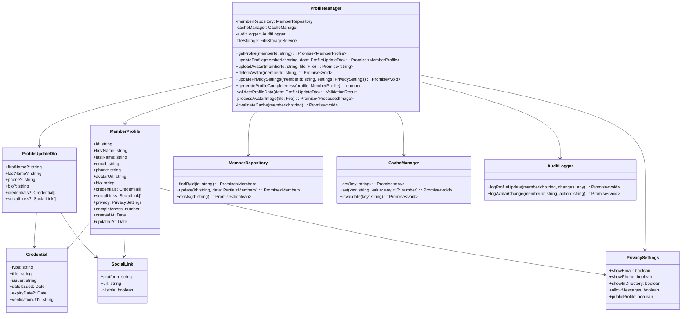

# Association Management Platform - C4 Architecture

## Executive Summary

This document presents the C4 architecture for a legacy home-grown web-based community platform integrated with a Salesforce-style CRM. The platform serves as a SaaS backend provider to professional associations (nursing associations, W3C, tech associations, etc.), supporting 50+ associations with over 500,000 total members.

## Table of Contents

1. [Business Context](#business-context)
2. [System Context Diagram (C1)](#system-context-diagram-c1)
3. [Container Diagram (C2)](#container-diagram-c2)
4. [Component Diagrams (C3)](#component-diagrams-c3)
5. [Code Structure (C4)](#code-structure-c4)
6. [Business Process Flows](#business-process-flows)
7. [Integration Patterns](#integration-patterns)
8. [Security Architecture](#security-architecture)
9. [Data Architecture](#data-architecture)

## Business Context

### Core Business Model
- **SaaS Provider**: Multi-tenant platform serving professional associations
- **Revenue Streams**: Subscription fees, transaction fees, premium features
- **Target Market**: Professional associations requiring member management, event coordination, certification tracking, and community engagement

### Key Features
- Member Management & Directory
- Event Registration & Management
- Certification & Continuing Education Tracking
- Content Management & Digital Library
- Community Forums & Networking
- Email Marketing & Communications
- Financial Management & Dues Collection
- Reporting & Analytics

## System Context Diagram (C1)

The System Context diagram shows how the Association Management Platform fits into the broader ecosystem and interacts with external users and systems.


## Container Diagram (C2)

The Container diagram zooms into the Association Management Platform to show the high-level technical building blocks and their interactions.


## Component Diagrams (C3)

### Member Service Component Diagram

The Member Service is a critical container managing all member-related operations. Here's its internal component structure:


### Event Service Component Diagram

The Event Service manages all event-related functionality including registration, scheduling, and virtual event integration.


### CRM Service Component Diagram

The CRM Service provides Salesforce-style functionality for managing contacts, opportunities, and organizational relationships.


## Code Structure (C4)

### Example: Member Profile Manager Component

Here's a detailed code structure for the Profile Manager component within the Member Service:



### Example Implementation (TypeScript/Node.js)

```typescript
// ProfileManager.ts
import { injectable, inject } from 'inversify';
import { MemberRepository } from '../repositories/MemberRepository';
import { CacheManager } from '../services/CacheManager';
import { AuditLogger } from '../services/AuditLogger';
import { FileStorageService } from '../services/FileStorageService';
import { MemberProfile, ProfileUpdateDto, PrivacySettings } from '../models';
import { ValidationResult, ProfileValidator } from '../validators/ProfileValidator';

@injectable()
export class ProfileManager {
    constructor(
        @inject('MemberRepository') private memberRepository: MemberRepository,
        @inject('CacheManager') private cacheManager: CacheManager,
        @inject('AuditLogger') private auditLogger: AuditLogger,
        @inject('FileStorageService') private fileStorage: FileStorageService
    ) {}

    async getProfile(memberId: string): Promise<MemberProfile> {
        // Check cache first
        const cacheKey = `profile:${memberId}`;
        const cached = await this.cacheManager.get(cacheKey);
        if (cached) {
            return cached;
        }

        // Fetch from database
        const member = await this.memberRepository.findById(memberId);
        if (!member) {
            throw new Error(`Member ${memberId} not found`);
        }

        const profile = this.mapToProfile(member);
        profile.completeness = this.generateProfileCompleteness(profile);

        // Cache for 5 minutes
        await this.cacheManager.set(cacheKey, profile, 300);
        
        return profile;
    }

    async updateProfile(memberId: string, data: ProfileUpdateDto): Promise<MemberProfile> {
        // Validate input
        const validation = this.validateProfileData(data);
        if (!validation.isValid) {
            throw new Error(`Validation failed: ${validation.errors.join(', ')}`);
        }

        // Update in database
        const updated = await this.memberRepository.update(memberId, data);
        
        // Log the change
        await this.auditLogger.logProfileUpdate(memberId, data);
        
        // Invalidate cache
        await this.invalidateCache(memberId);
        
        // Return updated profile
        return this.getProfile(memberId);
    }

    async uploadAvatar(memberId: string, file: File): Promise<string> {
        // Process image (resize, optimize)
        const processed = await this.processAvatarImage(file);
        
        // Upload to storage
        const key = `avatars/${memberId}/${Date.now()}.jpg`;
        const url = await this.fileStorage.upload(key, processed.buffer);
        
        // Update member record
        await this.memberRepository.update(memberId, { avatarUrl: url });
        
        // Log the change
        await this.auditLogger.logAvatarChange(memberId, 'upload');
        
        // Invalidate cache
        await this.invalidateCache(memberId);
        
        return url;
    }

    private generateProfileCompleteness(profile: MemberProfile): number {
        let score = 0;
        const weights = {
            firstName: 10,
            lastName: 10,
            email: 10,
            phone: 10,
            avatarUrl: 15,
            bio: 15,
            credentials: 20,
            socialLinks: 10
        };

        if (profile.firstName) score += weights.firstName;
        if (profile.lastName) score += weights.lastName;
        if (profile.email) score += weights.email;
        if (profile.phone) score += weights.phone;
        if (profile.avatarUrl) score += weights.avatarUrl;
        if (profile.bio && profile.bio.length > 50) score += weights.bio;
        if (profile.credentials && profile.credentials.length > 0) score += weights.credentials;
        if (profile.socialLinks && profile.socialLinks.length > 0) score += weights.socialLinks;

        return Math.min(score, 100);
    }

    private validateProfileData(data: ProfileUpdateDto): ValidationResult {
        return ProfileValidator.validate(data);
    }

    private async processAvatarImage(file: File): Promise<ProcessedImage> {
        // Implementation for image processing
        // Resize to standard dimensions, optimize file size, etc.
        return processedImage;
    }

    private async invalidateCache(memberId: string): Promise<void> {
        await this.cacheManager.invalidate(`profile:${memberId}`);
        await this.cacheManager.invalidate(`member:${memberId}`);
    }

    private mapToProfile(member: Member): MemberProfile {
        // Map database entity to profile DTO
        return {
            id: member.id,
            firstName: member.firstName,
            lastName: member.lastName,
            email: member.email,
            phone: member.phone,
            avatarUrl: member.avatarUrl,
            bio: member.bio,
            credentials: member.credentials,
            socialLinks: member.socialLinks,
            privacy: member.privacySettings,
            completeness: 0,
            createdAt: member.createdAt,
            updatedAt: member.updatedAt
        };
    }
}
```

## Business Process Flows

### Member Registration and Onboarding Flow


### Event Registration with Payment Flow


### Certification Management Flow


## Integration Patterns

### API Gateway Pattern


### Event-Driven Integration Pattern


### Data Synchronization Pattern


## Security Architecture

### Authentication and Authorization Flow


### Data Security Layers


## Data Architecture

### Multi-Tenant Data Model


### Data Partitioning Strategy


### Analytics Data Pipeline


## Performance Optimization Strategies

### Caching Strategy


### Load Balancing Architecture


## Monitoring and Observability

### Observability Stack


## Deployment Architecture

### Container Orchestration

```mermaid
graph TB
    subgraph "Container Registry"
        Registry[Container Registry<br/>ECR/ACR/GCR]
        BaseImages[Base Images<br/>Node, Java, Python]
        AppImages[Application Images<br/>Microservices]
    end
    
    subgraph "Kubernetes Cluster"
        Master[K8s Master<br/>Control plane]
        subgraph "Worker Nodes"
            Node1[Worker Node 1<br/>8 CPU, 32GB RAM]
            Node2[Worker Node 2<br/>8 CPU, 32GB RAM]
            Node3[Worker Node 3<br/>8 CPU, 32GB RAM]
        end
        
        subgraph "Namespaces"
            ProdNS[Production<br/>Live services]
            StagingNS[Staging<br/>Pre-prod testing]
            DevNS[Development<br/>Dev/Test env]
        end
    end
    
    subgraph "K8s Resources"
        Deployments[Deployments<br/>Replica management]
        Services[Services<br/>Load balancing]
        Ingress[Ingress<br/>HTTP routing]
        ConfigMaps[ConfigMaps<br/>Configuration]
        Secrets[Secrets<br/>Sensitive data]
        HPA[HPA<br/>Auto-scaling]
    end
    
    Registry --> Master
    BaseImages --> AppImages
    AppImages --> Registry
    
    Master --> Node1
    Master --> Node2
    Master --> Node3
    
    Node1 --> ProdNS
    Node2 --> ProdNS
    Node3 --> StagingNS
    
    ProdNS --> Deployments
    Deployments --> Services
    Services --> Ingress
    Deployments --> ConfigMaps
    Deployments --> Secrets
    Deployments --> HPA
    
    style Master fill:#1976D2,stroke:#0D47A1,stroke-width:3px
    style ProdNS fill:#388E3C,stroke:#1B5E20,stroke-width:2px
```

### CI/CD Pipeline

```mermaid
graph LR
    subgraph "Version Control"
        Git[Git Repository<br/>GitHub/GitLab]
        Branch[Feature Branch]
        PR[Pull Request]
    end
    
    subgraph "CI Pipeline"
        Build[Build<br/>Compile code]
        Test[Test<br/>Unit/Integration]
        Scan[Security Scan<br/>SAST/DAST]
        Package[Package<br/>Docker images]
    end
    
    subgraph "CD Pipeline"
        Deploy1[Deploy to Dev<br/>Automatic]
        Deploy2[Deploy to Staging<br/>Automatic]
        Deploy3[Deploy to Prod<br/>Manual approval]
        Rollback[Rollback<br/>Previous version]
    end
    
    subgraph "Quality Gates"
        Coverage[Code Coverage<br/>>80%]
        Performance[Performance Test<br/>Load testing]
        Security[Security Gate<br/>Vulnerability check]
        Approval[Manual Approval<br/>Release manager]
    end
    
    Git --> Branch
    Branch --> PR
    PR --> Build
    Build --> Test
    Test --> Scan
    Scan --> Package
    
    Package --> Deploy1
    Deploy1 --> Coverage
    Coverage --> Deploy2
    Deploy2 --> Performance
    Performance --> Security
    Security --> Approval
    Approval --> Deploy3
    Deploy3 -.-> Rollback
    
    style Build fill:#FFC107,stroke:#F57C00,stroke-width:2px
    style Deploy3 fill:#4CAF50,stroke:#2E7D32,stroke-width:3px
```

## Disaster Recovery Plan

### Backup and Recovery Architecture

```mermaid
graph TB
    subgraph "Primary Region"
        PrimaryDB[(Primary Database<br/>PostgreSQL)]
        PrimaryApp[Application Servers<br/>K8s Cluster]
        PrimaryStorage[Object Storage<br/>S3 Bucket]
    end
    
    subgraph "Backup Strategy"
        Snapshot[DB Snapshots<br/>Every 6 hours]
        Continuous[Continuous Backup<br/>WAL streaming]
        AppBackup[Application State<br/>ConfigMaps/Secrets]
        DataExport[Data Export<br/>Daily full export]
    end
    
    subgraph "Secondary Region"
        StandbyDB[(Standby Database<br/>Read replica)]
        StandbyApp[Standby Servers<br/>Inactive K8s]
        StandbyStorage[Replicated Storage<br/>Cross-region]
    end
    
    subgraph "Recovery Process"
        Detection[Failure Detection<br/>Health checks]
        Failover[Automated Failover<br/>DNS switch]
        Validation[Validation<br/>Data integrity]
        Notification[Notification<br/>Alert teams]
    end
    
    PrimaryDB --> Snapshot
    PrimaryDB --> Continuous
    PrimaryApp --> AppBackup
    PrimaryDB --> DataExport
    
    Continuous --> StandbyDB
    AppBackup --> StandbyApp
    PrimaryStorage --> StandbyStorage
    
    Detection --> Failover
    Failover --> StandbyDB
    Failover --> StandbyApp
    Failover --> Validation
    Validation --> Notification
    
    style PrimaryDB fill:#1976D2,stroke:#0D47A1,stroke-width:3px
    style Failover fill:#FF5252,stroke:#C62828,stroke-width:3px
```

## Conclusion

This C4 architecture documentation provides a comprehensive view of the Association Management Platform, from high-level system context down to detailed code structure. The architecture supports:

1. **Scalability**: Multi-tenant architecture with horizontal scaling capabilities
2. **Reliability**: Redundant systems with automated failover
3. **Security**: Multiple layers of security from application to infrastructure
4. **Performance**: Caching strategies and load balancing for optimal performance
5. **Maintainability**: Clear separation of concerns with microservices architecture
6. **Integration**: Flexible integration patterns for external systems

The platform is designed to handle the complex needs of professional associations while providing a modern, scalable, and secure foundation for growth.