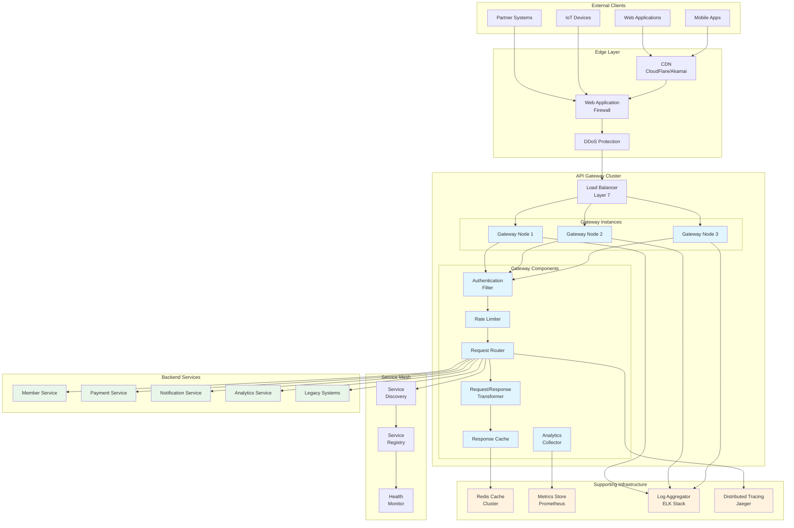
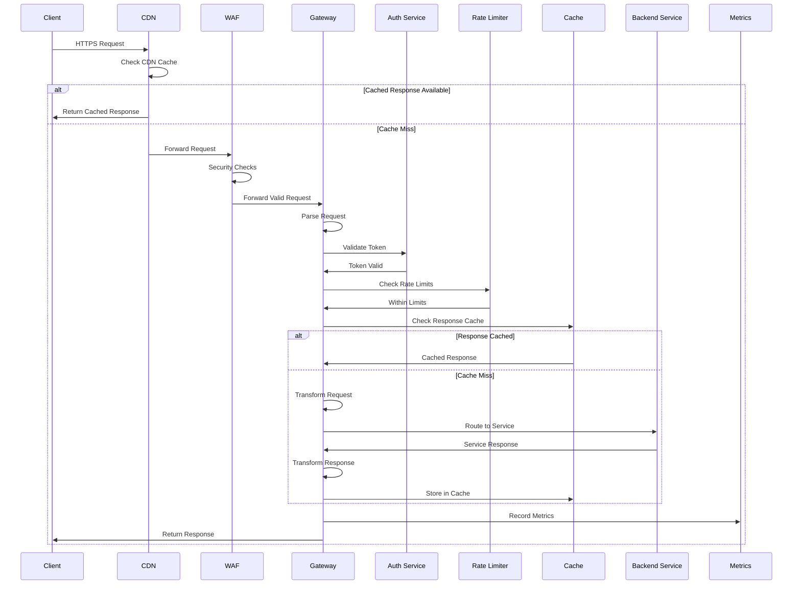
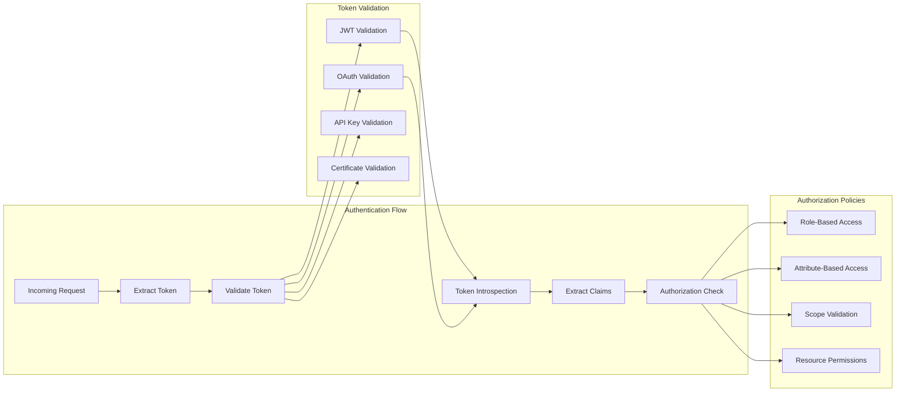
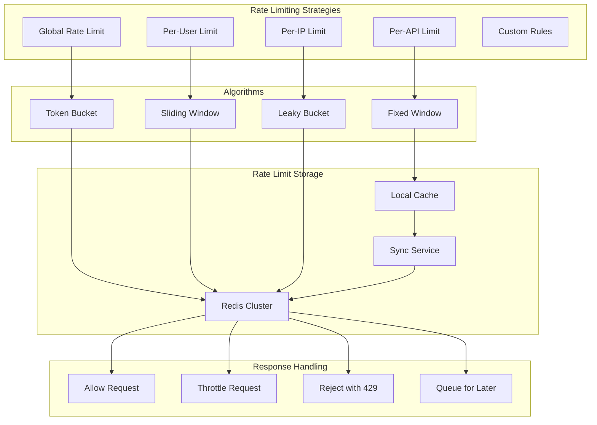
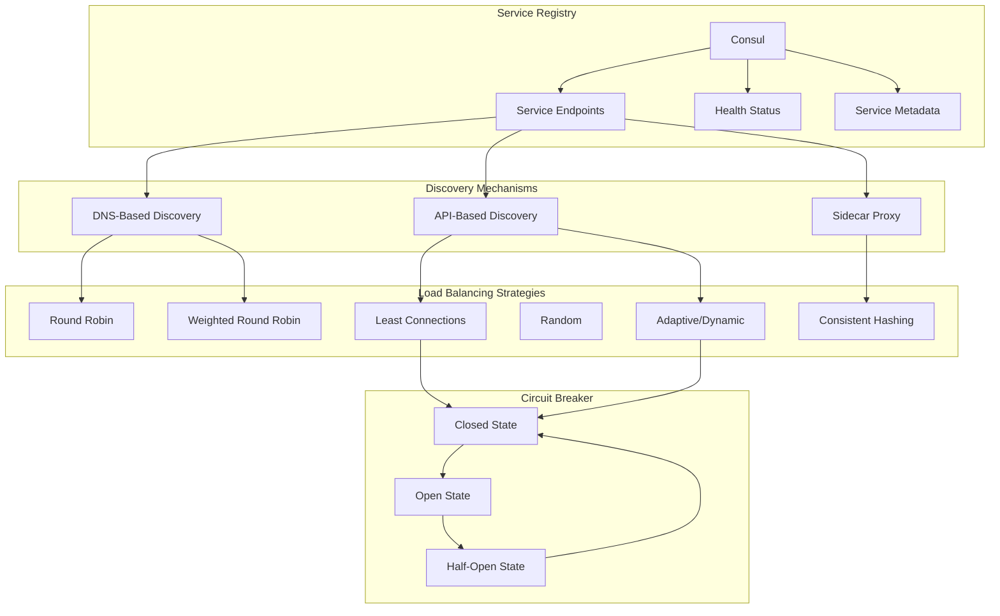
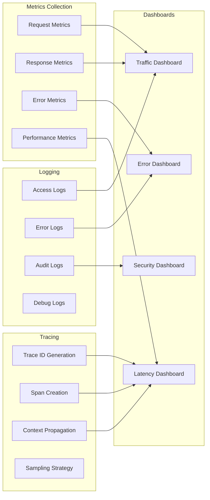

# API Gateway Architecture

## Gateway Architecture Overview



## Request Processing Flow



## Gateway Component Details

### Authentication and Authorization Flow



### Rate Limiting Architecture



## Service Discovery and Load Balancing



## API Gateway Configuration

### Route Configuration Example

```yaml
# API Gateway route configuration
routes:
  - id: member-service-v2
    uri: lb://member-service
    predicates:
      - Path=/api/v2/members/**
      - Method=GET,POST,PUT,DELETE
    filters:
      - name: Authentication
        args:
          required: true
          roles: ["member", "admin"]
      - name: RateLimiter
        args:
          redis-rate-limiter.replenishRate: 100
          redis-rate-limiter.burstCapacity: 200
          redis-rate-limiter.requestedTokens: 1
      - name: CircuitBreaker
        args:
          name: memberServiceCB
          fallbackUri: forward:/fallback/members
      - name: RequestTransformer
        args:
          add_headers:
            X-Gateway-Version: "2.0"
            X-Request-ID: "#{T(java.util.UUID).randomUUID().toString()}"
      - name: ResponseCache
        args:
          timeToLive: 300
          keyResolver: "#{@userKeyResolver}"
      - name: Retry
        args:
          retries: 3
          statuses: BAD_GATEWAY,SERVICE_UNAVAILABLE
          methods: GET,POST
          backoff:
            firstBackoff: 10ms
            maxBackoff: 500ms
            factor: 2

  - id: legacy-adapter
    uri: http://legacy-system:8080
    predicates:
      - Path=/api/v1/legacy/**
    filters:
      - name: Authentication
        args:
          required: true
      - name: RequestTransformer
        args:
          remove_headers:
            - "X-Modern-Header"
          transform:
            from: "modern_format"
            to: "legacy_format"
      - name: ResponseTransformer
        args:
          transform:
            from: "legacy_format"
            to: "modern_format"
      - name: ResponseCache
        args:
          timeToLive: 600
          varyBy: ["Accept", "Authorization"]

  - id: payment-service
    uri: lb://payment-service
    predicates:
      - Path=/api/v2/payments/**
    filters:
      - name: Authentication
        args:
          required: true
          scopes: ["payments:read", "payments:write"]
      - name: RateLimiter
        args:
          redis-rate-limiter.replenishRate: 50
          redis-rate-limiter.burstCapacity: 100
      - name: RequestLogging
        args:
          logLevel: "INFO"
          logHeaders: true
          logBody: false  # PCI compliance
      - name: Encryption
        args:
          fields: ["creditCard", "cvv"]
          algorithm: "AES-256"
```

### Security Configuration

```yaml
# Security configuration for API Gateway
security:
  cors:
    allowed-origins:
      - "https://app.association.org"
      - "https://admin.association.org"
    allowed-methods:
      - GET
      - POST
      - PUT
      - DELETE
      - OPTIONS
    allowed-headers:
      - Authorization
      - Content-Type
      - X-Requested-With
      - X-Request-ID
    exposed-headers:
      - X-Total-Count
      - X-Page-Number
      - Link
    allow-credentials: true
    max-age: 3600

  headers:
    frame-options: DENY
    content-type-options: nosniff
    xss-protection: "1; mode=block"
    strict-transport-security: "max-age=31536000; includeSubDomains"
    content-security-policy: "default-src 'self'"
    referrer-policy: "strict-origin-when-cross-origin"

  oauth2:
    resource-server:
      jwt:
        issuer-uri: https://auth.association.org
        jwk-set-uri: https://auth.association.org/.well-known/jwks.json
        audiences:
          - api.association.org
          - admin.association.org

  api-keys:
    header-name: X-API-Key
    query-param: api_key
    validation-url: http://auth-service/api/validate-key
    cache-ttl: 300

  ip-filtering:
    whitelist:
      enabled: true
      ips:
        - "10.0.0.0/8"
        - "172.16.0.0/12"
    blacklist:
      enabled: true
      ips: []
      geo-blocking:
        enabled: false
        blocked-countries: []
```

## Monitoring and Observability



### Monitoring Configuration

```yaml
# Monitoring configuration
monitoring:
  metrics:
    enabled: true
    export:
      prometheus:
        enabled: true
        endpoint: /metrics
        step: 60s
    
    tags:
      application: api-gateway
      environment: production
      region: us-east-1
    
    distribution:
      percentiles-histogram:
        http.server.requests: true
        gateway.requests: true
      
      percentiles:
        - 0.5
        - 0.95
        - 0.99
      
      sla:
        - 100ms
        - 500ms
        - 1s

  tracing:
    enabled: true
    sampling:
      probability: 0.1  # 10% sampling
      rate-limiting: 100  # Max 100 traces per second
    
    propagation:
      type: W3C
      extract:
        - W3C
        - B3
        - JAEGER
    
    exporter:
      jaeger:
        endpoint: http://jaeger-collector:14250
        service-name: api-gateway

  logging:
    level:
      root: INFO
      gateway: DEBUG
      security: INFO
    
    pattern:
      console: "%d{ISO8601} [%thread] %-5level %logger{36} - %msg%n"
      file: "%d{ISO8601} [%thread] %-5level %logger{36} [%X{traceId}] - %msg%n"
    
    appenders:
      - type: console
        threshold: INFO
      
      - type: file
        threshold: DEBUG
        file: /var/log/gateway/app.log
        max-file-size: 100MB
        max-history: 30
      
      - type: elasticsearch
        threshold: WARN
        index: gateway-logs
        hosts:
          - elasticsearch:9200
```

## High Availability and Disaster Recovery

```mermaid
graph TB
    subgraph "Primary Region"
        subgraph "Active Gateway Cluster"
            PRI_LB[Primary Load Balancer]
            PRI_GW1[Gateway Instance 1]
            PRI_GW2[Gateway Instance 2]
            PRI_GW3[Gateway Instance 3]
        end
        
        subgraph "Primary Data"
            PRI_REDIS[Redis Primary]
            PRI_CONFIG[Config Store]
            PRI_METRICS[Metrics Store]
        end
    end
    
    subgraph "Secondary Region"
        subgraph "Standby Gateway Cluster"
            SEC_LB[Secondary Load Balancer]
            SEC_GW1[Gateway Instance 1]
            SEC_GW2[Gateway Instance 2]
            SEC_GW3[Gateway Instance 3]
        end
        
        subgraph "Replica Data"
            SEC_REDIS[Redis Replica]
            SEC_CONFIG[Config Replica]
            SEC_METRICS[Metrics Replica]
        end
    end
    
    subgraph "Global Services"
        GLOBAL_LB[Global Load Balancer<br/>Route 53/Traffic Manager]
        HEALTH_CHECK[Health Monitor]
        FAILOVER[Failover Controller]
    end
    
    GLOBAL_LB --> PRI_LB
    GLOBAL_LB --> SEC_LB
    
    PRI_LB --> PRI_GW1
    PRI_LB --> PRI_GW2
    PRI_LB --> PRI_GW3
    
    SEC_LB --> SEC_GW1
    SEC_LB --> SEC_GW2
    SEC_LB --> SEC_GW3
    
    PRI_REDIS -.->|Replication| SEC_REDIS
    PRI_CONFIG -.->|Sync| SEC_CONFIG
    PRI_METRICS -.->|Sync| SEC_METRICS
    
    HEALTH_CHECK --> PRI_LB
    HEALTH_CHECK --> SEC_LB
    HEALTH_CHECK --> FAILOVER
    
    style GLOBAL_LB fill:#ffeb3b
    style FAILOVER fill:#ff5252
```



### Deployment Architecture

```yaml
# Kubernetes deployment for API Gateway
apiVersion: apps/v1
kind: Deployment
metadata:
  name: api-gateway
  labels:
    app: api-gateway
    version: v2.0
spec:
  replicas: 3
  strategy:
    type: RollingUpdate
    rollingUpdate:
      maxSurge: 1
      maxUnavailable: 0
  selector:
    matchLabels:
      app: api-gateway
  template:
    metadata:
      labels:
        app: api-gateway
        version: v2.0
      annotations:
        prometheus.io/scrape: "true"
        prometheus.io/port: "8080"
        prometheus.io/path: "/metrics"
    spec:
      affinity:
        podAntiAffinity:
          requiredDuringSchedulingIgnoredDuringExecution:
          - labelSelector:
              matchExpressions:
              - key: app
                operator: In
                values:
                - api-gateway
            topologyKey: kubernetes.io/hostname
      
      containers:
      - name: api-gateway
        image: api-gateway:2.0
        ports:
        - containerPort: 8080
          name: http
        - containerPort: 8443
          name: https
        - containerPort: 9090
          name: metrics
        
        env:
        - name: SPRING_PROFILES_ACTIVE
          value: "production,kubernetes"
        - name: JAVA_OPTS
          value: "-Xms2g -Xmx2g -XX:+UseG1GC"
        
        resources:
          requests:
            memory: "2Gi"
            cpu: "1000m"
          limits:
            memory: "4Gi"
            cpu: "2000m"
        
        livenessProbe:
          httpGet:
            path: /actuator/health/liveness
            port: 8080
          initialDelaySeconds: 30
          periodSeconds: 10
          timeoutSeconds: 5
          failureThreshold: 3
        
        readinessProbe:
          httpGet:
            path: /actuator/health/readiness
            port: 8080
          initialDelaySeconds: 20
          periodSeconds: 5
          timeoutSeconds: 3
          failureThreshold: 3
        
        volumeMounts:
        - name: config
          mountPath: /config
          readOnly: true
        - name: tls-certs
          mountPath: /etc/tls
          readOnly: true
      
      volumes:
      - name: config
        configMap:
          name: api-gateway-config
      - name: tls-certs
        secret:
          secretName: api-gateway-tls

---
apiVersion: v1
kind: Service
metadata:
  name: api-gateway
  labels:
    app: api-gateway
spec:
  type: LoadBalancer
  ports:
  - name: http
    port: 80
    targetPort: 8080
  - name: https
    port: 443
    targetPort: 8443
  selector:
    app: api-gateway
  sessionAffinity: ClientIP
  sessionAffinityConfig:
    clientIP:
      timeoutSeconds: 10800

---
apiVersion: autoscaling/v2
kind: HorizontalPodAutoscaler
metadata:
  name: api-gateway-hpa
spec:
  scaleTargetRef:
    apiVersion: apps/v1
    kind: Deployment
    name: api-gateway
  minReplicas: 3
  maxReplicas: 20
  metrics:
  - type: Resource
    resource:
      name: cpu
      target:
        type: Utilization
        averageUtilization: 70
  - type: Resource
    resource:
      name: memory
      target:
        type: Utilization
        averageUtilization: 80
  - type: Pods
    pods:
      metric:
        name: http_requests_per_second
      target:
        type: AverageValue
        averageValue: "1000"
  behavior:
    scaleDown:
      stabilizationWindowSeconds: 300
      policies:
      - type: Percent
        value: 50
        periodSeconds: 60
    scaleUp:
      stabilizationWindowSeconds: 60
      policies:
      - type: Percent
        value: 100
        periodSeconds: 60
```