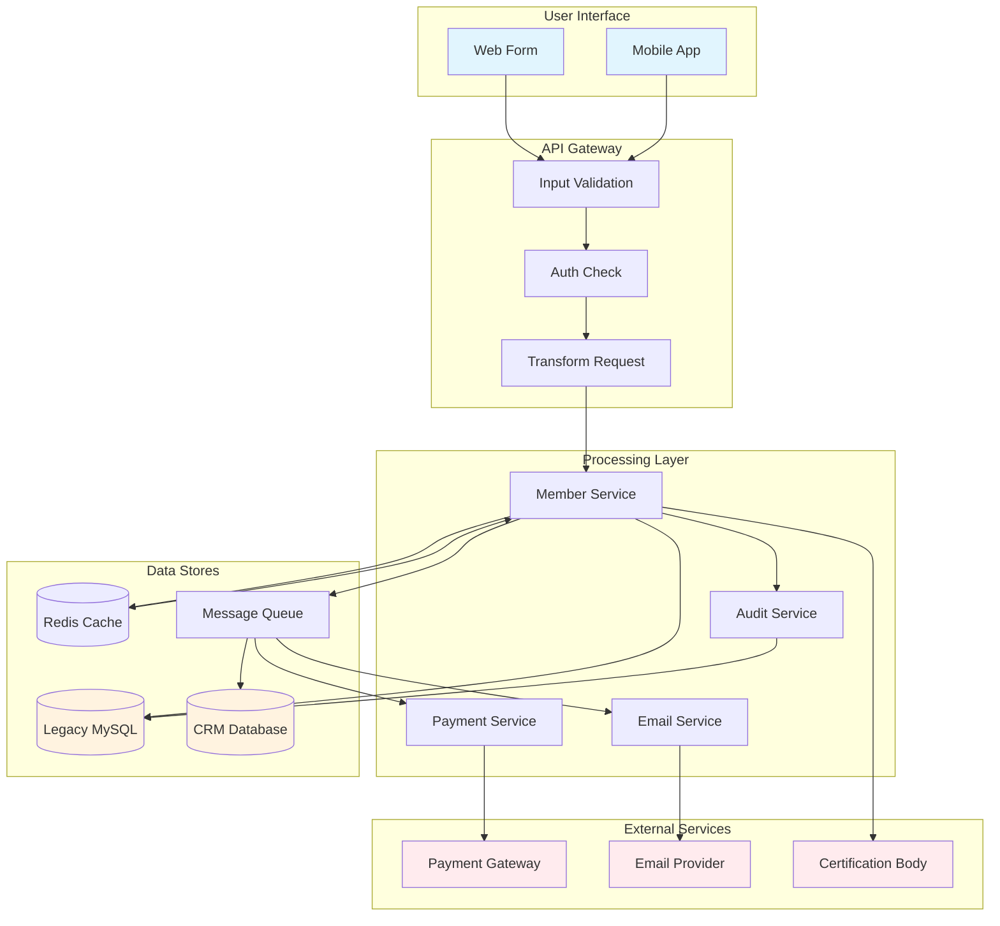
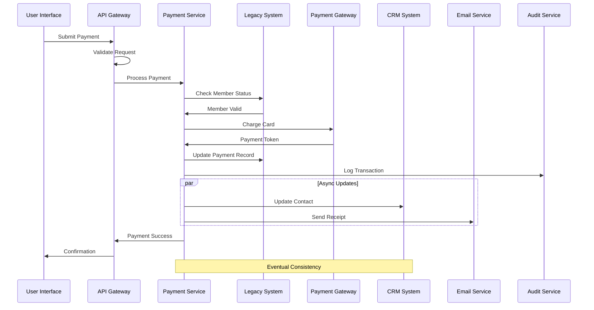
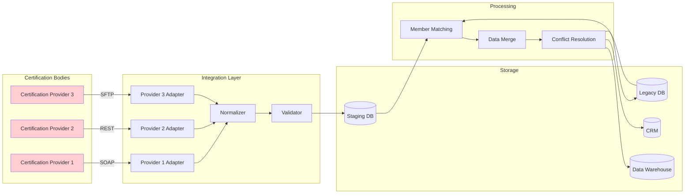
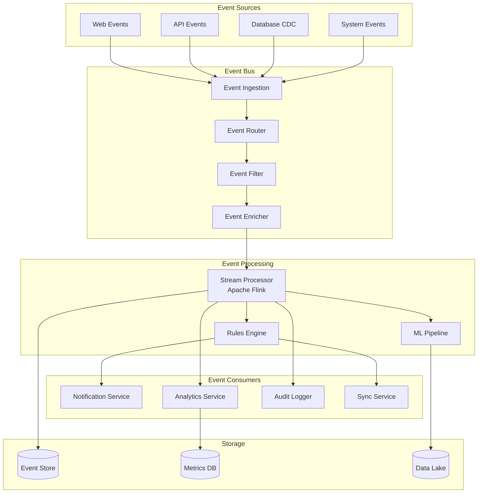
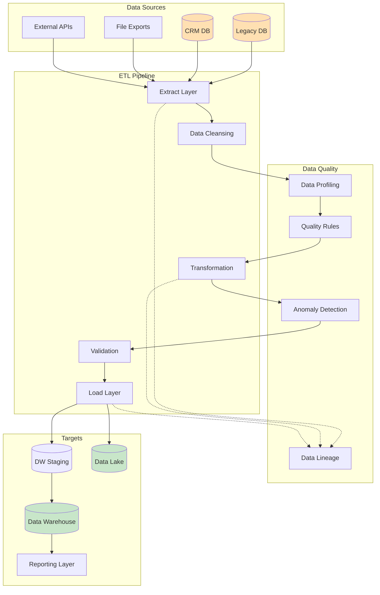
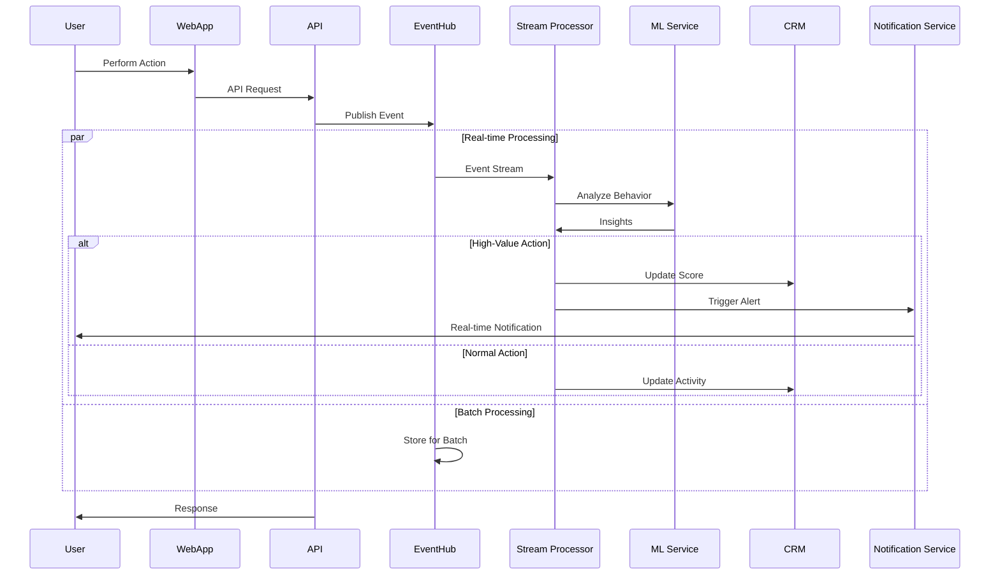
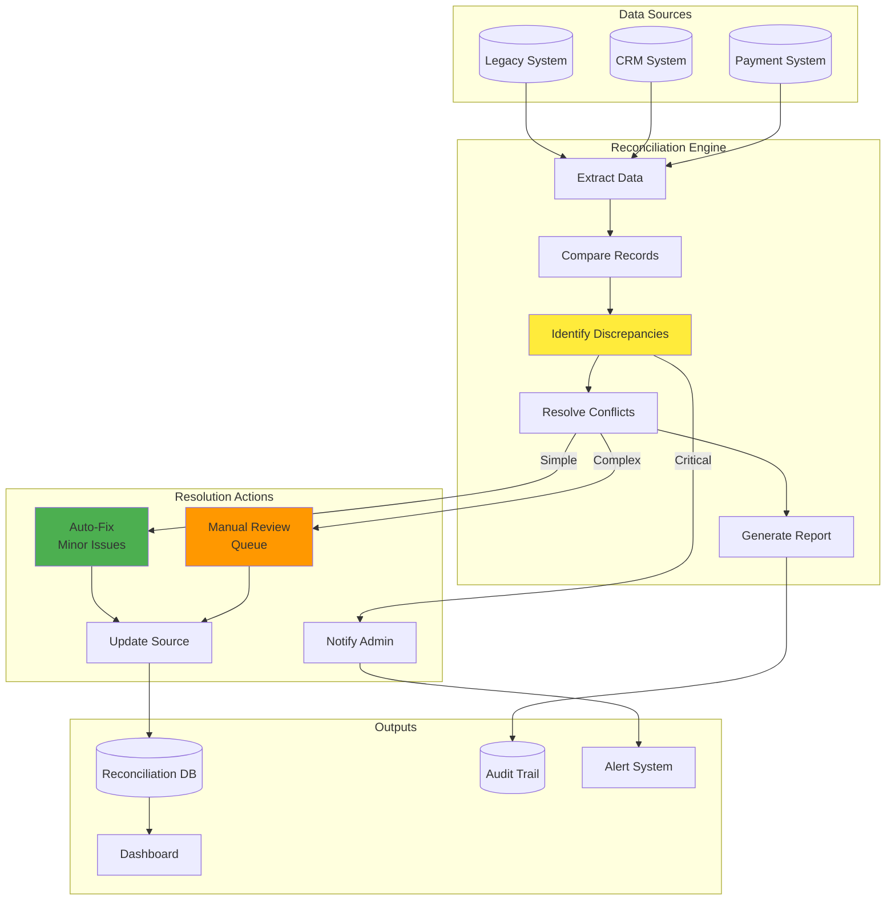
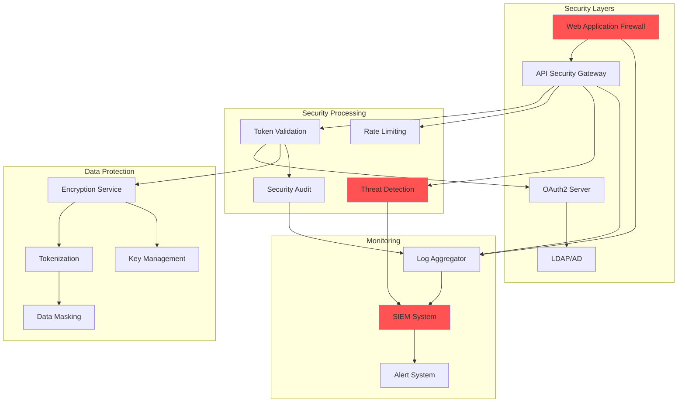

# Data Flow Diagrams

## Member Registration Data Flow

## Payment Processing Data Flow

## Certification Sync Data Flow

## Event Stream Data Flow

## Batch ETL Data Flow

## Real-time Member Activity Flow

## Data Reconciliation Flow

## Security Data Flow

