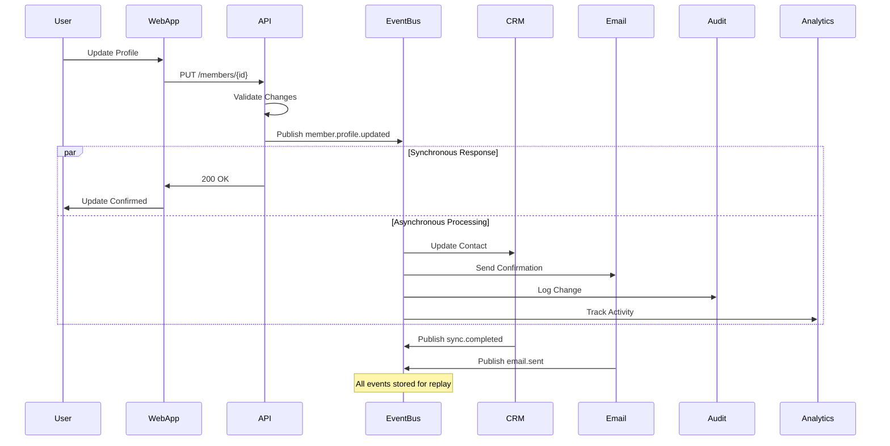
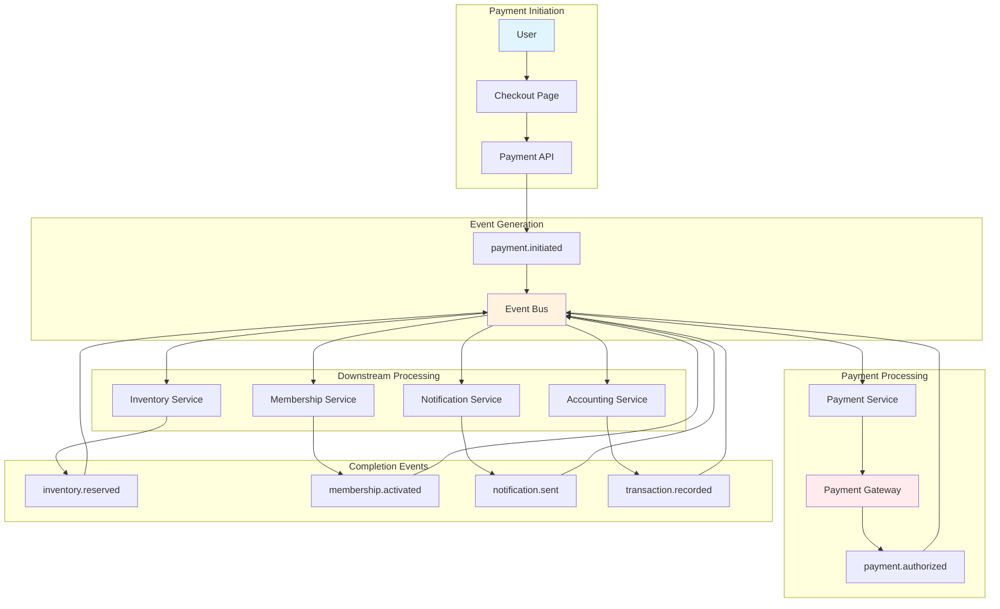
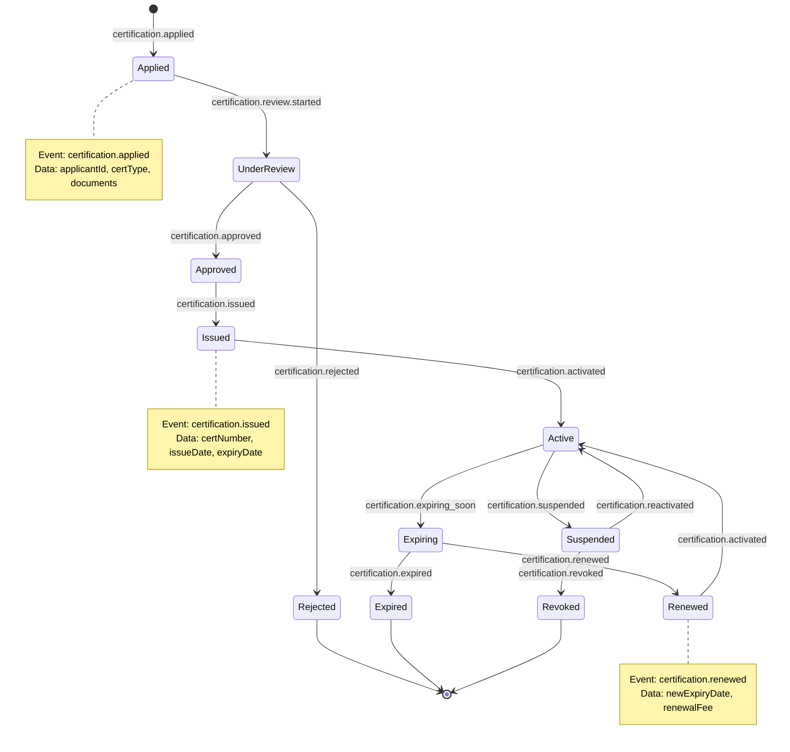
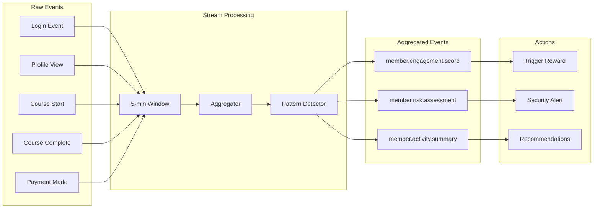
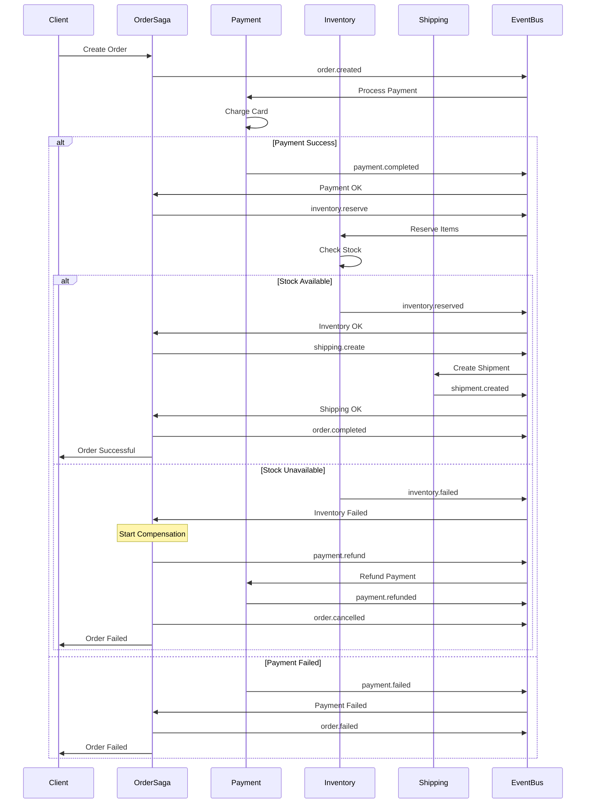
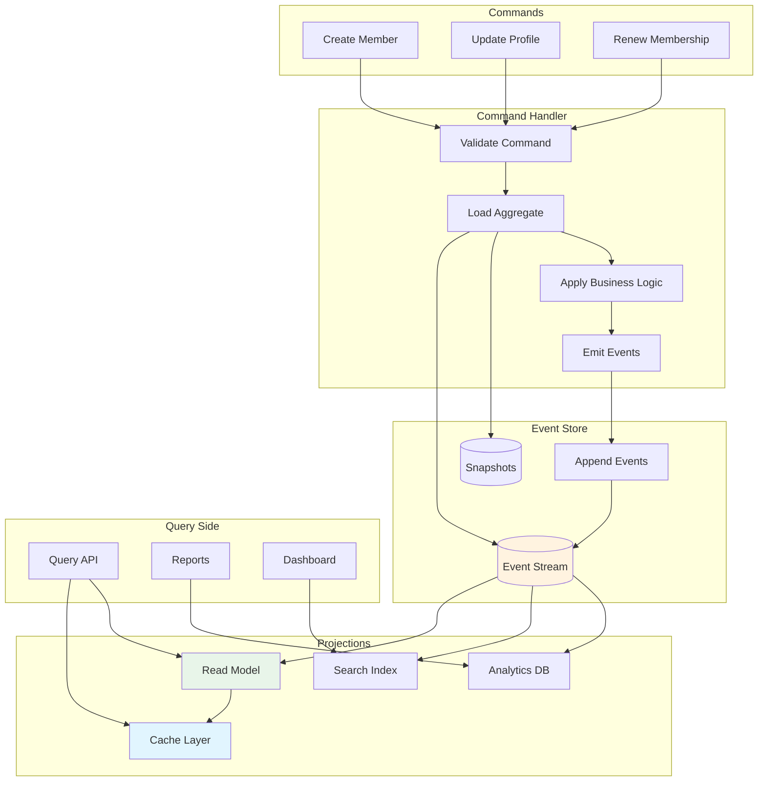
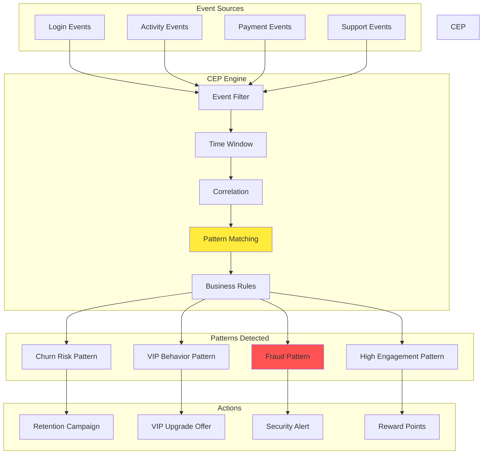
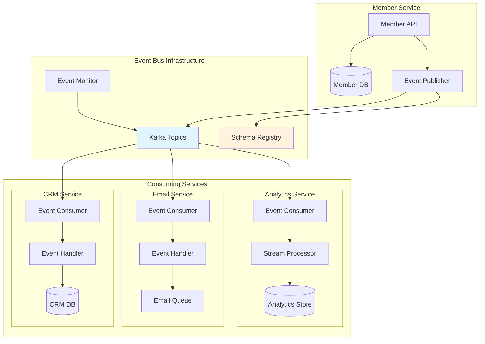
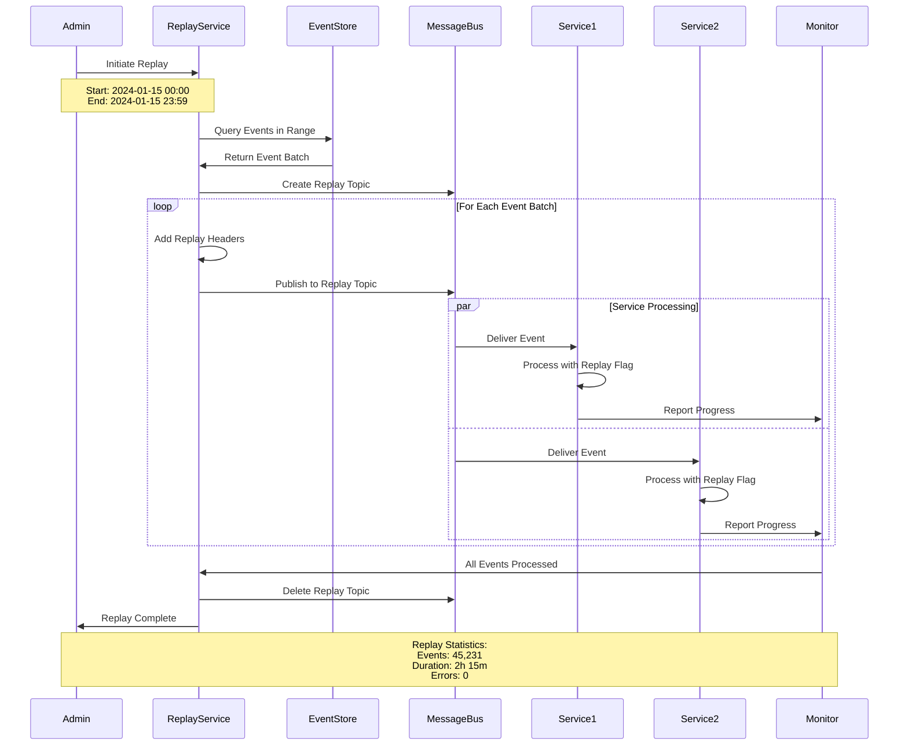

# Event Flow Diagrams

## Real-Time Member Update Event Flow

## Payment Processing Event Flow

## Certification Lifecycle Event Flow

## Event Aggregation Flow

## Saga Pattern for Distributed Transactions

## Event Sourcing Data Flow

## Complex Event Processing (CEP) Flow

## Event-Driven Microservices Communication

## Event Replay and Recovery Flow

