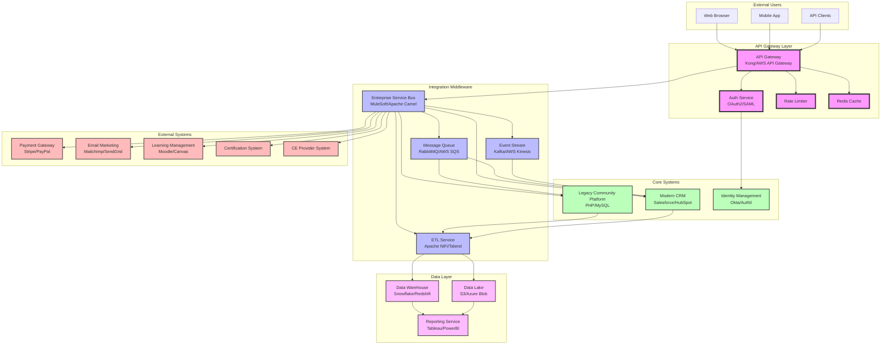

# High-Level Integration Architecture

## Architecture Diagram

## Component Overview

### 1. API Gateway Layer
- **Purpose**: Single entry point for all external requests
- **Components**:
  - API Gateway (Kong/AWS API Gateway)
  - Authentication Service (OAuth2/SAML)
  - Rate Limiting
  - Response Caching (Redis)
- **Key Features**:
  - Request routing and load balancing
  - API versioning
  - Request/response transformation
  - API documentation (OpenAPI/Swagger)

### 2. Integration Middleware
- **Purpose**: Orchestrate communication between systems
- **Components**:
  - Enterprise Service Bus (ESB)
  - Message Queue for async processing
  - Event Streaming for real-time updates
  - ETL Service for data transformation
- **Key Features**:
  - Protocol mediation
  - Message transformation
  - Service orchestration
  - Error handling and retry

### 3. Core Systems
- **Legacy Community Platform**: Existing PHP/MySQL system
- **Modern CRM**: Salesforce-style platform with REST APIs
- **Identity Management**: Centralized authentication and authorization

### 4. External Systems
- **Payment Gateways**: Stripe, PayPal integration
- **Email Marketing**: Mailchimp, SendGrid for communications
- **Learning Management**: Course delivery and tracking
- **Certification Systems**: Professional certification management
- **CE Providers**: Continuing education credit tracking

### 5. Data Layer
- **Data Warehouse**: Structured data for analytics
- **Data Lake**: Raw data storage for ML/AI
- **Reporting Service**: Business intelligence and dashboards

## Key Architecture Principles

1. **Loose Coupling**: Systems communicate through well-defined interfaces
2. **Scalability**: Horizontal scaling at each layer
3. **Resilience**: Circuit breakers and fallback mechanisms
4. **Security**: Defense in depth with multiple security layers
5. **Observability**: Comprehensive logging, monitoring, and tracing