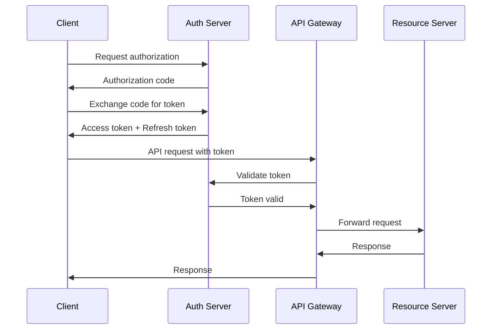
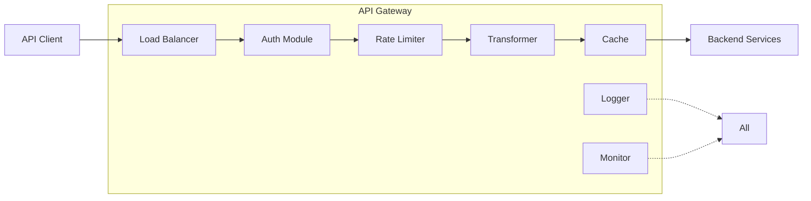

# API Architecture and Patterns

## API Design Principles

### 1. RESTful API Standards

#### Resource-Oriented Design
```
GET    /api/v1/members              # List members
GET    /api/v1/members/{id}         # Get specific member
POST   /api/v1/members              # Create member
PUT    /api/v1/members/{id}         # Update member
PATCH  /api/v1/members/{id}         # Partial update
DELETE /api/v1/members/{id}         # Delete member
```

#### HTTP Status Codes
- **2xx Success**
  - 200 OK - Successful GET, PUT
  - 201 Created - Successful POST
  - 202 Accepted - Async processing initiated
  - 204 No Content - Successful DELETE

- **4xx Client Errors**
  - 400 Bad Request - Invalid syntax
  - 401 Unauthorized - Authentication required
  - 403 Forbidden - Authorization failed
  - 404 Not Found - Resource doesn't exist
  - 429 Too Many Requests - Rate limit exceeded

- **5xx Server Errors**
  - 500 Internal Server Error
  - 502 Bad Gateway
  - 503 Service Unavailable
  - 504 Gateway Timeout

### 2. API Versioning Strategy

#### URI Versioning
```
https://api.association.org/v1/members
https://api.association.org/v2/members
```

#### Header Versioning
```
GET /members HTTP/1.1
Host: api.association.org
Accept: application/vnd.association.v2+json
```

#### Version Lifecycle
- **v1**: Legacy support (12 months deprecation notice)
- **v2**: Current stable version
- **v3**: Beta/preview features

### 3. Authentication & Authorization

#### OAuth 2.0 Flow


#### JWT Token Structure
```json
{
  "header": {
    "alg": "RS256",
    "typ": "JWT"
  },
  "payload": {
    "sub": "user123",
    "iss": "https://auth.association.org",
    "aud": "https://api.association.org",
    "exp": 1640995200,
    "iat": 1640991600,
    "scope": "read:members write:members",
    "org_id": "org456",
    "roles": ["member", "admin"]
  },
  "signature": "..."
}
```

### 4. API Gateway Architecture

#### Gateway Components


#### Gateway Configuration Example
```yaml
# Kong Gateway Configuration
services:
  - name: member-service
    url: http://legacy-platform:8080
    routes:
      - name: member-routes
        paths:
          - /api/v1/members
        methods:
          - GET
          - POST
          - PUT
          - DELETE
    plugins:
      - name: jwt
        config:
          uri_param_names:
            - jwt
          claims_to_verify:
            - exp
      - name: rate-limiting
        config:
          minute: 60
          hour: 1000
          policy: redis
      - name: request-transformer
        config:
          add:
            headers:
              - X-Org-ID:{{jwt.org_id}}
      - name: response-transformer
        config:
          remove:
            headers:
              - X-Internal-ID
```

### 5. API Patterns

#### 1. Pagination Pattern
```json
// Request
GET /api/v1/members?page=2&size=20&sort=lastName,asc

// Response
{
  "data": [...],
  "pagination": {
    "page": 2,
    "size": 20,
    "totalElements": 1543,
    "totalPages": 78,
    "first": false,
    "last": false
  },
  "links": {
    "self": "/api/v1/members?page=2&size=20",
    "first": "/api/v1/members?page=1&size=20",
    "prev": "/api/v1/members?page=1&size=20",
    "next": "/api/v1/members?page=3&size=20",
    "last": "/api/v1/members?page=78&size=20"
  }
}
```

#### 2. Filtering Pattern
```
GET /api/v1/members?filter[status]=active&filter[memberType]=professional&filter[joinDate][gte]=2023-01-01
```

#### 3. Field Selection Pattern
```
GET /api/v1/members/123?fields=id,firstName,lastName,email,membershipStatus
```

#### 4. Expansion Pattern
```
GET /api/v1/members/123?expand=certifications,courses,payments
```

#### 5. Batch Operations Pattern
```json
// Request
POST /api/v1/batch
{
  "operations": [
    {
      "method": "POST",
      "url": "/members",
      "body": { "firstName": "John", "lastName": "Doe" }
    },
    {
      "method": "PUT",
      "url": "/members/456",
      "body": { "status": "active" }
    }
  ]
}

// Response
{
  "results": [
    {
      "status": 201,
      "headers": { "Location": "/members/789" },
      "body": { "id": "789", "firstName": "John" }
    },
    {
      "status": 200,
      "body": { "id": "456", "status": "active" }
    }
  ]
}
```

### 6. Error Handling

#### Standard Error Response
```json
{
  "error": {
    "code": "VALIDATION_ERROR",
    "message": "Invalid request parameters",
    "details": [
      {
        "field": "email",
        "code": "INVALID_FORMAT",
        "message": "Email format is invalid"
      },
      {
        "field": "memberType",
        "code": "INVALID_VALUE",
        "message": "Must be one of: professional, student, associate"
      }
    ],
    "timestamp": "2024-01-20T10:30:45Z",
    "path": "/api/v1/members",
    "requestId": "req-123456"
  }
}
```

#### Error Code Hierarchy
```
AUTHENTICATION_ERROR
├── INVALID_CREDENTIALS
├── TOKEN_EXPIRED
└── TOKEN_INVALID

AUTHORIZATION_ERROR
├── INSUFFICIENT_PERMISSIONS
├── RESOURCE_ACCESS_DENIED
└── ORG_ACCESS_DENIED

VALIDATION_ERROR
├── REQUIRED_FIELD_MISSING
├── INVALID_FORMAT
├── INVALID_VALUE
└── CONSTRAINT_VIOLATION

BUSINESS_ERROR
├── DUPLICATE_RESOURCE
├── RESOURCE_LOCKED
├── BUSINESS_RULE_VIOLATION
└── DEPENDENCY_ERROR

SYSTEM_ERROR
├── DATABASE_ERROR
├── EXTERNAL_SERVICE_ERROR
├── TIMEOUT_ERROR
└── INTERNAL_ERROR
```

### 7. API Documentation

#### OpenAPI 3.0 Specification Example
```yaml
openapi: 3.0.0
info:
  title: Association Management API
  version: 2.0.0
  description: API for managing association members and services

servers:
  - url: https://api.association.org/v2
    description: Production server
  - url: https://api-staging.association.org/v2
    description: Staging server

security:
  - bearerAuth: []

paths:
  /members:
    get:
      summary: List members
      operationId: listMembers
      parameters:
        - $ref: '#/components/parameters/pageParam'
        - $ref: '#/components/parameters/sizeParam'
        - $ref: '#/components/parameters/sortParam'
      responses:
        200:
          description: Successful response
          content:
            application/json:
              schema:
                $ref: '#/components/schemas/MemberList'
        401:
          $ref: '#/components/responses/UnauthorizedError'

components:
  securitySchemes:
    bearerAuth:
      type: http
      scheme: bearer
      bearerFormat: JWT
  
  parameters:
    pageParam:
      name: page
      in: query
      schema:
        type: integer
        default: 1
    
    sizeParam:
      name: size
      in: query
      schema:
        type: integer
        default: 20
        maximum: 100
    
    sortParam:
      name: sort
      in: query
      schema:
        type: string
        example: "lastName,asc"
  
  schemas:
    Member:
      type: object
      required:
        - id
        - email
        - firstName
        - lastName
      properties:
        id:
          type: string
          format: uuid
        email:
          type: string
          format: email
        firstName:
          type: string
        lastName:
          type: string
        memberType:
          type: string
          enum: [professional, student, associate]
        status:
          type: string
          enum: [active, inactive, suspended]
  
  responses:
    UnauthorizedError:
      description: Authentication required
      content:
        application/json:
          schema:
            $ref: '#/components/schemas/Error'
```

### 8. API Security Best Practices

#### 1. Transport Security
- TLS 1.3 minimum
- Certificate pinning for mobile apps
- HSTS headers

#### 2. Input Validation
- Schema validation
- SQL injection prevention
- XSS protection
- Rate limiting per user/IP

#### 3. Output Security
- Response filtering
- Data masking for sensitive fields
- Audit logging

#### 4. API Keys Management
```json
{
  "apiKey": {
    "id": "key_123",
    "prefix": "assoc_live_",
    "scopes": ["read:members", "write:members"],
    "rateLimit": {
      "requests": 1000,
      "period": "hour"
    },
    "ipWhitelist": ["192.168.1.0/24"],
    "expiresAt": "2024-12-31T23:59:59Z"
  }
}
```

### 9. Performance Optimization

#### Caching Strategy
```http
# Response headers
Cache-Control: private, max-age=3600
ETag: "686897696a7c876b7e"
Last-Modified: Wed, 21 Oct 2023 07:28:00 GMT

# Conditional request
If-None-Match: "686897696a7c876b7e"
If-Modified-Since: Wed, 21 Oct 2023 07:28:00 GMT
```

#### Response Compression
```http
Accept-Encoding: gzip, deflate, br
Content-Encoding: gzip
```

#### Connection Pooling
- Keep-alive connections
- HTTP/2 multiplexing
- Connection reuse

### 10. Monitoring & Analytics

#### API Metrics
- Request rate (req/sec)
- Response time (p50, p95, p99)
- Error rate
- Success rate
- Bandwidth usage

#### Distributed Tracing
```http
X-Request-ID: 550e8400-e29b-41d4-a716-446655440000
X-Trace-ID: 1-5759e988-bd862e3fe1be46a994272793
X-Span-ID: 53995c3f42cd8ad8
```