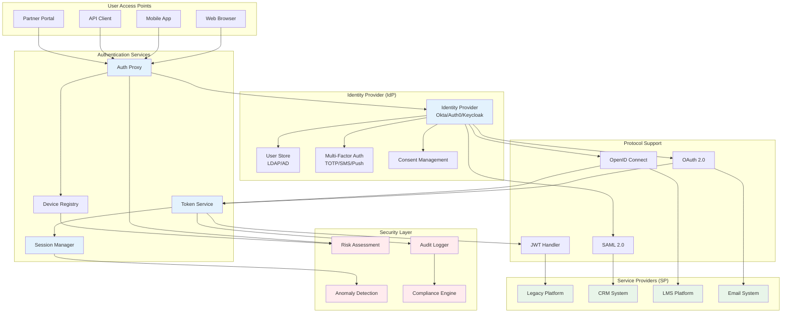
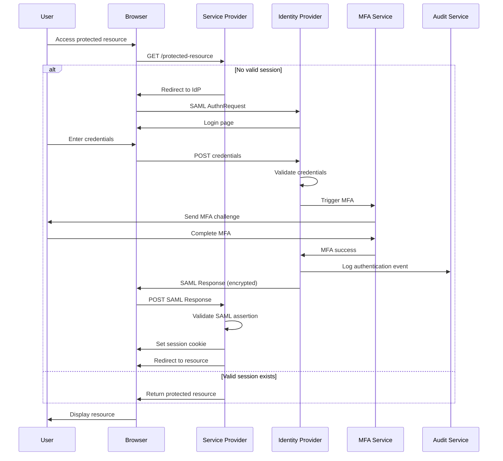
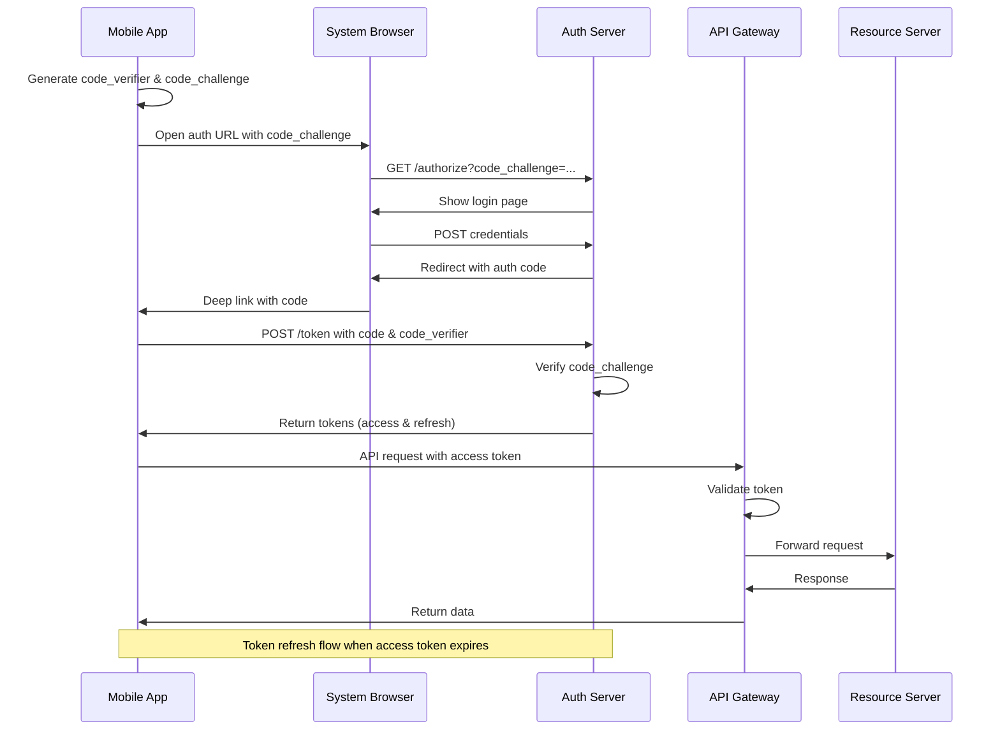
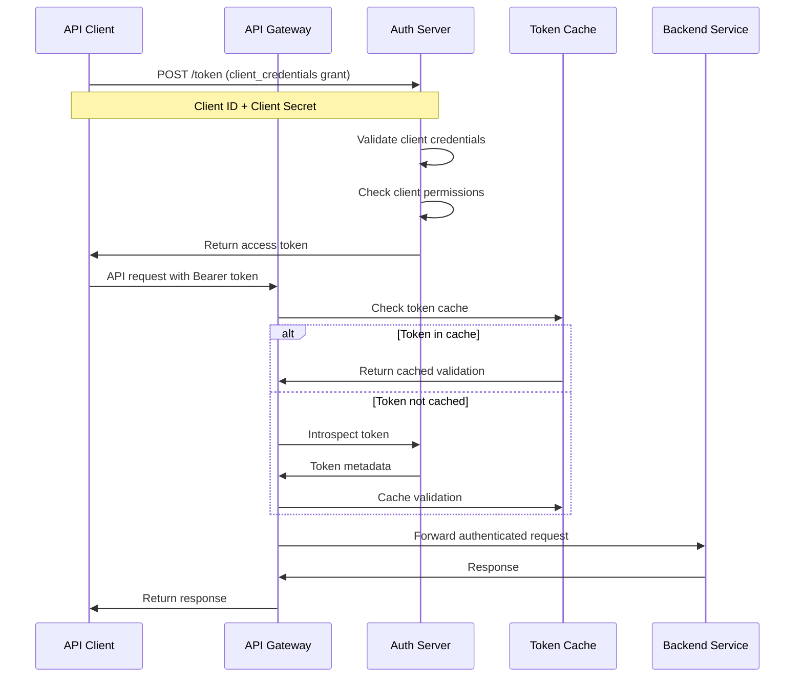
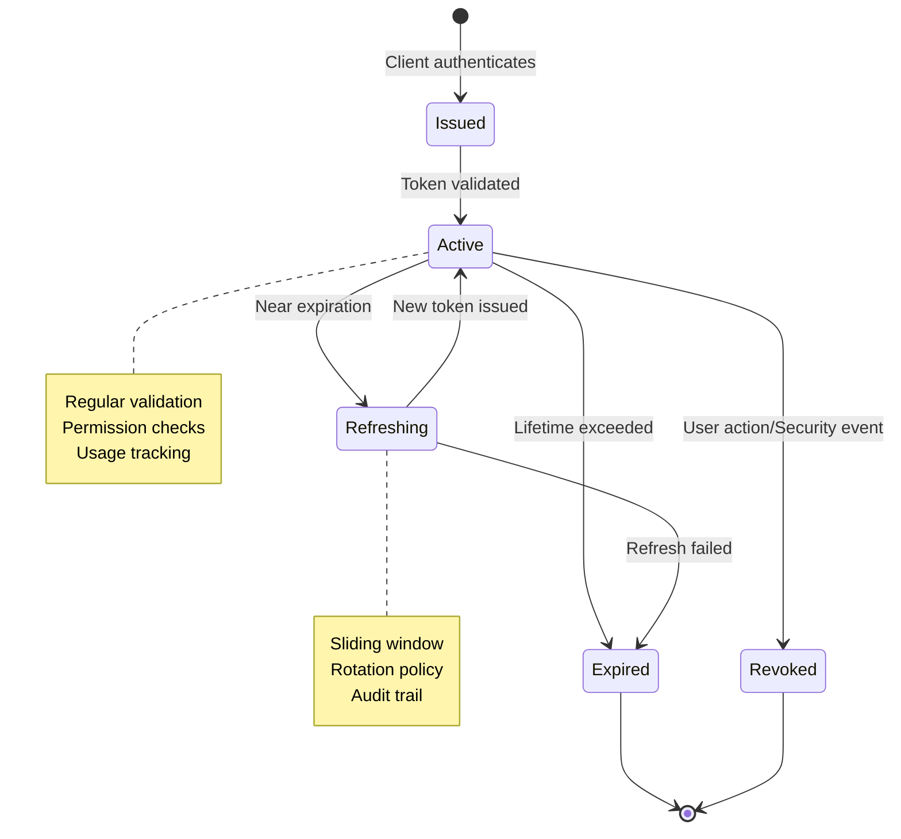
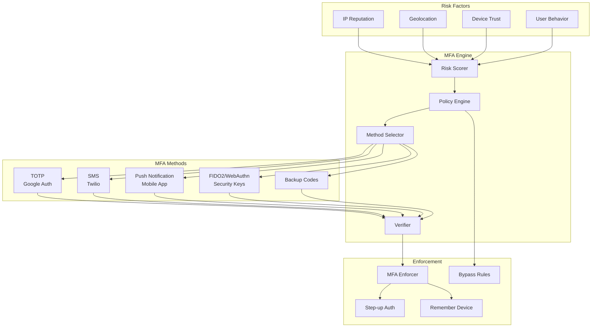
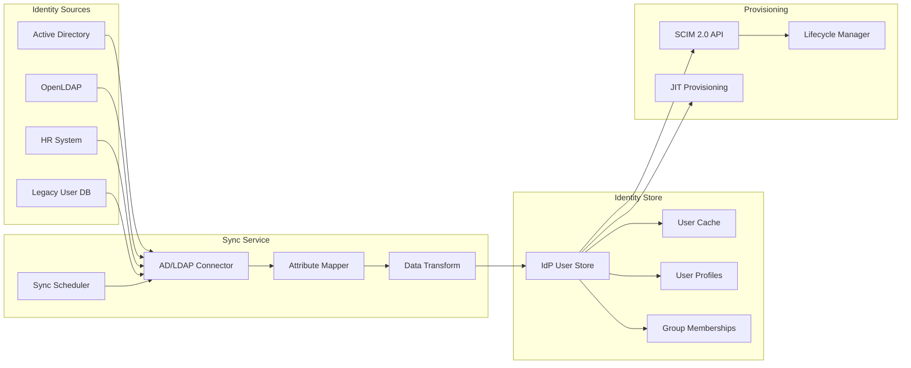

# Authentication and SSO Architecture

## Overview

This document outlines a comprehensive authentication and Single Sign-On (SSO) architecture that provides secure, seamless access across legacy systems, modern CRM platforms, and external services while maintaining compliance with industry standards.

## SSO Architecture Overview



## Authentication Flows

### 1. Web Browser SSO Flow (SAML)



### 2. Mobile App OAuth 2.0 + PKCE Flow



### 3. API Client Authentication (Client Credentials)



## Token Management

### 1. JWT Token Structure

```json
{
  "header": {
    "alg": "RS256",
    "typ": "JWT",
    "kid": "rsa-key-2024-01"
  },
  "payload": {
    "iss": "https://auth.association.org",
    "sub": "user:12345",
    "aud": ["api.association.org", "crm.association.org"],
    "exp": 1706620800,
    "iat": 1706617200,
    "nbf": 1706617200,
    "jti": "token-unique-id-123",
    "auth_time": 1706617200,
    "acr": "mfa",
    "amr": ["pwd", "otp"],
    "scope": "openid profile email members:read members:write",
    "azp": "web-client-id",
    "session_state": "session-abc123",
    "custom_claims": {
      "org_id": "org-456",
      "membership_level": "professional",
      "roles": ["member", "chapter_admin"],
      "permissions": ["view_members", "edit_members", "view_reports"]
    }
  },
  "signature": "..."
}
```

### 2. Token Lifecycle Management



### 3. Token Security Configuration

```yaml
# Token Service Configuration
token_service:
  jwt:
    signing:
      algorithm: RS256
      key_rotation_interval: 30d
      key_overlap_period: 7d
    
    validation:
      verify_signature: true
      verify_expiration: true
      verify_not_before: true
      verify_issuer: true
      verify_audience: true
      clock_skew_seconds: 30
    
    expiration:
      access_token: 3600  # 1 hour
      refresh_token: 2592000  # 30 days
      id_token: 3600  # 1 hour
      session_absolute: 43200  # 12 hours
      session_idle: 7200  # 2 hours
    
    security:
      require_jti: true  # Unique token ID
      store_jti_for_revocation: true
      encrypt_at_rest: true
      token_binding: optional
      dpop_required: false

session_management:
  storage:
    type: redis_cluster
    ttl: 43200  # 12 hours
    encryption: aes-256-gcm
  
  security:
    secure_cookie: true
    http_only: true
    same_site: strict
    domain: .association.org
    
  tracking:
    ip_validation: soft  # warn on change
    user_agent_validation: true
    device_fingerprint: true
```

## Multi-Factor Authentication (MFA)

### 1. MFA Architecture



### 2. Adaptive MFA Rules

```python
class AdaptiveMFAPolicy:
    def evaluate_risk(self, context):
        """Evaluate authentication risk and determine MFA requirement"""
        risk_score = 0
        mfa_required = False
        mfa_methods = []
        
        # IP reputation check
        if self.is_suspicious_ip(context.ip_address):
            risk_score += 30
            
        # Geolocation check
        if self.is_unusual_location(context.user_id, context.geo_location):
            risk_score += 25
            
        # Device trust check
        if not self.is_trusted_device(context.device_id):
            risk_score += 20
            
        # Time-based check
        if self.is_unusual_time(context.user_id, context.timestamp):
            risk_score += 15
            
        # Behavior analysis
        if self.detect_anomaly(context.user_id, context.behavior_pattern):
            risk_score += 40
            
        # Determine MFA requirement
        if risk_score >= 30:
            mfa_required = True
            
        # Select MFA methods based on risk
        if risk_score >= 70:
            mfa_methods = ['fido2', 'push']  # High security
        elif risk_score >= 40:
            mfa_methods = ['totp', 'push', 'sms']  # Medium security
        else:
            mfa_methods = ['totp', 'sms', 'backup']  # Standard security
            
        return {
            'risk_score': risk_score,
            'mfa_required': mfa_required,
            'allowed_methods': mfa_methods,
            'step_up_after': 3600 if risk_score >= 50 else None
        }
```

## Directory Integration

### 1. LDAP/AD Integration Architecture



### 2. Attribute Mapping Configuration

```yaml
# LDAP to IdP Attribute Mapping
attribute_mapping:
  ldap_to_idp:
    # Basic attributes
    uid: username
    cn: display_name
    givenName: first_name
    sn: last_name
    mail: email
    telephoneNumber: phone
    
    # Organization attributes
    o: organization
    ou: department
    title: job_title
    employeeNumber: employee_id
    
    # Custom attributes
    membershipLevel: custom.membership_level
    chapterAffiliation: custom.chapter
    certifications: custom.certifications[]
    
  # Group mappings
  group_mapping:
    "CN=Members,OU=Groups,DC=association,DC=org":
      idp_group: "members"
      permissions: ["basic_access"]
      
    "CN=ChapterAdmins,OU=Groups,DC=association,DC=org":
      idp_group: "chapter_admins"
      permissions: ["chapter_management", "member_view"]
      
    "CN=BoardMembers,OU=Groups,DC=association,DC=org":
      idp_group: "board_members"
      permissions: ["full_access", "financial_reports"]

# Sync configuration
sync_config:
  schedule: "0 */4 * * *"  # Every 4 hours
  batch_size: 1000
  conflict_resolution: "source_wins"
  soft_delete: true
  password_sync: false  # Use SSO instead
```

## Security Considerations

### 1. OAuth Security Profile

```yaml
oauth_security_profile:
  # PKCE is mandatory for public clients
  require_pkce: true
  pkce_challenge_methods: ["S256"]
  
  # Token binding
  token_binding:
    required: true
    methods: ["tls_client_cert", "dpop"]
  
  # Grant types
  allowed_grants:
    - authorization_code
    - refresh_token
    - client_credentials
  
  forbidden_grants:
    - implicit  # Deprecated
    - password  # Not recommended
  
  # Response types
  allowed_response_types:
    - code
  
  # Security headers
  security_headers:
    X-Frame-Options: DENY
    X-Content-Type-Options: nosniff
    X-XSS-Protection: "1; mode=block"
    Strict-Transport-Security: "max-age=31536000; includeSubDomains"
    Content-Security-Policy: "default-src 'self'"
```

### 2. Session Security

```python
class SecureSessionManager:
    def create_session(self, user_id, context):
        """Create secure session with context binding"""
        session = {
            'id': self.generate_secure_id(),
            'user_id': user_id,
            'created_at': datetime.utcnow(),
            'expires_at': datetime.utcnow() + timedelta(hours=12),
            'ip_address': context.ip_address,
            'user_agent': context.user_agent,
            'device_fingerprint': self.calculate_fingerprint(context),
            'security_context': {
                'auth_method': context.auth_method,
                'auth_level': context.auth_level,
                'mfa_satisfied': context.mfa_completed
            }
        }
        
        # Encrypt session data
        encrypted_session = self.encrypt_session(session)
        
        # Store in distributed cache
        self.redis_client.setex(
            f"session:{session['id']}",
            43200,  # 12 hours
            encrypted_session
        )
        
        # Create secure cookie
        cookie_value = self.create_signed_cookie(session['id'])
        
        return {
            'session_id': session['id'],
            'cookie': {
                'value': cookie_value,
                'secure': True,
                'httpOnly': True,
                'sameSite': 'Strict',
                'domain': '.association.org',
                'path': '/',
                'expires': session['expires_at']
            }
        }
    
    def validate_session(self, session_id, context):
        """Validate session with security checks"""
        session = self.get_session(session_id)
        
        if not session:
            raise InvalidSessionError("Session not found")
            
        # Check expiration
        if session['expires_at'] < datetime.utcnow():
            raise SessionExpiredError("Session expired")
            
        # Validate context binding
        if self.strict_validation:
            if session['ip_address'] != context.ip_address:
                self.log_security_event("IP_MISMATCH", session_id)
                if not self.allow_ip_change:
                    raise SecurityError("IP address mismatch")
                    
            if session['user_agent'] != context.user_agent:
                self.log_security_event("USER_AGENT_MISMATCH", session_id)
                raise SecurityError("User agent mismatch")
        
        # Update last activity
        session['last_activity'] = datetime.utcnow()
        self.update_session(session)
        
        return session
```

### 3. Audit and Compliance

```json
{
  "audit_event": {
    "event_id": "evt_2024012015304512345",
    "timestamp": "2024-01-20T15:30:45.123Z",
    "event_type": "authentication.success",
    "actor": {
      "user_id": "user_12345",
      "ip_address": "192.168.1.100",
      "user_agent": "Mozilla/5.0...",
      "session_id": "sess_abc123"
    },
    "authentication": {
      "method": "saml",
      "mfa_used": true,
      "mfa_type": "totp",
      "idp": "okta"
    },
    "target": {
      "service": "crm_system",
      "resource": "/api/members",
      "action": "read"
    },
    "outcome": {
      "result": "success",
      "reason": null
    },
    "metadata": {
      "risk_score": 15,
      "geo_location": "US-CA",
      "device_trusted": true
    }
  }
}
```

## Implementation Checklist

### Phase 1: Foundation
- [ ] Select and deploy Identity Provider (IdP)
- [ ] Configure LDAP/AD integration
- [ ] Set up OAuth 2.0/OIDC endpoints
- [ ] Implement JWT token service
- [ ] Deploy session management

### Phase 2: Integration
- [ ] Configure SAML for legacy system
- [ ] Implement OAuth for modern apps
- [ ] Set up API authentication
- [ ] Configure service provider metadata
- [ ] Test SSO flows

### Phase 3: Security Enhancement
- [ ] Deploy MFA solution
- [ ] Implement adaptive authentication
- [ ] Configure audit logging
- [ ] Set up anomaly detection
- [ ] Enable session security

### Phase 4: Operations
- [ ] Configure monitoring and alerts
- [ ] Set up backup authentication
- [ ] Document runbooks
- [ ] Train support team
- [ ] Plan disaster recovery