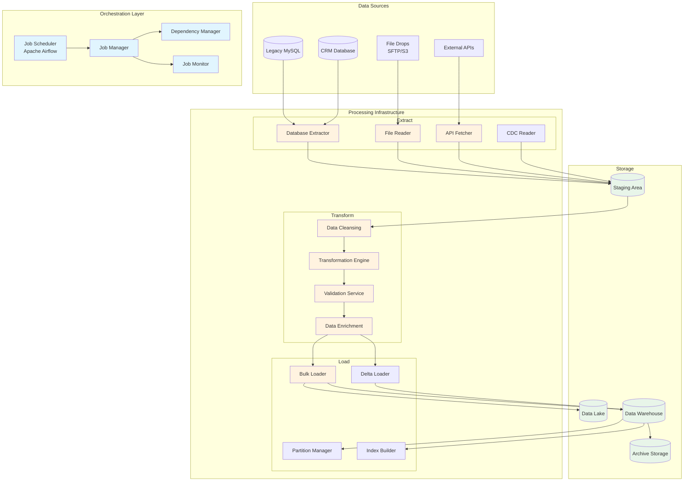

# Batch Processing for Large Data Transfers

## Overview

Batch processing enables efficient handling of large-scale data transfers between systems, supporting scheduled synchronization, bulk updates, and data warehouse loading while minimizing system impact during peak hours.

## Batch Processing Architecture



## Batch Job Orchestration

### 1. Apache Airflow DAG Definition

```python
from airflow import DAG
from airflow.operators.python_operator import PythonOperator
from airflow.operators.bash_operator import BashOperator
from airflow.providers.mysql.operators.mysql import MySqlOperator
from airflow.providers.amazon.aws.transfers.sql_to_s3 import SqlToS3Operator
from airflow.utils.dates import days_ago
from datetime import datetime, timedelta
import pendulum

# Default arguments
default_args = {
    'owner': 'data-engineering',
    'depends_on_past': True,
    'start_date': pendulum.datetime(2024, 1, 1, tz="UTC"),
    'email': ['data-team@association.org'],
    'email_on_failure': True,
    'email_on_retry': False,
    'retries': 2,
    'retry_delay': timedelta(minutes=15),
    'sla': timedelta(hours=6)
}

# DAG definition
dag = DAG(
    'member_data_warehouse_sync',
    default_args=default_args,
    description='Daily member data synchronization to data warehouse',
    schedule_interval='0 2 * * *',  # 2 AM daily
    catchup=False,
    max_active_runs=1,
    tags=['production', 'data-warehouse', 'members']
)

# Task definitions
def check_source_systems(**context):
    """Verify source systems are available"""
    from utils.health_check import check_database_health
    
    systems = [
        {'name': 'legacy_mysql', 'conn_id': 'legacy_db'},
        {'name': 'crm_postgres', 'conn_id': 'crm_db'},
        {'name': 'payment_api', 'endpoint': 'https://payments.api/health'}
    ]
    
    for system in systems:
        if not check_database_health(system):
            raise Exception(f"Source system {system['name']} is not healthy")
    
    return True

def extract_member_data(**context):
    """Extract member data with incremental logic"""
    from utils.extractors import MemberDataExtractor
    
    execution_date = context['execution_date']
    last_sync = context['task_instance'].xcom_pull(
        task_ids='get_last_sync_timestamp',
        key='last_sync_timestamp'
    )
    
    extractor = MemberDataExtractor()
    
    # Extract changed records
    member_changes = extractor.extract_changes(
        from_timestamp=last_sync,
        to_timestamp=execution_date,
        chunk_size=10000
    )
    
    # Store in staging
    staging_path = f"s3://data-staging/members/{execution_date}/raw/"
    extractor.save_to_staging(member_changes, staging_path)
    
    # Return metrics
    return {
        'record_count': len(member_changes),
        'staging_path': staging_path,
        'extraction_time': extractor.get_duration()
    }

def transform_member_data(**context):
    """Transform and cleanse member data"""
    from utils.transformers import MemberDataTransformer
    
    staging_path = context['task_instance'].xcom_pull(
        task_ids='extract_members',
        key='staging_path'
    )
    
    transformer = MemberDataTransformer()
    
    # Apply transformations
    transformed_data = transformer.transform(
        input_path=staging_path,
        transformations=[
            'normalize_phone_numbers',
            'validate_emails',
            'standardize_addresses',
            'calculate_membership_tenure',
            'derive_lifetime_value',
            'flag_data_quality_issues'
        ]
    )
    
    # Data quality checks
    quality_report = transformer.run_quality_checks(transformed_data)
    
    if quality_report['error_rate'] > 0.05:  # 5% threshold
        raise Exception(f"Data quality below threshold: {quality_report}")
    
    # Save transformed data
    output_path = f"s3://data-staging/members/{context['execution_date']}/transformed/"
    transformer.save_transformed(transformed_data, output_path)
    
    return {
        'transformed_count': len(transformed_data),
        'quality_report': quality_report,
        'output_path': output_path
    }

def load_to_warehouse(**context):
    """Load data to data warehouse"""
    from utils.loaders import WarehouseLoader
    
    transformed_path = context['task_instance'].xcom_pull(
        task_ids='transform_members',
        key='output_path'
    )
    
    loader = WarehouseLoader(conn_id='data_warehouse')
    
    # Load to staging tables first
    staging_table = f"staging.members_{context['ds_nodash']}"
    loader.create_staging_table(staging_table)
    loader.bulk_load(
        source_path=transformed_path,
        target_table=staging_table,
        format='parquet',
        compression='snappy'
    )
    
    # Merge into production tables
    merge_sql = f"""
    MERGE INTO dim_members AS target
    USING {staging_table} AS source
    ON target.member_id = source.member_id
    WHEN MATCHED AND source.updated_at > target.updated_at THEN
        UPDATE SET
            first_name = source.first_name,
            last_name = source.last_name,
            email = source.email,
            membership_status = source.membership_status,
            updated_at = source.updated_at,
            etl_timestamp = CURRENT_TIMESTAMP
    WHEN NOT MATCHED THEN
        INSERT (member_id, first_name, last_name, email, 
                membership_status, created_at, updated_at, etl_timestamp)
        VALUES (source.member_id, source.first_name, source.last_name,
                source.email, source.membership_status, source.created_at,
                source.updated_at, CURRENT_TIMESTAMP);
    """
    
    merge_result = loader.execute_merge(merge_sql)
    
    # Update fact tables
    loader.update_fact_tables(staging_table)
    
    # Clean up staging
    loader.drop_staging_table(staging_table)
    
    return {
        'rows_inserted': merge_result['inserted'],
        'rows_updated': merge_result['updated'],
        'load_duration': loader.get_duration()
    }

# Define tasks
health_check = PythonOperator(
    task_id='check_source_systems',
    python_callable=check_source_systems,
    dag=dag
)

get_last_sync = MySqlOperator(
    task_id='get_last_sync_timestamp',
    mysql_conn_id='metadata_db',
    sql="""
    SELECT MAX(sync_timestamp) as last_sync_timestamp
    FROM etl_metadata.sync_history
    WHERE job_name = 'member_data_warehouse_sync'
    AND status = 'SUCCESS';
    """,
    dag=dag
)

extract_members = PythonOperator(
    task_id='extract_members',
    python_callable=extract_member_data,
    pool='legacy_db_pool',  # Resource pool for legacy DB
    dag=dag
)

transform_members = PythonOperator(
    task_id='transform_members',
    python_callable=transform_member_data,
    dag=dag
)

load_warehouse = PythonOperator(
    task_id='load_to_warehouse',
    python_callable=load_to_warehouse,
    pool='warehouse_loader_pool',
    dag=dag
)

update_metadata = MySqlOperator(
    task_id='update_sync_metadata',
    mysql_conn_id='metadata_db',
    sql="""
    INSERT INTO etl_metadata.sync_history 
    (job_name, sync_timestamp, status, records_processed, duration_seconds)
    VALUES (
        'member_data_warehouse_sync',
        '{{ ds }}',
        'SUCCESS',
        {{ ti.xcom_pull(task_ids='load_to_warehouse', key='rows_inserted') + 
           ti.xcom_pull(task_ids='load_to_warehouse', key='rows_updated') }},
        {{ ti.duration }}
    );
    """,
    dag=dag
)

# Data quality report
generate_report = BashOperator(
    task_id='generate_quality_report',
    bash_command="""
    python /opt/airflow/scripts/generate_dq_report.py \
        --date {{ ds }} \
        --job member_data_warehouse_sync \
        --output s3://reports/data-quality/{{ ds }}/member_sync_report.html
    """,
    dag=dag
)

# Define dependencies
health_check >> get_last_sync >> extract_members
extract_members >> transform_members >> load_warehouse
load_warehouse >> [update_metadata, generate_report]
```

### 2. Batch Processing Patterns

#### Chunked Processing Pattern

```python
class ChunkedBatchProcessor:
    def __init__(self, chunk_size=10000, parallel_workers=4):
        self.chunk_size = chunk_size
        self.parallel_workers = parallel_workers
        self.progress_tracker = ProgressTracker()
    
    def process_large_dataset(self, source_query, process_func, target_table):
        """Process large dataset in chunks"""
        total_records = self.get_record_count(source_query)
        total_chunks = math.ceil(total_records / self.chunk_size)
        
        logger.info(f"Processing {total_records} records in {total_chunks} chunks")
        
        with ThreadPoolExecutor(max_workers=self.parallel_workers) as executor:
            futures = []
            
            for chunk_num in range(total_chunks):
                offset = chunk_num * self.chunk_size
                
                chunk_future = executor.submit(
                    self._process_chunk,
                    source_query,
                    process_func,
                    target_table,
                    offset,
                    self.chunk_size,
                    chunk_num
                )
                futures.append(chunk_future)
            
            # Wait for completion and handle results
            for future in as_completed(futures):
                try:
                    result = future.result()
                    self.progress_tracker.update(result['processed_count'])
                    logger.info(f"Chunk {result['chunk_num']} completed: "
                              f"{result['processed_count']} records")
                except Exception as e:
                    logger.error(f"Chunk processing failed: {e}")
                    raise
        
        return self.progress_tracker.get_summary()
    
    def _process_chunk(self, query, process_func, target, offset, limit, chunk_num):
        """Process individual chunk"""
        chunk_query = f"{query} LIMIT {limit} OFFSET {offset}"
        
        # Extract chunk
        with get_db_connection() as conn:
            chunk_data = pd.read_sql(chunk_query, conn)
        
        # Process chunk
        processed_data = process_func(chunk_data)
        
        # Load chunk
        self._load_chunk(processed_data, target, chunk_num)
        
        return {
            'chunk_num': chunk_num,
            'processed_count': len(processed_data),
            'success': True
        }
```

#### Delta Processing Pattern

```python
class DeltaProcessor:
    def __init__(self, tracking_table='etl_metadata.delta_tracking'):
        self.tracking_table = tracking_table
    
    def process_delta(self, source_table, target_table, key_columns, timestamp_column):
        """Process only changed records since last run"""
        
        # Get last successful sync point
        last_sync = self.get_last_sync_point(source_table, target_table)
        
        # Identify changes using multiple strategies
        changes = self.identify_changes(
            source_table, 
            target_table,
            key_columns,
            timestamp_column,
            last_sync
        )
        
        # Process different types of changes
        results = {
            'inserts': self.process_inserts(changes['new_records'], target_table),
            'updates': self.process_updates(changes['modified_records'], target_table),
            'deletes': self.process_deletes(changes['deleted_records'], target_table)
        }
        
        # Update tracking
        self.update_sync_point(source_table, target_table, changes['max_timestamp'])
        
        return results
    
    def identify_changes(self, source, target, keys, ts_column, last_sync):
        """Identify inserted, updated, and deleted records"""
        
        # Build comparison query
        comparison_sql = f"""
        WITH source_data AS (
            SELECT {', '.join(keys)}, 
                   {ts_column},
                   MD5(CONCAT_WS('|', *)) as row_hash
            FROM {source}
            WHERE {ts_column} > '{last_sync}'
        ),
        target_data AS (
            SELECT {', '.join(keys)},
                   MD5(CONCAT_WS('|', *)) as row_hash
            FROM {target}
        )
        SELECT 
            s.{keys[0]},
            CASE 
                WHEN t.{keys[0]} IS NULL THEN 'INSERT'
                WHEN s.row_hash != t.row_hash THEN 'UPDATE'
            END as change_type,
            s.{ts_column}
        FROM source_data s
        LEFT JOIN target_data t ON {' AND '.join([f's.{k} = t.{k}' for k in keys])}
        WHERE t.{keys[0]} IS NULL OR s.row_hash != t.row_hash
        
        UNION ALL
        
        SELECT 
            t.{keys[0]},
            'DELETE' as change_type,
            CURRENT_TIMESTAMP as {ts_column}
        FROM target_data t
        LEFT JOIN source_data s ON {' AND '.join([f't.{k} = s.{k}' for k in keys])}
        WHERE s.{keys[0]} IS NULL
        """
        
        with get_db_connection() as conn:
            changes_df = pd.read_sql(comparison_sql, conn)
        
        return {
            'new_records': changes_df[changes_df['change_type'] == 'INSERT'],
            'modified_records': changes_df[changes_df['change_type'] == 'UPDATE'],
            'deleted_records': changes_df[changes_df['change_type'] == 'DELETE'],
            'max_timestamp': changes_df[ts_column].max()
        }
```

## Performance Optimization

### 1. Parallel Processing Configuration

```yaml
# Batch processing configuration
batch_processing:
  # Resource allocation
  resources:
    cpu_cores: 16
    memory_gb: 64
    temp_storage_gb: 500
  
  # Parallelism settings
  parallelism:
    max_parallel_extracts: 4
    max_parallel_transforms: 8
    max_parallel_loads: 2
    
  # Database connections
  connection_pools:
    source_db:
      min_connections: 2
      max_connections: 20
      connection_timeout: 30
    
    target_db:
      min_connections: 5
      max_connections: 50
      connection_timeout: 60
  
  # Chunk processing
  chunking:
    default_chunk_size: 10000
    max_chunk_size: 50000
    adaptive_sizing: true
    memory_threshold_mb: 1000
  
  # Compression
  compression:
    staging_files: gzip
    archive_files: bzip2
    network_transfer: lz4
```

### 2. Bulk Loading Optimization

```python
class OptimizedBulkLoader:
    def __init__(self, target_db, config):
        self.target_db = target_db
        self.config = config
    
    def bulk_load_partitioned(self, source_files, target_table):
        """Optimized bulk loading with partitioning"""
        
        # Prepare target table
        self.prepare_target_table(target_table)
        
        # Disable constraints for faster loading
        with self.target_db.transaction() as txn:
            txn.execute(f"ALTER TABLE {target_table} DISABLE TRIGGER ALL")
            txn.execute(f"ALTER TABLE {target_table} SET UNLOGGED")
        
        try:
            # Parallel load by partition
            with ProcessPoolExecutor(max_workers=self.config['parallel_loads']) as executor:
                futures = []
                
                for partition_key, files in self.partition_files(source_files).items():
                    future = executor.submit(
                        self._load_partition,
                        files,
                        target_table,
                        partition_key
                    )
                    futures.append(future)
                
                # Wait for all loads to complete
                for future in as_completed(futures):
                    result = future.result()
                    logger.info(f"Loaded partition {result['partition']}: "
                              f"{result['rows_loaded']} rows")
            
            # Re-enable constraints and rebuild indexes
            self.finalize_table(target_table)
            
        except Exception as e:
            logger.error(f"Bulk load failed: {e}")
            self.rollback_changes(target_table)
            raise
    
    def _load_partition(self, files, table, partition):
        """Load single partition using COPY command"""
        
        # Create temporary table for partition
        temp_table = f"{table}_temp_{partition}"
        self.create_temp_table(temp_table, table)
        
        # Use COPY for fast loading
        for file_path in files:
            copy_sql = f"""
            COPY {temp_table} 
            FROM '{file_path}'
            WITH (
                FORMAT CSV,
                DELIMITER ',',
                HEADER true,
                ENCODING 'UTF8',
                QUOTE '"',
                NULL '',
                FORCE_NOT_NULL {', '.join(self.get_not_null_columns(table))}
            )
            """
            
            with self.target_db.connection() as conn:
                conn.execute(copy_sql)
        
        # Move from temp to final table
        insert_sql = f"""
        INSERT INTO {table} 
        SELECT * FROM {temp_table}
        ON CONFLICT ({', '.join(self.get_primary_keys(table))})
        DO UPDATE SET
            {', '.join([f"{col} = EXCLUDED.{col}" 
                       for col in self.get_updatable_columns(table)])}
        """
        
        rows_affected = self.target_db.execute(insert_sql)
        
        # Clean up
        self.target_db.execute(f"DROP TABLE {temp_table}")
        
        return {
            'partition': partition,
            'rows_loaded': rows_affected
        }
```

### 3. Memory-Efficient Processing

```python
class MemoryEfficientProcessor:
    def __init__(self, memory_limit_mb=1000):
        self.memory_limit_mb = memory_limit_mb
        self.current_memory_mb = 0
    
    def process_with_spilling(self, input_iterator, process_func, output_path):
        """Process data with automatic spilling to disk when memory limit reached"""
        
        buffer = []
        spill_files = []
        
        for record in input_iterator:
            # Process record
            processed = process_func(record)
            buffer.append(processed)
            
            # Estimate memory usage
            self.current_memory_mb = self.estimate_memory_usage(buffer)
            
            # Spill to disk if needed
            if self.current_memory_mb >= self.memory_limit_mb:
                spill_file = self.spill_to_disk(buffer)
                spill_files.append(spill_file)
                buffer = []
                self.current_memory_mb = 0
        
        # Final spill if buffer has data
        if buffer:
            spill_file = self.spill_to_disk(buffer)
            spill_files.append(spill_file)
        
        # Merge spill files
        self.merge_spill_files(spill_files, output_path)
        
        # Cleanup
        for spill_file in spill_files:
            os.remove(spill_file)
    
    def spill_to_disk(self, buffer):
        """Write buffer to temporary file"""
        spill_file = tempfile.mktemp(suffix='.parquet')
        
        df = pd.DataFrame(buffer)
        df.to_parquet(
            spill_file,
            engine='pyarrow',
            compression='snappy',
            index=False
        )
        
        logger.debug(f"Spilled {len(buffer)} records to {spill_file}")
        return spill_file
    
    def merge_spill_files(self, spill_files, output_path):
        """Merge multiple spill files into final output"""
        
        # Use generator to avoid loading all data at once
        def read_spills():
            for spill_file in spill_files:
                df = pd.read_parquet(spill_file)
                yield df
        
        # Write merged output
        first = True
        for df_chunk in read_spills():
            df_chunk.to_parquet(
                output_path,
                engine='pyarrow',
                compression='snappy',
                index=False,
                append=not first
            )
            first = False
```

## Error Handling and Recovery

### 1. Batch Job Error Handling

```python
class BatchJobErrorHandler:
    def __init__(self, job_name, alert_config):
        self.job_name = job_name
        self.alert_config = alert_config
        self.error_threshold = 0.05  # 5% error rate threshold
    
    def handle_batch_errors(self, batch_results):
        """Comprehensive error handling for batch jobs"""
        
        error_summary = self.analyze_errors(batch_results)
        
        # Determine severity and action
        if error_summary['error_rate'] > self.error_threshold:
            self.handle_critical_failure(error_summary)
        elif error_summary['error_count'] > 0:
            self.handle_partial_failure(error_summary)
        else:
            self.log_success(batch_results)
    
    def analyze_errors(self, results):
        """Analyze and categorize errors"""
        
        errors_by_type = {}
        total_records = results['total_records']
        error_records = []
        
        for error in results.get('errors', []):
            error_type = self.categorize_error(error)
            errors_by_type[error_type] = errors_by_type.get(error_type, 0) + 1
            error_records.append({
                'record_id': error.get('record_id'),
                'error_type': error_type,
                'error_message': str(error.get('exception')),
                'timestamp': datetime.utcnow()
            })
        
        return {
            'error_count': len(error_records),
            'error_rate': len(error_records) / total_records if total_records > 0 else 0,
            'errors_by_type': errors_by_type,
            'error_records': error_records,
            'total_records': total_records
        }
    
    def handle_critical_failure(self, error_summary):
        """Handle critical batch failures"""
        
        # Stop further processing
        self.set_job_status('FAILED')
        
        # Store error details
        self.persist_error_records(error_summary['error_records'])
        
        # Send alerts
        self.send_critical_alert(error_summary)
        
        # Initiate recovery if configured
        if self.alert_config.get('auto_recovery'):
            self.initiate_recovery(error_summary)
        
        raise BatchJobFailure(f"Batch job failed with {error_summary['error_rate']:.2%} error rate")
    
    def handle_partial_failure(self, error_summary):
        """Handle partial failures with error records"""
        
        # Continue processing but flag for review
        self.set_job_status('COMPLETED_WITH_ERRORS')
        
        # Store error records for reprocessing
        error_queue = self.queue_error_records(error_summary['error_records'])
        
        # Send warning alert
        self.send_warning_alert(error_summary, error_queue)
        
        # Schedule reprocessing
        self.schedule_error_reprocessing(error_queue)
    
    def categorize_error(self, error):
        """Categorize errors for appropriate handling"""
        
        error_message = str(error.get('exception', ''))
        
        if 'constraint violation' in error_message.lower():
            return 'DATA_INTEGRITY_ERROR'
        elif 'connection' in error_message.lower():
            return 'CONNECTION_ERROR'
        elif 'timeout' in error_message.lower():
            return 'TIMEOUT_ERROR'
        elif 'permission' in error_message.lower():
            return 'PERMISSION_ERROR'
        elif 'format' in error_message.lower() or 'parsing' in error_message.lower():
            return 'FORMAT_ERROR'
        else:
            return 'UNKNOWN_ERROR'
```

### 2. Checkpoint and Recovery

```python
class CheckpointManager:
    def __init__(self, job_id, checkpoint_store):
        self.job_id = job_id
        self.checkpoint_store = checkpoint_store
    
    def create_checkpoint(self, state, metadata=None):
        """Create checkpoint for current processing state"""
        
        checkpoint = {
            'job_id': self.job_id,
            'checkpoint_id': str(uuid.uuid4()),
            'timestamp': datetime.utcnow(),
            'state': state,
            'metadata': metadata or {}
        }
        
        # Persist checkpoint
        self.checkpoint_store.save(checkpoint)
        
        # Keep only recent checkpoints
        self.cleanup_old_checkpoints()
        
        return checkpoint['checkpoint_id']
    
    def restore_from_checkpoint(self, checkpoint_id=None):
        """Restore processing state from checkpoint"""
        
        if checkpoint_id:
            checkpoint = self.checkpoint_store.get(checkpoint_id)
        else:
            # Get latest checkpoint
            checkpoint = self.checkpoint_store.get_latest(self.job_id)
        
        if not checkpoint:
            return None
        
        logger.info(f"Restoring from checkpoint {checkpoint['checkpoint_id']} "
                   f"created at {checkpoint['timestamp']}")
        
        return checkpoint['state']
    
    def create_incremental_checkpoint(self, batch_num, processed_count, last_key):
        """Create checkpoint after processing each batch"""
        
        state = {
            'batch_num': batch_num,
            'processed_count': processed_count,
            'last_processed_key': last_key,
            'partial_results_path': f"s3://checkpoints/{self.job_id}/batch_{batch_num}/"
        }
        
        return self.create_checkpoint(state, {
            'checkpoint_type': 'incremental',
            'batch_size': self.batch_size
        })
```

## Monitoring and Alerting

### 1. Batch Job Monitoring Dashboard

```python
# Grafana dashboard configuration for batch processing
dashboard_config = {
    "title": "Batch Processing Monitor",
    "panels": [
        {
            "title": "Job Execution Timeline",
            "type": "gantt",
            "targets": [{
                "query": """
                SELECT job_name, start_time, end_time, status
                FROM batch_job_history
                WHERE start_time > now() - interval '24 hours'
                ORDER BY start_time DESC
                """
            }]
        },
        {
            "title": "Processing Throughput",
            "type": "graph",
            "targets": [{
                "expr": "rate(batch_records_processed_total[5m])"
            }]
        },
        {
            "title": "Error Rate by Job",
            "type": "heatmap",
            "targets": [{
                "expr": """
                sum(rate(batch_errors_total[1h])) by (job_name) /
                sum(rate(batch_records_total[1h])) by (job_name)
                """
            }]
        },
        {
            "title": "Resource Utilization",
            "type": "gauge",
            "targets": [
                {"expr": "batch_cpu_usage_percent"},
                {"expr": "batch_memory_usage_percent"},
                {"expr": "batch_disk_io_usage_percent"}
            ]
        },
        {
            "title": "Queue Depth",
            "type": "stat",
            "targets": [{
                "expr": "batch_queue_depth"
            }]
        }
    ]
}
```

### 2. SLA Monitoring

```python
class SLAMonitor:
    def __init__(self, sla_config):
        self.sla_config = sla_config
    
    def check_sla_compliance(self, job_name, execution_metrics):
        """Check if job execution meets SLA requirements"""
        
        sla = self.sla_config.get(job_name, {})
        violations = []
        
        # Check completion time SLA
        if 'max_duration_hours' in sla:
            duration_hours = execution_metrics['duration_seconds'] / 3600
            if duration_hours > sla['max_duration_hours']:
                violations.append({
                    'type': 'DURATION_EXCEEDED',
                    'expected': sla['max_duration_hours'],
                    'actual': duration_hours,
                    'severity': 'HIGH'
                })
        
        # Check data freshness SLA
        if 'max_data_lag_hours' in sla:
            data_lag_hours = execution_metrics['data_lag_seconds'] / 3600
            if data_lag_hours > sla['max_data_lag_hours']:
                violations.append({
                    'type': 'DATA_FRESHNESS',
                    'expected': sla['max_data_lag_hours'],
                    'actual': data_lag_hours,
                    'severity': 'MEDIUM'
                })
        
        # Check error rate SLA
        if 'max_error_rate' in sla:
            if execution_metrics['error_rate'] > sla['max_error_rate']:
                violations.append({
                    'type': 'ERROR_RATE_EXCEEDED',
                    'expected': sla['max_error_rate'],
                    'actual': execution_metrics['error_rate'],
                    'severity': 'HIGH'
                })
        
        # Check data quality SLA
        if 'min_quality_score' in sla:
            if execution_metrics['quality_score'] < sla['min_quality_score']:
                violations.append({
                    'type': 'QUALITY_BELOW_THRESHOLD',
                    'expected': sla['min_quality_score'],
                    'actual': execution_metrics['quality_score'],
                    'severity': 'MEDIUM'
                })
        
        return {
            'compliant': len(violations) == 0,
            'violations': violations,
            'job_name': job_name,
            'execution_time': execution_metrics['execution_time']
        }
```

## Best Practices

### 1. Batch Processing Guidelines

- **Scheduling**: Run intensive batch jobs during off-peak hours
- **Chunking**: Process data in manageable chunks to avoid memory issues
- **Parallelism**: Utilize parallel processing for independent operations
- **Checkpointing**: Implement checkpoints for long-running jobs
- **Monitoring**: Set up comprehensive monitoring and alerting
- **Error Handling**: Implement robust error handling and recovery
- **Data Validation**: Validate data quality at each stage
- **Resource Management**: Monitor and optimize resource usage
- **Documentation**: Maintain clear documentation of batch processes
- **Testing**: Thoroughly test batch jobs with production-like data volumes

### 2. Performance Tuning Checklist

- [ ] Optimize database queries with proper indexing
- [ ] Use bulk operations instead of row-by-row processing
- [ ] Implement connection pooling
- [ ] Enable compression for data transfers
- [ ] Partition large tables for parallel processing
- [ ] Use columnar storage formats (Parquet, ORC)
- [ ] Implement data caching where appropriate
- [ ] Monitor and tune garbage collection
- [ ] Use appropriate batch sizes based on data volume
- [ ] Consider using specialized ETL tools for complex transformations