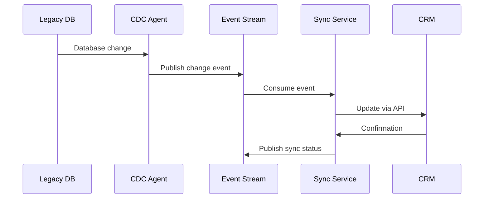
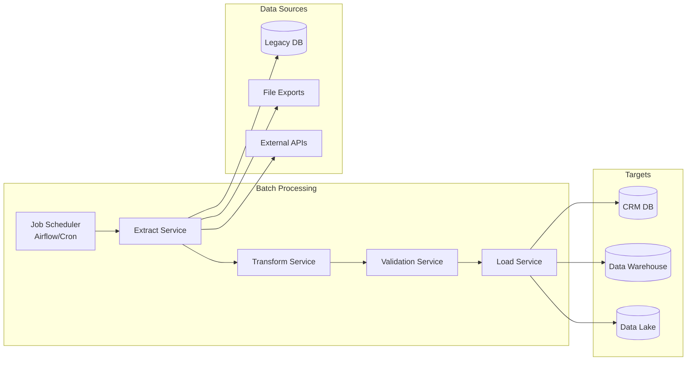
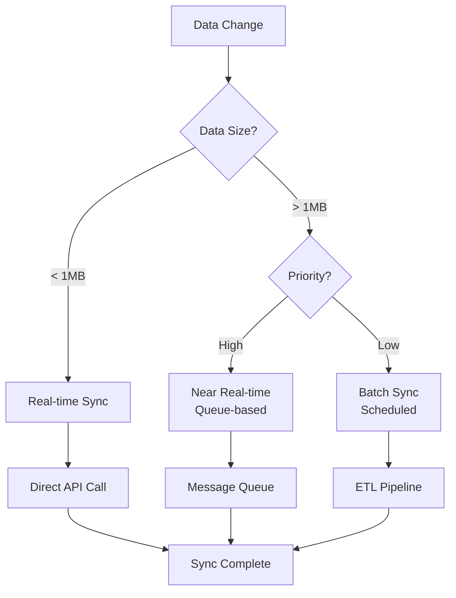
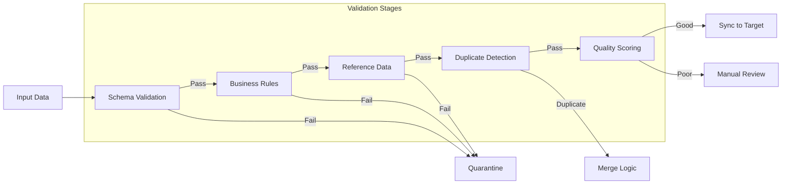
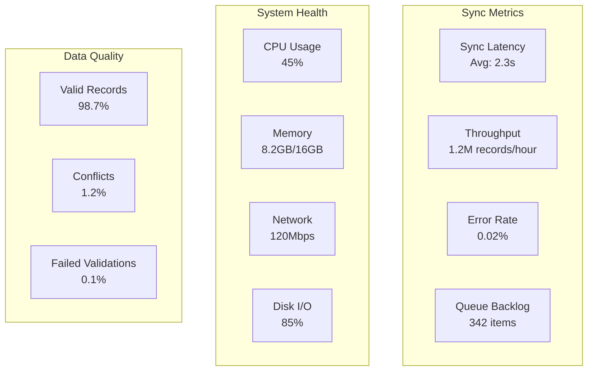

# Data Synchronization Strategies

## Overview

Data synchronization between legacy systems and modern CRM platforms requires careful planning to ensure data consistency, minimize latency, and prevent data loss. This document outlines comprehensive strategies for various synchronization scenarios.

## Synchronization Patterns

### 1. Real-Time Synchronization

#### Event-Driven Sync Using CDC (Change Data Capture)


#### Implementation Example (Debezium + Kafka)
```yaml
# Debezium connector configuration
{
  "name": "legacy-mysql-connector",
  "config": {
    "connector.class": "io.debezium.connector.mysql.MySqlConnector",
    "database.hostname": "legacy-db.internal",
    "database.port": "3306",
    "database.user": "debezium",
    "database.password": "${DB_PASSWORD}",
    "database.server.id": "184054",
    "database.server.name": "legacy-platform",
    "database.whitelist": "members_db",
    "table.whitelist": "members_db.members,members_db.memberships",
    "database.history.kafka.bootstrap.servers": "kafka:9092",
    "database.history.kafka.topic": "schema-changes.members",
    "transforms": "route",
    "transforms.route.type": "org.apache.kafka.connect.transforms.RegexRouter",
    "transforms.route.regex": "([^.]+)\\.([^.]+)\\.([^.]+)",
    "transforms.route.replacement": "sync.$3"
  }
}
```

### 2. Batch Synchronization

#### Scheduled Batch Sync Architecture


#### Batch Job Configuration
```python
# Apache Airflow DAG for member synchronization
from airflow import DAG
from airflow.operators.python_operator import PythonOperator
from datetime import datetime, timedelta

default_args = {
    'owner': 'data-team',
    'depends_on_past': False,
    'start_date': datetime(2024, 1, 1),
    'email_on_failure': True,
    'email_on_retry': False,
    'retries': 3,
    'retry_delay': timedelta(minutes=5)
}

dag = DAG(
    'member_sync_batch',
    default_args=default_args,
    description='Batch sync members from legacy to CRM',
    schedule_interval='0 2 * * *',  # Daily at 2 AM
    catchup=False
)

def extract_members(**context):
    """Extract member data from legacy system"""
    query = """
    SELECT m.*, ms.status, ms.expiry_date
    FROM members m
    JOIN memberships ms ON m.id = ms.member_id
    WHERE m.updated_at >= %s OR ms.updated_at >= %s
    """
    last_sync = context['task_instance'].xcom_pull(
        task_ids='get_last_sync_time'
    )
    # Implementation details...

def transform_members(**context):
    """Transform member data to CRM format"""
    members = context['task_instance'].xcom_pull(task_ids='extract_members')
    transformed = []
    for member in members:
        transformed.append({
            'contactId': member['id'],
            'firstName': member['first_name'],
            'lastName': member['last_name'],
            'email': member['email'],
            'membershipStatus': map_status(member['status']),
            'customFields': {
                'legacyId': member['id'],
                'memberType': member['member_type'],
                'joinDate': member['created_at']
            }
        })
    return transformed

def load_to_crm(**context):
    """Load transformed data to CRM"""
    members = context['task_instance'].xcom_pull(task_ids='transform_members')
    batch_size = 100
    for i in range(0, len(members), batch_size):
        batch = members[i:i+batch_size]
        response = crm_api.bulk_upsert('contacts', batch)
        # Handle response and errors...

# Define task dependencies
extract_task = PythonOperator(
    task_id='extract_members',
    python_callable=extract_members,
    dag=dag
)

transform_task = PythonOperator(
    task_id='transform_members',
    python_callable=transform_members,
    dag=dag
)

load_task = PythonOperator(
    task_id='load_to_crm',
    python_callable=load_to_crm,
    dag=dag
)

extract_task >> transform_task >> load_task
```

### 3. Hybrid Synchronization

#### Decision Matrix for Sync Strategy


## Data Consistency Strategies

### 1. Conflict Resolution

#### Last-Write-Wins Strategy
```json
{
  "conflictResolution": {
    "strategy": "last-write-wins",
    "timestampField": "updated_at",
    "timezone": "UTC"
  }
}
```

#### Source-of-Truth Strategy
```json
{
  "conflictResolution": {
    "strategy": "source-of-truth",
    "rules": [
      {
        "field": "email",
        "source": "CRM",
        "reason": "CRM handles email verification"
      },
      {
        "field": "membershipStatus",
        "source": "Legacy",
        "reason": "Legacy system processes payments"
      }
    ]
  }
}
```

#### Custom Merge Strategy
```python
def merge_member_records(legacy_record, crm_record):
    """Custom merge logic for member records"""
    merged = {}
    
    # Use CRM for contact info (more recently updated)
    if crm_record['updated_at'] > legacy_record['updated_at']:
        merged['email'] = crm_record['email']
        merged['phone'] = crm_record['phone']
    else:
        merged['email'] = legacy_record['email']
        merged['phone'] = legacy_record['phone']
    
    # Always use legacy for membership data (source of truth)
    merged['membershipStatus'] = legacy_record['membership_status']
    merged['expiryDate'] = legacy_record['expiry_date']
    
    # Merge custom fields
    merged['customFields'] = {
        **legacy_record.get('custom_fields', {}),
        **crm_record.get('customFields', {})
    }
    
    return merged
```

### 2. Data Quality Assurance

#### Validation Pipeline


#### Validation Rules Example
```python
class MemberValidator:
    def validate(self, member_data):
        errors = []
        
        # Schema validation
        if not self._is_valid_email(member_data.get('email')):
            errors.append({
                'field': 'email',
                'error': 'Invalid email format',
                'value': member_data.get('email')
            })
        
        # Business rule validation
        if member_data.get('memberType') == 'student':
            if not member_data.get('graduationDate'):
                errors.append({
                    'field': 'graduationDate',
                    'error': 'Required for student members'
                })
        
        # Reference data validation
        valid_chapters = self._get_valid_chapters()
        if member_data.get('chapterId') not in valid_chapters:
            errors.append({
                'field': 'chapterId',
                'error': 'Invalid chapter reference',
                'value': member_data.get('chapterId')
            })
        
        return errors
```

### 3. Incremental Sync Strategy

#### Change Tracking Methods

##### 1. Timestamp-based
```sql
-- Legacy system query
SELECT * FROM members 
WHERE updated_at > :last_sync_timestamp
OR deleted_at > :last_sync_timestamp
ORDER BY updated_at ASC
LIMIT 1000;
```

##### 2. Sequence-based
```sql
-- Using auto-increment ID or sequence
SELECT * FROM members 
WHERE id > :last_synced_id
ORDER BY id ASC
LIMIT 1000;
```

##### 3. Hash-based Change Detection
```python
def calculate_record_hash(record):
    """Calculate hash for change detection"""
    # Exclude volatile fields
    stable_fields = {k: v for k, v in record.items() 
                    if k not in ['updated_at', 'last_login']}
    
    # Create deterministic string representation
    record_string = json.dumps(stable_fields, sort_keys=True)
    
    # Calculate hash
    return hashlib.sha256(record_string.encode()).hexdigest()

def detect_changes(source_records, target_records):
    """Detect changed records using hash comparison"""
    source_hashes = {r['id']: calculate_record_hash(r) 
                    for r in source_records}
    target_hashes = {r['id']: calculate_record_hash(r) 
                    for r in target_records}
    
    changed = []
    for record_id, source_hash in source_hashes.items():
        if record_id not in target_hashes or \
           target_hashes[record_id] != source_hash:
            changed.append(record_id)
    
    return changed
```

## Synchronization Monitoring

### 1. Sync Health Dashboard


### 2. Monitoring Configuration
```yaml
# Prometheus monitoring rules
groups:
  - name: sync_monitoring
    interval: 30s
    rules:
      - record: sync_latency_p95
        expr: histogram_quantile(0.95, sync_duration_seconds_bucket)
      
      - record: sync_error_rate
        expr: rate(sync_errors_total[5m]) / rate(sync_attempts_total[5m])
      
      - alert: HighSyncLatency
        expr: sync_latency_p95 > 10
        for: 5m
        labels:
          severity: warning
        annotations:
          summary: "High sync latency detected"
          description: "95th percentile latency is {{ $value }}s"
      
      - alert: SyncBacklogGrowing
        expr: delta(sync_queue_size[10m]) > 1000
        for: 10m
        labels:
          severity: critical
        annotations:
          summary: "Sync backlog growing rapidly"
          description: "Queue size increased by {{ $value }} in 10 minutes"
```

## Recovery and Resilience

### 1. Failure Recovery Patterns

#### Circuit Breaker Implementation
```python
class SyncCircuitBreaker:
    def __init__(self, failure_threshold=5, recovery_timeout=60):
        self.failure_threshold = failure_threshold
        self.recovery_timeout = recovery_timeout
        self.failure_count = 0
        self.last_failure_time = None
        self.state = 'CLOSED'  # CLOSED, OPEN, HALF_OPEN
    
    def call(self, func, *args, **kwargs):
        if self.state == 'OPEN':
            if self._should_attempt_reset():
                self.state = 'HALF_OPEN'
            else:
                raise CircuitOpenError("Circuit breaker is OPEN")
        
        try:
            result = func(*args, **kwargs)
            self._on_success()
            return result
        except Exception as e:
            self._on_failure()
            raise e
    
    def _on_success(self):
        self.failure_count = 0
        self.state = 'CLOSED'
    
    def _on_failure(self):
        self.failure_count += 1
        self.last_failure_time = time.time()
        if self.failure_count >= self.failure_threshold:
            self.state = 'OPEN'
    
    def _should_attempt_reset(self):
        return (time.time() - self.last_failure_time) >= self.recovery_timeout
```

#### Retry Strategy
```python
@retry(
    stop=stop_after_attempt(3),
    wait=wait_exponential(multiplier=1, min=4, max=60),
    retry=retry_if_exception_type((ConnectionError, TimeoutError)),
    before_sleep=log_retry_attempt
)
def sync_record_to_crm(record):
    """Sync single record with retry logic"""
    response = crm_api.upsert('contact', record)
    if response.status_code not in [200, 201]:
        raise SyncError(f"Failed to sync: {response.text}")
    return response.json()
```

### 2. Data Recovery Procedures

#### Point-in-Time Recovery
```sql
-- Create sync checkpoint
INSERT INTO sync_checkpoints (
    checkpoint_id,
    source_system,
    target_system,
    last_synced_id,
    last_sync_timestamp,
    record_count,
    checksum
) VALUES (
    UUID(),
    'legacy_platform',
    'salesforce',
    384291,
    '2024-01-20 14:30:00',
    15234,
    'a3f5e8d2c9b4'
);

-- Restore from checkpoint
SELECT * FROM sync_checkpoints
WHERE source_system = 'legacy_platform'
AND target_system = 'salesforce'
AND checkpoint_timestamp <= '2024-01-20 12:00:00'
ORDER BY checkpoint_timestamp DESC
LIMIT 1;
```

## Best Practices

### 1. Sync Performance Optimization
- Use bulk APIs when available
- Implement connection pooling
- Compress data transfers
- Parallelize independent sync operations
- Cache frequently accessed reference data

### 2. Data Governance
- Maintain data lineage tracking
- Implement audit trails for all changes
- Document field mappings and transformations
- Regular data quality assessments
- Privacy compliance (GDPR, CCPA)

### 3. Operational Excellence
- Automated monitoring and alerting
- Regular sync performance reviews
- Disaster recovery testing
- Documentation and runbooks
- On-call rotation for critical systems