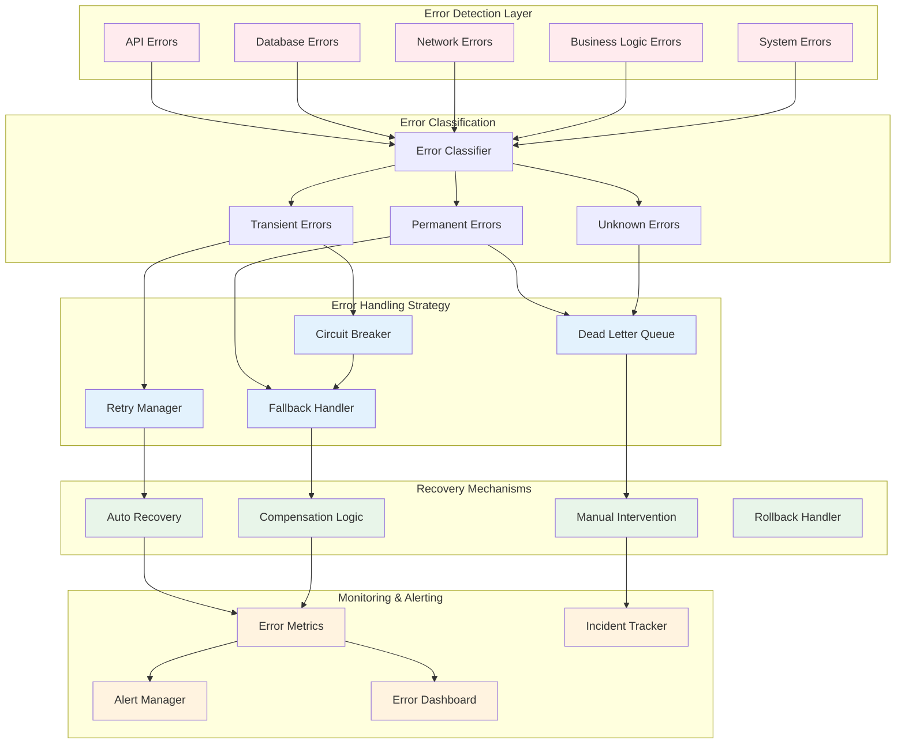

# Error Handling and Retry Mechanisms

## Overview

Robust error handling and retry mechanisms are essential for maintaining reliability and resilience in distributed integration architectures. This document outlines comprehensive strategies for handling failures, implementing retry logic, and ensuring system recovery.

## Error Handling Architecture



## Error Classification and Handling

### 1. Error Taxonomy

```python
from enum import Enum
from dataclasses import dataclass
from typing import Optional, Dict, Any

class ErrorCategory(Enum):
    TRANSIENT = "transient"
    PERMANENT = "permanent"
    UNKNOWN = "unknown"

class ErrorType(Enum):
    # Network errors
    CONNECTION_TIMEOUT = ("connection_timeout", ErrorCategory.TRANSIENT)
    CONNECTION_REFUSED = ("connection_refused", ErrorCategory.TRANSIENT)
    DNS_RESOLUTION = ("dns_resolution", ErrorCategory.TRANSIENT)
    NETWORK_UNREACHABLE = ("network_unreachable", ErrorCategory.TRANSIENT)
    
    # API errors
    RATE_LIMIT_EXCEEDED = ("rate_limit_exceeded", ErrorCategory.TRANSIENT)
    SERVICE_UNAVAILABLE = ("service_unavailable", ErrorCategory.TRANSIENT)
    GATEWAY_TIMEOUT = ("gateway_timeout", ErrorCategory.TRANSIENT)
    BAD_REQUEST = ("bad_request", ErrorCategory.PERMANENT)
    UNAUTHORIZED = ("unauthorized", ErrorCategory.PERMANENT)
    FORBIDDEN = ("forbidden", ErrorCategory.PERMANENT)
    NOT_FOUND = ("not_found", ErrorCategory.PERMANENT)
    
    # Database errors
    DB_CONNECTION_LOST = ("db_connection_lost", ErrorCategory.TRANSIENT)
    DB_DEADLOCK = ("db_deadlock", ErrorCategory.TRANSIENT)
    DB_CONSTRAINT_VIOLATION = ("db_constraint_violation", ErrorCategory.PERMANENT)
    DB_SYNTAX_ERROR = ("db_syntax_error", ErrorCategory.PERMANENT)
    
    # Business logic errors
    VALIDATION_ERROR = ("validation_error", ErrorCategory.PERMANENT)
    BUSINESS_RULE_VIOLATION = ("business_rule_violation", ErrorCategory.PERMANENT)
    INSUFFICIENT_FUNDS = ("insufficient_funds", ErrorCategory.PERMANENT)
    DUPLICATE_REQUEST = ("duplicate_request", ErrorCategory.PERMANENT)
    
    # System errors
    OUT_OF_MEMORY = ("out_of_memory", ErrorCategory.TRANSIENT)
    DISK_FULL = ("disk_full", ErrorCategory.TRANSIENT)
    PROCESS_CRASHED = ("process_crashed", ErrorCategory.TRANSIENT)
    CONFIGURATION_ERROR = ("configuration_error", ErrorCategory.PERMANENT)

@dataclass
class ErrorContext:
    error_type: ErrorType
    error_code: str
    message: str
    timestamp: datetime
    service: str
    operation: str
    correlation_id: str
    request_data: Optional[Dict[str, Any]] = None
    stack_trace: Optional[str] = None
    retry_count: int = 0
    metadata: Dict[str, Any] = None

class ErrorClassifier:
    def __init__(self):
        self.patterns = self._build_error_patterns()
    
    def classify_error(self, exception: Exception, context: Dict[str, Any]) -> ErrorContext:
        """Classify an error based on exception type and message"""
        
        error_type = self._identify_error_type(exception)
        
        return ErrorContext(
            error_type=error_type,
            error_code=self._generate_error_code(error_type),
            message=str(exception),
            timestamp=datetime.utcnow(),
            service=context.get('service', 'unknown'),
            operation=context.get('operation', 'unknown'),
            correlation_id=context.get('correlation_id', str(uuid.uuid4())),
            request_data=context.get('request_data'),
            stack_trace=traceback.format_exc(),
            metadata=self._extract_metadata(exception)
        )
    
    def _identify_error_type(self, exception: Exception) -> ErrorType:
        """Identify error type based on exception"""
        
        # Check exception type
        if isinstance(exception, ConnectionError):
            return ErrorType.CONNECTION_REFUSED
        elif isinstance(exception, TimeoutError):
            return ErrorType.CONNECTION_TIMEOUT
        elif isinstance(exception, ValidationError):
            return ErrorType.VALIDATION_ERROR
        
        # Check error message patterns
        error_message = str(exception).lower()
        
        for pattern, error_type in self.patterns.items():
            if pattern in error_message:
                return error_type
        
        # Default to unknown
        return ErrorType.UNKNOWN
    
    def _build_error_patterns(self) -> Dict[str, ErrorType]:
        """Build patterns for error message matching"""
        return {
            'timeout': ErrorType.CONNECTION_TIMEOUT,
            'connection refused': ErrorType.CONNECTION_REFUSED,
            'rate limit': ErrorType.RATE_LIMIT_EXCEEDED,
            '503': ErrorType.SERVICE_UNAVAILABLE,
            '504': ErrorType.GATEWAY_TIMEOUT,
            'deadlock': ErrorType.DB_DEADLOCK,
            'constraint violation': ErrorType.DB_CONSTRAINT_VIOLATION,
            'out of memory': ErrorType.OUT_OF_MEMORY,
            'disk full': ErrorType.DISK_FULL
        }
```

### 2. Error Handling Strategies

```python
class ErrorHandler:
    def __init__(self, retry_config, circuit_breaker_config, dlq_config):
        self.retry_manager = RetryManager(retry_config)
        self.circuit_breaker = CircuitBreaker(circuit_breaker_config)
        self.dlq_handler = DeadLetterQueueHandler(dlq_config)
        self.error_classifier = ErrorClassifier()
        self.metrics_collector = MetricsCollector()
    
    async def handle_error(self, exception: Exception, context: Dict[str, Any], 
                          operation_func, *args, **kwargs):
        """Main error handling entry point"""
        
        # Classify the error
        error_context = self.error_classifier.classify_error(exception, context)
        
        # Record metrics
        self.metrics_collector.record_error(error_context)
        
        # Determine handling strategy based on error category
        if error_context.error_type.value[1] == ErrorCategory.TRANSIENT:
            return await self._handle_transient_error(
                error_context, operation_func, *args, **kwargs
            )
        elif error_context.error_type.value[1] == ErrorCategory.PERMANENT:
            return await self._handle_permanent_error(error_context)
        else:
            return await self._handle_unknown_error(error_context)
    
    async def _handle_transient_error(self, error_context, operation_func, 
                                     *args, **kwargs):
        """Handle transient errors with retry logic"""
        
        # Check circuit breaker state
        if self.circuit_breaker.is_open(error_context.service):
            logger.warning(f"Circuit breaker open for {error_context.service}")
            return await self._execute_fallback(error_context)
        
        # Attempt retry
        try:
            result = await self.retry_manager.execute_with_retry(
                operation_func,
                error_context,
                *args,
                **kwargs
            )
            
            # Success - notify circuit breaker
            self.circuit_breaker.record_success(error_context.service)
            return result
            
        except MaxRetriesExceeded:
            # Retries exhausted
            self.circuit_breaker.record_failure(error_context.service)
            await self.dlq_handler.send_to_dlq(error_context)
            return await self._execute_fallback(error_context)
    
    async def _handle_permanent_error(self, error_context):
        """Handle permanent errors - no retry"""
        
        logger.error(f"Permanent error detected: {error_context.error_type}")
        
        # Send to DLQ immediately
        await self.dlq_handler.send_to_dlq(error_context)
        
        # Execute fallback or compensation
        return await self._execute_fallback(error_context)
    
    async def _handle_unknown_error(self, error_context):
        """Handle unknown errors conservatively"""
        
        logger.warning(f"Unknown error type: {error_context.message}")
        
        # Attempt limited retries
        error_context.metadata = {'max_retries': 2}
        
        try:
            return await self.retry_manager.execute_with_retry(
                operation_func,
                error_context,
                *args,
                **kwargs
            )
        except:
            await self.dlq_handler.send_to_dlq(error_context)
            return await self._execute_fallback(error_context)
    
    async def _execute_fallback(self, error_context):
        """Execute fallback logic based on error type"""
        
        fallback_strategies = {
            'api_call': self._api_fallback,
            'database_operation': self._database_fallback,
            'payment_processing': self._payment_fallback,
            'notification': self._notification_fallback
        }
        
        strategy = fallback_strategies.get(
            error_context.operation,
            self._default_fallback
        )
        
        return await strategy(error_context)
```

## Retry Mechanisms

### 1. Retry Strategy Implementation

```python
class RetryStrategy(ABC):
    @abstractmethod
    def calculate_delay(self, attempt: int) -> float:
        pass

class ExponentialBackoffStrategy(RetryStrategy):
    def __init__(self, base_delay: float = 1.0, max_delay: float = 60.0, 
                 multiplier: float = 2.0, jitter: bool = True):
        self.base_delay = base_delay
        self.max_delay = max_delay
        self.multiplier = multiplier
        self.jitter = jitter
    
    def calculate_delay(self, attempt: int) -> float:
        delay = min(self.base_delay * (self.multiplier ** (attempt - 1)), self.max_delay)
        
        if self.jitter:
            # Add random jitter to prevent thundering herd
            delay = delay * (0.5 + random.random() * 0.5)
        
        return delay

class LinearBackoffStrategy(RetryStrategy):
    def __init__(self, delay_increment: float = 1.0, max_delay: float = 30.0):
        self.delay_increment = delay_increment
        self.max_delay = max_delay
    
    def calculate_delay(self, attempt: int) -> float:
        return min(self.delay_increment * attempt, self.max_delay)

class FibonacciBackoffStrategy(RetryStrategy):
    def __init__(self, initial_delay: float = 1.0, max_delay: float = 60.0):
        self.initial_delay = initial_delay
        self.max_delay = max_delay
        self._fib_cache = {0: 0, 1: 1}
    
    def _fibonacci(self, n: int) -> int:
        if n in self._fib_cache:
            return self._fib_cache[n]
        
        self._fib_cache[n] = self._fibonacci(n - 1) + self._fibonacci(n - 2)
        return self._fib_cache[n]
    
    def calculate_delay(self, attempt: int) -> float:
        fib_value = self._fibonacci(attempt)
        return min(self.initial_delay * fib_value, self.max_delay)

class RetryManager:
    def __init__(self, config: Dict[str, Any]):
        self.max_retries = config.get('max_retries', 3)
        self.strategies = {
            'exponential': ExponentialBackoffStrategy(**config.get('exponential', {})),
            'linear': LinearBackoffStrategy(**config.get('linear', {})),
            'fibonacci': FibonacciBackoffStrategy(**config.get('fibonacci', {}))
        }
        self.default_strategy = config.get('default_strategy', 'exponential')
        self.retry_conditions = config.get('retry_conditions', {})
    
    async def execute_with_retry(self, operation, error_context: ErrorContext, 
                                *args, **kwargs):
        """Execute operation with retry logic"""
        
        strategy = self._get_strategy_for_error(error_context.error_type)
        max_attempts = self._get_max_attempts(error_context)
        
        for attempt in range(1, max_attempts + 1):
            try:
                # Update retry count
                error_context.retry_count = attempt - 1
                
                # Log retry attempt
                if attempt > 1:
                    logger.info(f"Retry attempt {attempt}/{max_attempts} for "
                              f"{error_context.operation}")
                
                # Execute operation
                result = await operation(*args, **kwargs)
                
                # Success - record metrics
                if attempt > 1:
                    self._record_retry_success(error_context, attempt)
                
                return result
                
            except Exception as e:
                # Check if error is retryable
                if not self._is_retryable(e, error_context):
                    raise
                
                # Last attempt failed
                if attempt == max_attempts:
                    self._record_retry_failure(error_context, attempt)
                    raise MaxRetriesExceeded(
                        f"Max retries ({max_attempts}) exceeded for "
                        f"{error_context.operation}"
                    )
                
                # Calculate delay
                delay = strategy.calculate_delay(attempt)
                
                logger.warning(f"Operation failed, retrying in {delay:.2f}s. "
                             f"Error: {str(e)}")
                
                # Wait before retry
                await asyncio.sleep(delay)
    
    def _get_strategy_for_error(self, error_type: ErrorType) -> RetryStrategy:
        """Get appropriate retry strategy for error type"""
        
        strategy_name = self.retry_conditions.get(
            error_type.value[0], 
            self.default_strategy
        )
        
        return self.strategies[strategy_name]
    
    def _get_max_attempts(self, error_context: ErrorContext) -> int:
        """Get max retry attempts for error"""
        
        # Check if max retries specified in metadata
        if error_context.metadata and 'max_retries' in error_context.metadata:
            return error_context.metadata['max_retries']
        
        # Use configured max retries for error type
        return self.retry_conditions.get(
            error_context.error_type.value[0], 
            {}).get('max_retries', self.max_retries)
```

### 2. Circuit Breaker Pattern

```python
class CircuitBreakerState(Enum):
    CLOSED = "closed"
    OPEN = "open"
    HALF_OPEN = "half_open"

class CircuitBreaker:
    def __init__(self, config: Dict[str, Any]):
        self.failure_threshold = config.get('failure_threshold', 5)
        self.success_threshold = config.get('success_threshold', 2)
        self.timeout = config.get('timeout', 60)  # seconds
        self.half_open_max_calls = config.get('half_open_max_calls', 3)
        
        self.breakers = {}  # Per-service circuit breakers
        
    def is_open(self, service: str) -> bool:
        """Check if circuit breaker is open for service"""
        
        breaker = self._get_breaker(service)
        
        if breaker['state'] == CircuitBreakerState.OPEN:
            # Check if timeout has passed
            if time.time() - breaker['opened_at'] >= self.timeout:
                # Transition to half-open
                logger.info(f"Circuit breaker for {service} transitioning to half-open")
                breaker['state'] = CircuitBreakerState.HALF_OPEN
                breaker['half_open_calls'] = 0
                return False
            return True
            
        elif breaker['state'] == CircuitBreakerState.HALF_OPEN:
            # Allow limited calls in half-open state
            return breaker['half_open_calls'] >= self.half_open_max_calls
            
        return False
    
    def record_success(self, service: str):
        """Record successful call"""
        
        breaker = self._get_breaker(service)
        
        if breaker['state'] == CircuitBreakerState.HALF_OPEN:
            breaker['success_count'] += 1
            breaker['half_open_calls'] += 1
            
            # Check if we can close the circuit
            if breaker['success_count'] >= self.success_threshold:
                logger.info(f"Circuit breaker for {service} closing")
                self._reset_breaker(breaker)
                
        elif breaker['state'] == CircuitBreakerState.CLOSED:
            # Reset failure count on success
            breaker['failure_count'] = 0
    
    def record_failure(self, service: str):
        """Record failed call"""
        
        breaker = self._get_breaker(service)
        
        if breaker['state'] == CircuitBreakerState.CLOSED:
            breaker['failure_count'] += 1
            
            # Check if we should open the circuit
            if breaker['failure_count'] >= self.failure_threshold:
                logger.warning(f"Circuit breaker for {service} opening")
                breaker['state'] = CircuitBreakerState.OPEN
                breaker['opened_at'] = time.time()
                
        elif breaker['state'] == CircuitBreakerState.HALF_OPEN:
            # Failure in half-open state - reopen immediately
            logger.warning(f"Circuit breaker for {service} reopening")
            breaker['state'] = CircuitBreakerState.OPEN
            breaker['opened_at'] = time.time()
            breaker['success_count'] = 0
    
    def _get_breaker(self, service: str) -> Dict[str, Any]:
        """Get or create circuit breaker for service"""
        
        if service not in self.breakers:
            self.breakers[service] = {
                'state': CircuitBreakerState.CLOSED,
                'failure_count': 0,
                'success_count': 0,
                'opened_at': None,
                'half_open_calls': 0
            }
        
        return self.breakers[service]
    
    def _reset_breaker(self, breaker: Dict[str, Any]):
        """Reset circuit breaker to closed state"""
        
        breaker['state'] = CircuitBreakerState.CLOSED
        breaker['failure_count'] = 0
        breaker['success_count'] = 0
        breaker['opened_at'] = None
        breaker['half_open_calls'] = 0
    
    def get_status(self) -> Dict[str, Any]:
        """Get status of all circuit breakers"""
        
        status = {}
        for service, breaker in self.breakers.items():
            status[service] = {
                'state': breaker['state'].value,
                'failure_count': breaker['failure_count'],
                'success_count': breaker['success_count'],
                'opened_at': breaker['opened_at']
            }
        
        return status
```

## Dead Letter Queue (DLQ) Management

### 1. DLQ Implementation

```python
class DeadLetterQueueHandler:
    def __init__(self, config: Dict[str, Any]):
        self.queue_client = self._init_queue_client(config)
        self.storage_client = self._init_storage_client(config)
        self.max_retries = config.get('max_dlq_retries', 3)
        self.retention_days = config.get('retention_days', 30)
        self.batch_size = config.get('batch_size', 100)
    
    async def send_to_dlq(self, error_context: ErrorContext):
        """Send failed message to DLQ"""
        
        dlq_message = {
            'message_id': str(uuid.uuid4()),
            'original_message': error_context.request_data,
            'error_details': {
                'error_type': error_context.error_type.value[0],
                'error_code': error_context.error_code,
                'message': error_context.message,
                'stack_trace': error_context.stack_trace
            },
            'context': {
                'service': error_context.service,
                'operation': error_context.operation,
                'correlation_id': error_context.correlation_id,
                'retry_count': error_context.retry_count
            },
            'timestamps': {
                'original_timestamp': error_context.timestamp.isoformat(),
                'dlq_timestamp': datetime.utcnow().isoformat()
            },
            'metadata': error_context.metadata or {}
        }
        
        # Send to queue
        await self.queue_client.send_message(
            queue_name='dead-letter-queue',
            message=dlq_message,
            attributes={
                'error_type': error_context.error_type.value[0],
                'service': error_context.service,
                'retry_count': str(error_context.retry_count)
            }
        )
        
        # Store for long-term analysis
        await self._archive_dlq_message(dlq_message)
        
        # Alert if critical
        if self._is_critical_error(error_context):
            await self._send_critical_alert(error_context)
    
    async def process_dlq_messages(self):
        """Process messages from DLQ for retry or manual intervention"""
        
        messages = await self.queue_client.receive_messages(
            queue_name='dead-letter-queue',
            max_messages=self.batch_size
        )
        
        for message in messages:
            try:
                result = await self._process_single_dlq_message(message)
                
                if result['success']:
                    # Remove from DLQ
                    await self.queue_client.delete_message(message['receipt_handle'])
                    
                elif result['retry_later']:
                    # Update visibility timeout for retry
                    await self.queue_client.change_message_visibility(
                        message['receipt_handle'],
                        visibility_timeout=result['retry_delay']
                    )
                else:
                    # Move to manual intervention queue
                    await self._move_to_manual_queue(message)
                    
            except Exception as e:
                logger.error(f"Error processing DLQ message: {e}")
    
    async def _process_single_dlq_message(self, message: Dict[str, Any]) -> Dict[str, Any]:
        """Process individual DLQ message"""
        
        dlq_data = message['body']
        retry_count = int(message['attributes'].get('retry_count', 0))
        
        # Check if we should retry
        if retry_count < self.max_retries:
            # Attempt to reprocess
            try:
                await self._reprocess_message(dlq_data['original_message'])
                
                return {
                    'success': True,
                    'action': 'reprocessed'
                }
            except Exception as e:
                # Reprocessing failed
                return {
                    'success': False,
                    'retry_later': True,
                    'retry_delay': self._calculate_retry_delay(retry_count),
                    'error': str(e)
                }
        else:
            # Max retries exceeded
            return {
                'success': False,
                'retry_later': False,
                'action': 'manual_intervention_required'
            }
    
    async def get_dlq_statistics(self) -> Dict[str, Any]:
        """Get DLQ statistics for monitoring"""
        
        stats = {
            'queue_depth': await self.queue_client.get_queue_depth('dead-letter-queue'),
            'messages_by_error_type': {},
            'messages_by_service': {},
            'oldest_message_age': None,
            'processing_rate': 0
        }
        
        # Analyze recent messages
        recent_messages = await self.storage_client.query_recent_dlq_messages(
            hours=24
        )
        
        for msg in recent_messages:
            error_type = msg['error_details']['error_type']
            service = msg['context']['service']
            
            stats['messages_by_error_type'][error_type] = \
                stats['messages_by_error_type'].get(error_type, 0) + 1
            
            stats['messages_by_service'][service] = \
                stats['messages_by_service'].get(service, 0) + 1
        
        return stats
```

### 2. DLQ Monitoring and Alerting

```yaml
# Prometheus alert rules for DLQ
groups:
  - name: dlq_alerts
    interval: 30s
    rules:
      - alert: HighDLQDepth
        expr: dead_letter_queue_depth > 1000
        for: 5m
        labels:
          severity: warning
          team: platform
        annotations:
          summary: "High number of messages in DLQ"
          description: "DLQ contains {{ $value }} messages"
          
      - alert: DLQProcessingStalled
        expr: rate(dlq_messages_processed_total[5m]) == 0 and dead_letter_queue_depth > 100
        for: 15m
        labels:
          severity: critical
          team: platform
        annotations:
          summary: "DLQ processing has stalled"
          description: "No messages processed from DLQ in 15 minutes with {{ $value }} messages pending"
          
      - alert: HighDLQErrorRate
        expr: |
          rate(dlq_processing_errors_total[5m]) / 
          rate(dlq_messages_processed_total[5m]) > 0.1
        for: 10m
        labels:
          severity: warning
          team: platform
        annotations:
          summary: "High error rate in DLQ processing"
          description: "{{ $value | humanizePercentage }} of DLQ messages failing to process"
```

## Compensation and Rollback Strategies

### 1. Saga Pattern Implementation

```python
class SagaOrchestrator:
    def __init__(self):
        self.saga_log = SagaLog()
        self.compensation_handlers = {}
    
    async def execute_saga(self, saga_definition: Dict[str, Any], context: Dict[str, Any]):
        """Execute saga with automatic compensation on failure"""
        
        saga_id = str(uuid.uuid4())
        completed_steps = []
        
        try:
            for step in saga_definition['steps']:
                # Log step start
                await self.saga_log.log_step_start(saga_id, step['name'])
                
                # Execute step
                result = await self._execute_step(step, context)
                
                # Log step completion
                await self.saga_log.log_step_complete(saga_id, step['name'], result)
                
                completed_steps.append({
                    'step': step,
                    'result': result
                })
                
                # Update context for next step
                context.update(result)
            
            # Saga completed successfully
            await self.saga_log.log_saga_complete(saga_id)
            
            return {
                'success': True,
                'saga_id': saga_id,
                'results': completed_steps
            }
            
        except Exception as e:
            # Saga failed - initiate compensation
            logger.error(f"Saga {saga_id} failed at step {step['name']}: {e}")
            
            await self.saga_log.log_saga_failure(saga_id, step['name'], str(e))
            
            # Execute compensations in reverse order
            await self._compensate_saga(saga_id, completed_steps, context)
            
            return {
                'success': False,
                'saga_id': saga_id,
                'error': str(e),
                'compensated': True
            }
    
    async def _compensate_saga(self, saga_id: str, completed_steps: List[Dict[str, Any]], 
                               context: Dict[str, Any]):
        """Execute compensation for completed steps"""
        
        # Reverse order compensation
        for step_data in reversed(completed_steps):
            step = step_data['step']
            
            if 'compensation' not in step:
                logger.warning(f"No compensation defined for step {step['name']}")
                continue
            
            try:
                # Log compensation start
                await self.saga_log.log_compensation_start(saga_id, step['name'])
                
                # Execute compensation
                compensation_handler = self.compensation_handlers.get(
                    step['compensation']['handler']
                )
                
                if compensation_handler:
                    await compensation_handler(
                        step_data['result'],
                        context,
                        **step['compensation'].get('params', {})
                    )
                
                # Log compensation complete
                await self.saga_log.log_compensation_complete(saga_id, step['name'])
                
            except Exception as e:
                # Compensation failed - critical error
                logger.critical(f"Compensation failed for step {step['name']}: {e}")
                await self.saga_log.log_compensation_failure(saga_id, step['name'], str(e))
                
                # Send alert for manual intervention
                await self._alert_compensation_failure(saga_id, step['name'], e)
```

### 2. Rollback Strategies

```python
class RollbackManager:
    def __init__(self):
        self.rollback_strategies = {
            'database': DatabaseRollbackStrategy(),
            'api': APIRollbackStrategy(),
            'file': FileSystemRollbackStrategy(),
            'message': MessageRollbackStrategy()
        }
    
    async def create_savepoint(self, operation_type: str, context: Dict[str, Any]) -> str:
        """Create savepoint before operation"""
        
        strategy = self.rollback_strategies.get(operation_type)
        if not strategy:
            raise ValueError(f"Unknown operation type: {operation_type}")
        
        return await strategy.create_savepoint(context)
    
    async def rollback_to_savepoint(self, operation_type: str, savepoint_id: str):
        """Rollback to specific savepoint"""
        
        strategy = self.rollback_strategies.get(operation_type)
        if not strategy:
            raise ValueError(f"Unknown operation type: {operation_type}")
        
        await strategy.rollback(savepoint_id)

class DatabaseRollbackStrategy:
    async def create_savepoint(self, context: Dict[str, Any]) -> str:
        """Create database savepoint"""
        
        connection = context['db_connection']
        savepoint_id = f"sp_{uuid.uuid4().hex[:8]}"
        
        await connection.execute(f"SAVEPOINT {savepoint_id}")
        
        return savepoint_id
    
    async def rollback(self, savepoint_id: str):
        """Rollback to savepoint"""
        
        await connection.execute(f"ROLLBACK TO SAVEPOINT {savepoint_id}")
        await connection.execute(f"RELEASE SAVEPOINT {savepoint_id}")

class APIRollbackStrategy:
    async def create_savepoint(self, context: Dict[str, Any]) -> str:
        """Store state before API call"""
        
        savepoint_id = str(uuid.uuid4())
        
        # Store current state
        state_snapshot = {
            'resource_id': context['resource_id'],
            'current_state': await self._fetch_current_state(context),
            'timestamp': datetime.utcnow()
        }
        
        await self._store_snapshot(savepoint_id, state_snapshot)
        
        return savepoint_id
    
    async def rollback(self, savepoint_id: str):
        """Restore previous state via API"""
        
        snapshot = await self._retrieve_snapshot(savepoint_id)
        
        # Call API to restore state
        await self._restore_via_api(
            snapshot['resource_id'],
            snapshot['current_state']
        )
```

## Monitoring and Observability

### 1. Error Tracking Dashboard

```python
# Grafana dashboard configuration
error_dashboard = {
    "title": "Error Handling and Recovery Dashboard",
    "panels": [
        {
            "title": "Error Rate by Type",
            "type": "graph",
            "targets": [{
                "expr": "sum(rate(errors_total[5m])) by (error_type)"
            }]
        },
        {
            "title": "Retry Success Rate",
            "type": "stat",
            "targets": [{
                "expr": """
                sum(rate(retry_success_total[1h])) / 
                sum(rate(retry_attempts_total[1h]))
                """
            }]
        },
        {
            "title": "Circuit Breaker Status",
            "type": "table",
            "targets": [{
                "expr": "circuit_breaker_state"
            }]
        },
        {
            "title": "DLQ Depth",
            "type": "graph",
            "targets": [{
                "expr": "dead_letter_queue_depth"
            }]
        },
        {
            "title": "Compensation Success Rate",
            "type": "gauge",
            "targets": [{
                "expr": """
                sum(rate(compensation_success_total[1h])) /
                sum(rate(compensation_attempts_total[1h]))
                """
            }]
        },
        {
            "title": "Mean Time to Recovery (MTTR)",
            "type": "stat",
            "targets": [{
                "expr": "avg(error_recovery_duration_seconds)"
            }]
        }
    ]
}
```

### 2. Error Analysis and Reporting

```python
class ErrorAnalyzer:
    def __init__(self, metrics_store, time_window_hours=24):
        self.metrics_store = metrics_store
        self.time_window_hours = time_window_hours
    
    async def generate_error_report(self) -> Dict[str, Any]:
        """Generate comprehensive error analysis report"""
        
        end_time = datetime.utcnow()
        start_time = end_time - timedelta(hours=self.time_window_hours)
        
        report = {
            'time_range': {
                'start': start_time.isoformat(),
                'end': end_time.isoformat()
            },
            'summary': await self._get_error_summary(start_time, end_time),
            'top_errors': await self._get_top_errors(start_time, end_time),
            'error_trends': await self._analyze_error_trends(start_time, end_time),
            'recovery_metrics': await self._get_recovery_metrics(start_time, end_time),
            'impact_analysis': await self._analyze_error_impact(start_time, end_time),
            'recommendations': await self._generate_recommendations()
        }
        
        return report
    
    async def _get_error_summary(self, start_time: datetime, end_time: datetime) -> Dict[str, Any]:
        """Get error summary statistics"""
        
        total_errors = await self.metrics_store.count_errors(start_time, end_time)
        errors_by_category = await self.metrics_store.count_errors_by_category(start_time, end_time)
        
        return {
            'total_errors': total_errors,
            'errors_by_category': errors_by_category,
            'error_rate': total_errors / (self.time_window_hours * 3600),  # Per second
            'most_common_category': max(errors_by_category.items(), key=lambda x: x[1])[0]
        }
    
    async def _analyze_error_trends(self, start_time: datetime, end_time: datetime) -> Dict[str, Any]:
        """Analyze error trends over time"""
        
        hourly_errors = await self.metrics_store.get_hourly_error_counts(start_time, end_time)
        
        # Calculate trend
        if len(hourly_errors) > 1:
            first_half = sum(hourly_errors[:len(hourly_errors)//2])
            second_half = sum(hourly_errors[len(hourly_errors)//2:])
            trend = 'increasing' if second_half > first_half else 'decreasing'
        else:
            trend = 'stable'
        
        return {
            'hourly_counts': hourly_errors,
            'trend': trend,
            'peak_hour': hourly_errors.index(max(hourly_errors)),
            'average_hourly': sum(hourly_errors) / len(hourly_errors)
        }
```

## Best Practices

### 1. Error Handling Guidelines
- **Classify errors appropriately**: Distinguish between transient and permanent failures
- **Use exponential backoff**: Prevent overwhelming failing services
- **Implement circuit breakers**: Protect services from cascading failures
- **Log comprehensively**: Include context, correlation IDs, and stack traces
- **Monitor proactively**: Set up alerts for error rate thresholds
- **Test error scenarios**: Include error handling in integration tests

### 2. Retry Best Practices
- **Make operations idempotent**: Ensure retries don't cause duplicate effects
- **Set reasonable retry limits**: Balance recovery chances with resource usage
- **Use jitter**: Prevent thundering herd problem
- **Consider retry budgets**: Limit total retry time across all operations
- **Log retry attempts**: Track retry patterns for optimization

### 3. DLQ Management
- **Set retention policies**: Balance storage costs with debugging needs
- **Implement DLQ processing**: Don't let messages accumulate indefinitely
- **Monitor DLQ depth**: Alert on unusual accumulation
- **Provide manual intervention tools**: Some errors require human judgment
- **Archive for analysis**: Use DLQ data to improve error handling

### 4. Recovery Strategies
- **Design for compensation**: Plan rollback strategies upfront
- **Test recovery paths**: Ensure compensations work correctly
- **Document dependencies**: Understand impact of failures
- **Implement health checks**: Detect issues before they cause errors
- **Plan for partial failures**: Handle scenarios where only some operations succeed