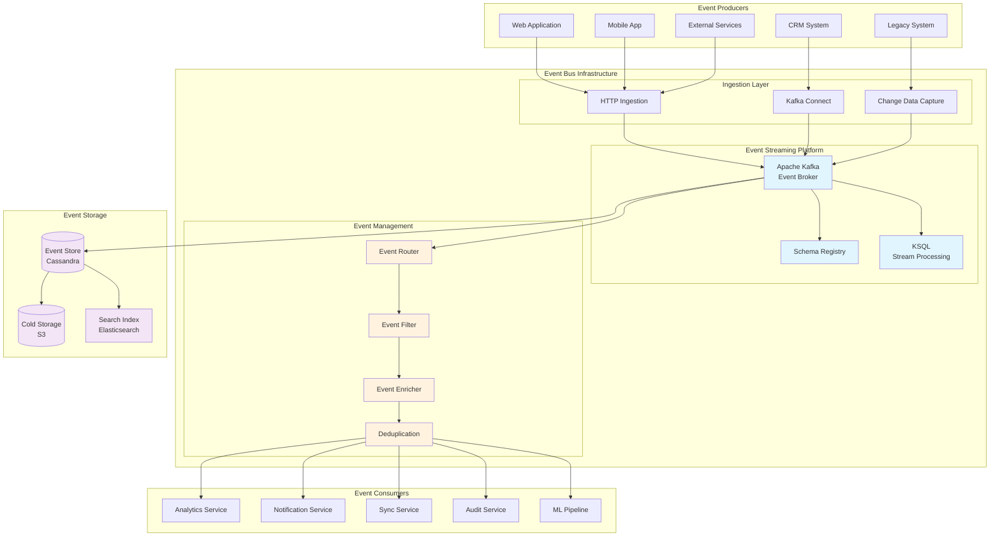

# Event-Driven Architecture

## Overview

The event-driven architecture enables real-time communication between systems, supports asynchronous processing, and provides a scalable foundation for handling high-volume transactions across the integration platform.

## Core Architecture



## Event Schema Design

### 1. Base Event Structure

```json
{
  "eventId": "evt_550e8400-e29b-41d4-a716-446655440000",
  "eventType": "member.profile.updated",
  "eventVersion": "2.0",
  "eventTime": "2024-01-20T15:30:45.123Z",
  "producer": {
    "service": "member-service",
    "instance": "member-service-pod-7d8c5b",
    "version": "3.2.1"
  },
  "subject": {
    "type": "member",
    "id": "mem_12345",
    "alternateIds": {
      "legacyId": "L98765",
      "crmId": "C54321"
    }
  },
  "data": {
    // Event-specific payload
  },
  "metadata": {
    "correlationId": "corr_abc123",
    "causationId": "evt_parent123",
    "userId": "usr_789",
    "sessionId": "sess_xyz",
    "traceId": "trace_123",
    "tags": ["profile", "update", "manual"]
  },
  "dataVersion": "1.0",
  "dataContentType": "application/json"
}
```

### 2. Event Type Taxonomy

```yaml
event_types:
  # Member Events
  member:
    lifecycle:
      - member.created
      - member.activated
      - member.suspended
      - member.reactivated
      - member.terminated
    
    profile:
      - member.profile.updated
      - member.contact.changed
      - member.preferences.updated
      - member.consent.granted
      - member.consent.revoked
    
    membership:
      - member.membership.renewed
      - member.membership.upgraded
      - member.membership.downgraded
      - member.membership.expired
      - member.membership.cancelled
  
  # Payment Events
  payment:
    transaction:
      - payment.initiated
      - payment.authorized
      - payment.captured
      - payment.failed
      - payment.refunded
    
    subscription:
      - payment.subscription.created
      - payment.subscription.updated
      - payment.subscription.cancelled
      - payment.subscription.renewed
  
  # Certification Events
  certification:
    lifecycle:
      - certification.applied
      - certification.approved
      - certification.issued
      - certification.renewed
      - certification.expired
      - certification.revoked
    
    education:
      - certification.credits.earned
      - certification.course.completed
      - certification.exam.passed
      - certification.exam.failed
  
  # System Events
  system:
    audit:
      - system.user.login
      - system.user.logout
      - system.permission.granted
      - system.permission.revoked
      - system.data.exported
    
    integration:
      - system.sync.started
      - system.sync.completed
      - system.sync.failed
      - system.webhook.delivered
      - system.webhook.failed
```

## Event Processing Patterns

### 1. Event Sourcing Implementation

```python
class EventStore:
    def __init__(self, cassandra_session, kafka_producer):
        self.session = cassandra_session
        self.producer = kafka_producer
        
    def append_event(self, aggregate_id, event):
        """Append event to event store"""
        # Store in Cassandra for persistence
        query = """
        INSERT INTO events (
            aggregate_id, event_id, event_type, 
            event_version, event_time, event_data,
            metadata
        ) VALUES (?, ?, ?, ?, ?, ?, ?)
        """
        
        self.session.execute(query, [
            aggregate_id,
            event['eventId'],
            event['eventType'],
            event['eventVersion'],
            event['eventTime'],
            json.dumps(event['data']),
            json.dumps(event['metadata'])
        ])
        
        # Publish to Kafka for real-time processing
        self.producer.send(
            topic=f"events.{event['eventType']}",
            key=aggregate_id.encode(),
            value=json.dumps(event).encode(),
            headers=[
                ('eventType', event['eventType'].encode()),
                ('eventVersion', event['eventVersion'].encode())
            ]
        )
    
    def get_events(self, aggregate_id, from_version=0):
        """Retrieve events for aggregate"""
        query = """
        SELECT * FROM events 
        WHERE aggregate_id = ? 
        AND version > ?
        ORDER BY version ASC
        """
        
        rows = self.session.execute(query, [aggregate_id, from_version])
        return [self._row_to_event(row) for row in rows]
    
    def get_snapshot(self, aggregate_id):
        """Get latest snapshot for faster replay"""
        query = """
        SELECT * FROM snapshots 
        WHERE aggregate_id = ?
        ORDER BY version DESC
        LIMIT 1
        """
        
        row = self.session.execute(query, [aggregate_id]).one()
        return self._row_to_snapshot(row) if row else None
```

### 2. CQRS Pattern Implementation

```python
# Command Side
class MemberCommandHandler:
    def __init__(self, event_store):
        self.event_store = event_store
    
    def handle_update_profile(self, command):
        """Handle profile update command"""
        member_id = command['memberId']
        
        # Load current state from event store
        events = self.event_store.get_events(member_id)
        member = self.replay_events(events)
        
        # Validate command
        if not self.validate_profile_update(member, command):
            raise ValidationError("Invalid profile update")
        
        # Create event
        event = {
            'eventId': str(uuid.uuid4()),
            'eventType': 'member.profile.updated',
            'eventVersion': '2.0',
            'eventTime': datetime.utcnow().isoformat(),
            'subject': {
                'type': 'member',
                'id': member_id
            },
            'data': {
                'changes': command['changes'],
                'previousValues': self.extract_changed_values(member, command)
            },
            'metadata': {
                'commandId': command['commandId'],
                'userId': command['userId']
            }
        }
        
        # Append event
        self.event_store.append_event(member_id, event)
        
        return event

# Query Side
class MemberQueryHandler:
    def __init__(self, read_db):
        self.db = read_db
    
    def get_member_profile(self, member_id):
        """Get member profile from read model"""
        query = """
        SELECT m.*, ms.status, ms.expiry_date
        FROM member_profiles m
        JOIN membership_status ms ON m.id = ms.member_id
        WHERE m.id = ?
        """
        
        return self.db.execute(query, [member_id]).one()
    
    def search_members(self, criteria):
        """Search members using optimized read model"""
        query_builder = MemberSearchQueryBuilder()
        query, params = query_builder.build(criteria)
        
        return self.db.execute(query, params).all()

# Event Projector
class MemberProjector:
    def __init__(self, read_db):
        self.db = read_db
    
    @event_handler('member.profile.updated')
    def on_profile_updated(self, event):
        """Update read model when profile changes"""
        member_id = event['subject']['id']
        changes = event['data']['changes']
        
        update_query = """
        UPDATE member_profiles 
        SET {} 
        WHERE id = ?
        """.format(
            ', '.join([f"{k} = ?" for k in changes.keys()])
        )
        
        params = list(changes.values()) + [member_id]
        self.db.execute(update_query, params)
```

### 3. Event Stream Processing

```java
// Kafka Streams topology for real-time analytics
public class MemberAnalyticsTopology {
    
    public Topology buildTopology() {
        StreamsBuilder builder = new StreamsBuilder();
        
        // Source stream
        KStream<String, MemberEvent> memberEvents = builder.stream(
            "events.member",
            Consumed.with(Serdes.String(), memberEventSerde)
        );
        
        // Filter relevant events
        KStream<String, MemberEvent> profileUpdates = memberEvents
            .filter((key, event) -> 
                event.getEventType().startsWith("member.profile")
            );
        
        // Window aggregation for activity metrics
        KTable<Windowed<String>, Long> hourlyActivity = profileUpdates
            .groupByKey()
            .windowedBy(TimeWindows.of(Duration.ofHours(1)))
            .count(Materialized.as("member-hourly-activity"));
        
        // Pattern detection for suspicious activity
        KStream<String, SuspiciousActivity> suspiciousActivities = 
            memberEvents
                .groupByKey()
                .windowedBy(SessionWindows.with(Duration.ofMinutes(5)))
                .aggregate(
                    ActivityPattern::new,
                    (key, event, pattern) -> pattern.addEvent(event),
                    Materialized.as("activity-patterns")
                )
                .toStream()
                .filter((key, pattern) -> pattern.isSuspicious())
                .mapValues(pattern -> pattern.toSuspiciousActivity());
        
        // Output to topics
        hourlyActivity.toStream().to(
            "analytics.member.activity",
            Produced.with(
                WindowedSerdes.timeWindowedSerdeFrom(String.class),
                Serdes.Long()
            )
        );
        
        suspiciousActivities.to(
            "alerts.suspicious.activity",
            Produced.with(Serdes.String(), suspiciousActivitySerde)
        );
        
        return builder.build();
    }
}
```

## Event Routing and Filtering

### 1. Content-Based Routing

```yaml
# Event routing configuration
routing_rules:
  - name: member_events_to_crm
    condition:
      eventType:
        pattern: "member\\..*"
      metadata:
        tags:
          contains: ["sync_to_crm"]
    targets:
      - topic: crm.sync.queue
        transform: 
          type: "jolt"
          spec: "transforms/member_to_crm.json"
  
  - name: payment_events_to_finance
    condition:
      eventType:
        pattern: "payment\\..*"
      data:
        amount:
          gte: 1000
    targets:
      - topic: finance.high_value_transactions
      - topic: audit.financial_events
  
  - name: certification_updates
    condition:
      eventType:
        in:
          - certification.issued
          - certification.renewed
          - certification.revoked
    targets:
      - topic: certification.updates
      - http:
          url: "https://cert-body.org/webhook"
          headers:
            Authorization: "Bearer ${CERT_BODY_TOKEN}"
```

### 2. Event Enrichment Pipeline

```python
class EventEnricher:
    def __init__(self, member_cache, org_service, geo_service):
        self.member_cache = member_cache
        self.org_service = org_service
        self.geo_service = geo_service
    
    async def enrich_event(self, event):
        """Enrich event with additional context"""
        enriched = copy.deepcopy(event)
        
        # Add member context
        if event['subject']['type'] == 'member':
            member_id = event['subject']['id']
            member_data = await self.member_cache.get(member_id)
            
            if member_data:
                enriched['context'] = enriched.get('context', {})
                enriched['context']['member'] = {
                    'membershipLevel': member_data['level'],
                    'joinDate': member_data['joinDate'],
                    'chapter': member_data['chapter'],
                    'lifetimeValue': member_data['ltv']
                }
        
        # Add organizational context
        if 'organizationId' in event['metadata']:
            org_data = await self.org_service.get_organization(
                event['metadata']['organizationId']
            )
            enriched['context']['organization'] = {
                'name': org_data['name'],
                'type': org_data['type'],
                'size': org_data['size']
            }
        
        # Add geolocation
        if 'ipAddress' in event['metadata']:
            geo_data = await self.geo_service.lookup(
                event['metadata']['ipAddress']
            )
            enriched['context']['geo'] = {
                'country': geo_data['country'],
                'region': geo_data['region'],
                'city': geo_data['city']
            }
        
        return enriched
```

## Error Handling and Dead Letter Queue

### 1. Error Handling Strategy

```python
class EventProcessor:
    def __init__(self, handler, error_handler, dlq_producer):
        self.handler = handler
        self.error_handler = error_handler
        self.dlq_producer = dlq_producer
        self.retry_policy = RetryPolicy(
            max_attempts=3,
            backoff_multiplier=2,
            max_backoff=60
        )
    
    async def process_event(self, event, context):
        """Process event with error handling"""
        attempt = 0
        last_error = None
        
        while attempt < self.retry_policy.max_attempts:
            try:
                # Process event
                result = await self.handler.handle(event)
                
                # Record metrics
                context.metrics.increment('events.processed.success')
                
                return result
                
            except TransientError as e:
                # Retryable error
                attempt += 1
                last_error = e
                
                if attempt < self.retry_policy.max_attempts:
                    backoff = self.retry_policy.calculate_backoff(attempt)
                    await asyncio.sleep(backoff)
                    
                    context.logger.warning(
                        f"Transient error processing event, attempt {attempt}",
                        event_id=event['eventId'],
                        error=str(e)
                    )
                    
            except PermanentError as e:
                # Non-retryable error
                context.logger.error(
                    "Permanent error processing event",
                    event_id=event['eventId'],
                    error=str(e)
                )
                
                await self.send_to_dlq(event, e, context)
                context.metrics.increment('events.processed.permanent_failure')
                
                return None
                
            except Exception as e:
                # Unexpected error
                context.logger.exception(
                    "Unexpected error processing event",
                    event_id=event['eventId']
                )
                
                await self.send_to_dlq(event, e, context)
                context.metrics.increment('events.processed.unexpected_failure')
                
                return None
        
        # Max retries exceeded
        await self.send_to_dlq(event, last_error, context)
        context.metrics.increment('events.processed.retry_exhausted')
        
        return None
    
    async def send_to_dlq(self, event, error, context):
        """Send failed event to dead letter queue"""
        dlq_event = {
            'originalEvent': event,
            'error': {
                'type': type(error).__name__,
                'message': str(error),
                'stackTrace': traceback.format_exc()
            },
            'processingContext': {
                'processor': self.__class__.__name__,
                'timestamp': datetime.utcnow().isoformat(),
                'correlationId': context.correlation_id
            }
        }
        
        await self.dlq_producer.send(
            topic='events.dlq',
            key=event['eventId'],
            value=dlq_event
        )
```

### 2. Dead Letter Queue Monitoring

```yaml
# Prometheus alerts for DLQ
groups:
  - name: dlq_monitoring
    rules:
      - alert: HighDLQRate
        expr: rate(events_dlq_total[5m]) > 10
        for: 5m
        labels:
          severity: warning
        annotations:
          summary: "High rate of events going to DLQ"
          description: "{{ $value }} events/sec going to DLQ"
      
      - alert: DLQBacklog
        expr: kafka_consumer_lag{topic="events.dlq"} > 1000
        for: 10m
        labels:
          severity: critical
        annotations:
          summary: "Large backlog in DLQ"
          description: "{{ $value }} events in DLQ backlog"
      
      - alert: EventProcessingErrors
        expr: |
          rate(events_processed_permanent_failure_total[5m]) > 0.01 * 
          rate(events_processed_total[5m])
        for: 5m
        labels:
          severity: warning
        annotations:
          summary: "High event processing error rate"
          description: "{{ $value | humanizePercentage }} error rate"
```

## Event Store Design

### 1. Cassandra Schema for Event Storage

```cql
-- Keyspace for event store
CREATE KEYSPACE IF NOT EXISTS event_store
WITH replication = {
  'class': 'NetworkTopologyStrategy',
  'dc1': 3,
  'dc2': 3
};

-- Events table
CREATE TABLE IF NOT EXISTS event_store.events (
    aggregate_id UUID,
    event_id UUID,
    event_type TEXT,
    event_version TEXT,
    event_time TIMESTAMP,
    sequence_number BIGINT,
    event_data TEXT,  -- JSON
    metadata TEXT,    -- JSON
    created_at TIMESTAMP,
    PRIMARY KEY (aggregate_id, sequence_number)
) WITH CLUSTERING ORDER BY (sequence_number ASC)
  AND compaction = {
    'class': 'LeveledCompactionStrategy'
  }
  AND compression = {
    'class': 'LZ4Compressor'
  };

-- Event type index
CREATE INDEX IF NOT EXISTS idx_event_type 
ON event_store.events (event_type);

-- Time-based partition for recent events
CREATE TABLE IF NOT EXISTS event_store.events_by_time (
    time_bucket TEXT,  -- YYYY-MM-DD-HH
    event_time TIMESTAMP,
    event_id UUID,
    event_type TEXT,
    aggregate_id UUID,
    event_data TEXT,
    PRIMARY KEY (time_bucket, event_time, event_id)
) WITH CLUSTERING ORDER BY (event_time DESC, event_id ASC)
  AND default_time_to_live = 2592000;  -- 30 days

-- Snapshots table
CREATE TABLE IF NOT EXISTS event_store.snapshots (
    aggregate_id UUID,
    version BIGINT,
    snapshot_data TEXT,  -- JSON
    created_at TIMESTAMP,
    PRIMARY KEY (aggregate_id, version)
) WITH CLUSTERING ORDER BY (version DESC);
```

### 2. Event Archival Strategy

```python
class EventArchiver:
    def __init__(self, event_store, s3_client, config):
        self.event_store = event_store
        self.s3_client = s3_client
        self.config = config
    
    async def archive_old_events(self):
        """Archive events older than retention period"""
        cutoff_date = datetime.utcnow() - timedelta(
            days=self.config['retention_days']
        )
        
        # Query old events in batches
        batch_size = 10000
        total_archived = 0
        
        while True:
            events = await self.event_store.get_events_before(
                cutoff_date, 
                limit=batch_size
            )
            
            if not events:
                break
            
            # Compress and upload to S3
            archive_key = self.generate_archive_key(events)
            compressed_data = self.compress_events(events)
            
            await self.s3_client.put_object(
                Bucket=self.config['archive_bucket'],
                Key=archive_key,
                Body=compressed_data,
                StorageClass='GLACIER'
            )
            
            # Create archive index entry
            await self.event_store.create_archive_index(
                events[0]['aggregate_id'],
                events[0]['sequence_number'],
                events[-1]['sequence_number'],
                archive_key
            )
            
            # Delete archived events
            await self.event_store.delete_events(
                [e['event_id'] for e in events]
            )
            
            total_archived += len(events)
            
            self.logger.info(
                f"Archived {len(events)} events to {archive_key}"
            )
        
        return total_archived
```

## Performance Optimization

### 1. Kafka Performance Tuning

```yaml
# Kafka broker configuration
kafka_broker_config:
  # Network and I/O threads
  num.network.threads: 8
  num.io.threads: 16
  
  # Socket buffer sizes
  socket.send.buffer.bytes: 102400
  socket.receive.buffer.bytes: 102400
  socket.request.max.bytes: 104857600
  
  # Log configuration
  log.segment.bytes: 1073741824  # 1GB
  log.retention.hours: 168  # 7 days
  log.retention.check.interval.ms: 300000
  
  # Replication
  default.replication.factor: 3
  min.insync.replicas: 2
  
  # Compression
  compression.type: lz4
  
  # Performance
  num.replica.fetchers: 4
  replica.fetch.max.bytes: 1048576
  
# Producer configuration
kafka_producer_config:
  # Batching
  batch.size: 16384
  linger.ms: 10
  
  # Compression
  compression.type: lz4
  
  # Reliability
  acks: all
  retries: 3
  max.in.flight.requests.per.connection: 5
  
  # Performance
  buffer.memory: 33554432
  
# Consumer configuration
kafka_consumer_config:
  # Fetching
  fetch.min.bytes: 1024
  fetch.max.wait.ms: 500
  max.partition.fetch.bytes: 1048576
  
  # Processing
  max.poll.records: 500
  max.poll.interval.ms: 300000
  
  # Coordination
  session.timeout.ms: 30000
  heartbeat.interval.ms: 3000
```

### 2. Stream Processing Optimization

```java
// Optimized Kafka Streams configuration
Properties streamConfig = new Properties();

// Application settings
streamConfig.put(StreamsConfig.APPLICATION_ID_CONFIG, "member-analytics");
streamConfig.put(StreamsConfig.BOOTSTRAP_SERVERS_CONFIG, "kafka:9092");

// Processing guarantees
streamConfig.put(StreamsConfig.PROCESSING_GUARANTEE_CONFIG, 
    StreamsConfig.EXACTLY_ONCE_V2);

// Performance tuning
streamConfig.put(StreamsConfig.NUM_STREAM_THREADS_CONFIG, 4);
streamConfig.put(StreamsConfig.CACHE_MAX_BYTES_BUFFERING_CONFIG, 10485760L);
streamConfig.put(StreamsConfig.COMMIT_INTERVAL_MS_CONFIG, 1000);

// State store optimization
streamConfig.put(StreamsConfig.ROCKSDB_CONFIG_SETTER_CLASS_CONFIG,
    CustomRocksDBConfig.class);

public class CustomRocksDBConfig implements RocksDBConfigSetter {
    @Override
    public void setConfig(String storeName, Options options, 
                         Map<String, Object> configs) {
        // Optimize for SSD
        options.setCompactionStyle(CompactionStyle.LEVEL);
        options.setCompressionType(CompressionType.LZ4_COMPRESSION);
        options.setWriteBufferSize(16 * 1024 * 1024);
        options.setMaxWriteBufferNumber(3);
        options.setTargetFileSizeBase(64 * 1024 * 1024);
        
        // Block cache
        BlockBasedTableConfig tableConfig = new BlockBasedTableConfig();
        tableConfig.setBlockCache(new LRUCache(256 * 1024 * 1024));
        tableConfig.setBlockSize(16 * 1024);
        options.setTableFormatConfig(tableConfig);
    }
}
```

## Monitoring and Observability

### 1. Event Flow Monitoring Dashboard

```python
# Grafana dashboard configuration
dashboard_config = {
    "title": "Event-Driven Architecture Monitoring",
    "panels": [
        {
            "title": "Event Rate by Type",
            "targets": [{
                "expr": "sum(rate(events_published_total[5m])) by (event_type)"
            }]
        },
        {
            "title": "Event Processing Latency",
            "targets": [{
                "expr": "histogram_quantile(0.95, rate(event_processing_duration_seconds_bucket[5m]))"
            }]
        },
        {
            "title": "Kafka Lag by Consumer Group",
            "targets": [{
                "expr": "kafka_consumer_lag_sum by (group, topic)"
            }]
        },
        {
            "title": "Error Rate",
            "targets": [{
                "expr": "sum(rate(events_processing_errors_total[5m])) by (error_type)"
            }]
        },
        {
            "title": "DLQ Size",
            "targets": [{
                "expr": "kafka_topic_partition_current_offset{topic='events.dlq'}"
            }]
        }
    ]
}
```

### 2. Distributed Tracing

```python
# OpenTelemetry instrumentation
from opentelemetry import trace
from opentelemetry.trace import Status, StatusCode

tracer = trace.get_tracer(__name__)

class TracedEventProcessor:
    async def process_event(self, event):
        # Create span for event processing
        with tracer.start_as_current_span(
            "process_event",
            attributes={
                "event.id": event['eventId'],
                "event.type": event['eventType'],
                "event.version": event['eventVersion']
            }
        ) as span:
            try:
                # Validate event
                with tracer.start_as_current_span("validate_event"):
                    self.validate_event(event)
                
                # Enrich event
                with tracer.start_as_current_span("enrich_event"):
                    enriched = await self.enrich_event(event)
                
                # Process business logic
                with tracer.start_as_current_span("business_logic"):
                    result = await self.handle_business_logic(enriched)
                
                # Publish results
                with tracer.start_as_current_span("publish_results"):
                    await self.publish_results(result)
                
                span.set_status(Status(StatusCode.OK))
                return result
                
            except Exception as e:
                span.record_exception(e)
                span.set_status(
                    Status(StatusCode.ERROR, str(e))
                )
                raise
```