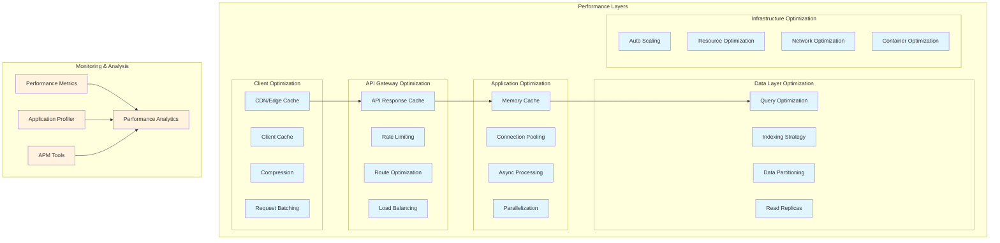

# Performance Optimization Strategies

## Overview

Performance optimization is critical for maintaining responsive, scalable integration architectures. This document outlines comprehensive strategies for optimizing performance across all layers of the integration platform.

## Performance Architecture Overview



## Caching Strategies

### 1. Multi-Layer Caching Architecture

```python
from typing import Optional, Any, Dict, List
from datetime import datetime, timedelta
import hashlib
import json

class CacheLayer(Enum):
    CDN = "cdn"
    API_GATEWAY = "api_gateway"
    APPLICATION = "application"
    DATABASE = "database"

class CacheStrategy(Enum):
    CACHE_ASIDE = "cache_aside"
    READ_THROUGH = "read_through"
    WRITE_THROUGH = "write_through"
    WRITE_BEHIND = "write_behind"
    REFRESH_AHEAD = "refresh_ahead"

class MultiLayerCache:
    def __init__(self, config: Dict[str, Any]):
        self.layers = {
            CacheLayer.CDN: CDNCache(config['cdn']),
            CacheLayer.API_GATEWAY: RedisCache(config['api_gateway']),
            CacheLayer.APPLICATION: InMemoryCache(config['application']),
            CacheLayer.DATABASE: QueryCache(config['database'])
        }
        self.strategy = config.get('strategy', CacheStrategy.CACHE_ASIDE)
        self.ttl_config = config.get('ttl', {})
        self.invalidation_config = config.get('invalidation', {})
    
    async def get(self, key: str, fetch_func=None, 
                  layers: List[CacheLayer] = None) -> Optional[Any]:
        """Get value from cache hierarchy"""
        
        layers = layers or list(self.layers.keys())
        
        # Try each cache layer
        for layer in layers:
            cache = self.layers[layer]
            value = await cache.get(key)
            
            if value is not None:
                # Found in cache - update higher layers
                await self._populate_higher_layers(key, value, layer, layers)
                return value
        
        # Not in any cache layer
        if fetch_func and self.strategy != CacheStrategy.CACHE_ASIDE:
            # Fetch and cache based on strategy
            value = await self._fetch_and_cache(key, fetch_func, layers)
            return value
        
        return None
    
    async def set(self, key: str, value: Any, 
                  layers: List[CacheLayer] = None, ttl: int = None):
        """Set value in cache layers"""
        
        layers = layers or list(self.layers.keys())
        ttl = ttl or self._get_ttl_for_key(key)
        
        # Set in all specified layers
        for layer in layers:
            cache = self.layers[layer]
            layer_ttl = self._get_layer_ttl(layer, ttl)
            await cache.set(key, value, ttl=layer_ttl)
    
    async def invalidate(self, pattern: str, layers: List[CacheLayer] = None):
        """Invalidate cache entries matching pattern"""
        
        layers = layers or list(self.layers.keys())
        
        # Track invalidation for monitoring
        invalidation_start = datetime.utcnow()
        invalidated_count = 0
        
        for layer in layers:
            cache = self.layers[layer]
            count = await cache.invalidate_pattern(pattern)
            invalidated_count += count
        
        # Log invalidation metrics
        self._record_invalidation_metrics(
            pattern, 
            invalidated_count,
            (datetime.utcnow() - invalidation_start).total_seconds()
        )
        
        return invalidated_count
    
    async def _populate_higher_layers(self, key: str, value: Any, 
                                     found_layer: CacheLayer, 
                                     all_layers: List[CacheLayer]):
        """Populate cache layers above where value was found"""
        
        found_index = all_layers.index(found_layer)
        higher_layers = all_layers[:found_index]
        
        for layer in higher_layers:
            cache = self.layers[layer]
            ttl = self._get_layer_ttl(layer, self._get_ttl_for_key(key))
            await cache.set(key, value, ttl=ttl)
    
    def _get_ttl_for_key(self, key: str) -> int:
        """Determine TTL based on key pattern"""
        
        for pattern, ttl in self.ttl_config.items():
            if pattern in key:
                return ttl
        
        return 3600  # Default 1 hour

class CacheKeyGenerator:
    """Generate consistent cache keys"""
    
    @staticmethod
    def generate_key(resource_type: str, params: Dict[str, Any], 
                    version: str = "v1") -> str:
        """Generate cache key from parameters"""
        
        # Sort parameters for consistency
        sorted_params = sorted(params.items())
        param_str = json.dumps(sorted_params, sort_keys=True)
        
        # Create hash for long parameter lists
        if len(param_str) > 200:
            param_hash = hashlib.md5(param_str.encode()).hexdigest()
            return f"{resource_type}:{version}:{param_hash}"
        
        # Use readable key for short parameters
        param_parts = [f"{k}={v}" for k, v in sorted_params]
        return f"{resource_type}:{version}:{':'.join(param_parts)}"

class CacheWarmer:
    """Proactively warm cache with frequently accessed data"""
    
    def __init__(self, cache: MultiLayerCache, analytics_service):
        self.cache = cache
        self.analytics = analytics_service
        self.warming_config = {}
    
    async def warm_cache(self):
        """Warm cache based on access patterns"""
        
        # Get frequently accessed keys
        hot_keys = await self.analytics.get_hot_keys(
            time_window=timedelta(hours=24),
            limit=1000
        )
        
        warming_tasks = []
        
        for key_info in hot_keys:
            key = key_info['key']
            access_count = key_info['access_count']
            
            # Determine if key should be warmed
            if self._should_warm_key(key, access_count):
                task = self._warm_single_key(key)
                warming_tasks.append(task)
        
        # Execute warming in parallel with concurrency limit
        results = await self._execute_with_concurrency(
            warming_tasks, 
            max_concurrent=50
        )
        
        return {
            'warmed_keys': len([r for r in results if r['success']]),
            'failed_keys': len([r for r in results if not r['success']]),
            'duration': sum(r['duration'] for r in results)
        }
    
    async def _warm_single_key(self, key: str) -> Dict[str, Any]:
        """Warm individual cache key"""
        
        start_time = datetime.utcnow()
        
        try:
            # Fetch fresh data
            value = await self._fetch_fresh_data(key)
            
            # Store in cache with extended TTL
            await self.cache.set(
                key, 
                value,
                ttl=self._get_warming_ttl(key)
            )
            
            return {
                'key': key,
                'success': True,
                'duration': (datetime.utcnow() - start_time).total_seconds()
            }
            
        except Exception as e:
            logger.error(f"Failed to warm cache key {key}: {e}")
            return {
                'key': key,
                'success': False,
                'error': str(e),
                'duration': (datetime.utcnow() - start_time).total_seconds()
            }
```

### 2. Cache Invalidation Strategies

```python
class CacheInvalidationManager:
    def __init__(self, cache: MultiLayerCache, event_bus):
        self.cache = cache
        self.event_bus = event_bus
        self.invalidation_rules = {}
        self.dependency_graph = DependencyGraph()
        
        # Subscribe to change events
        self._setup_event_handlers()
    
    def register_invalidation_rule(self, event_type: str, 
                                  invalidation_func):
        """Register invalidation rule for event type"""
        
        self.invalidation_rules[event_type] = invalidation_func
    
    def register_dependency(self, parent_key: str, 
                           dependent_keys: List[str]):
        """Register cache key dependencies"""
        
        for dependent in dependent_keys:
            self.dependency_graph.add_edge(parent_key, dependent)
    
    async def handle_change_event(self, event: Dict[str, Any]):
        """Handle change event and invalidate affected cache entries"""
        
        event_type = event['type']
        
        # Get invalidation rule
        invalidation_func = self.invalidation_rules.get(event_type)
        
        if not invalidation_func:
            logger.warning(f"No invalidation rule for event type: {event_type}")
            return
        
        # Determine keys to invalidate
        keys_to_invalidate = invalidation_func(event)
        
        # Add dependent keys
        all_keys = set(keys_to_invalidate)
        for key in keys_to_invalidate:
            dependents = self.dependency_graph.get_dependents(key)
            all_keys.update(dependents)
        
        # Perform invalidation
        invalidation_tasks = []
        for key_pattern in all_keys:
            task = self.cache.invalidate(key_pattern)
            invalidation_tasks.append(task)
        
        results = await asyncio.gather(*invalidation_tasks)
        
        # Log invalidation metrics
        total_invalidated = sum(results)
        logger.info(f"Invalidated {total_invalidated} cache entries for "
                   f"event {event_type}")
        
        return total_invalidated
    
    def _setup_event_handlers(self):
        """Setup event handlers for cache invalidation"""
        
        # Member update events
        @self.event_bus.on('member.updated')
        async def invalidate_member_cache(event):
            member_id = event['data']['member_id']
            return [
                f"member:{member_id}:*",
                f"members:list:*",
                f"organization:{event['data']['org_id']}:members:*"
            ]
        
        # Payment events
        @self.event_bus.on('payment.completed')
        async def invalidate_payment_cache(event):
            member_id = event['data']['member_id']
            return [
                f"member:{member_id}:balance",
                f"member:{member_id}:transactions:*",
                f"reports:revenue:*"
            ]

class SmartInvalidation:
    """Intelligent cache invalidation based on access patterns"""
    
    def __init__(self, cache, analytics):
        self.cache = cache
        self.analytics = analytics
        
    async def selective_invalidate(self, key_pattern: str):
        """Selectively invalidate based on access patterns"""
        
        # Get all matching keys
        matching_keys = await self.cache.get_keys(key_pattern)
        
        # Analyze access patterns
        access_data = await self.analytics.get_access_patterns(
            matching_keys,
            time_window=timedelta(hours=1)
        )
        
        # Categorize keys
        hot_keys = []
        cold_keys = []
        
        for key, data in access_data.items():
            if data['access_count'] > 100:  # Hot threshold
                hot_keys.append(key)
            else:
                cold_keys.append(key)
        
        # Invalidate cold keys immediately
        for key in cold_keys:
            await self.cache.invalidate(key)
        
        # Schedule gradual invalidation for hot keys
        for key in hot_keys:
            delay = self._calculate_invalidation_delay(
                access_data[key]['access_count']
            )
            asyncio.create_task(
                self._delayed_invalidate(key, delay)
            )
        
        return {
            'immediate_invalidations': len(cold_keys),
            'delayed_invalidations': len(hot_keys)
        }
```

## Database Performance Optimization

### 1. Query Optimization

```python
class QueryOptimizer:
    def __init__(self, db_connection, config):
        self.db = db_connection
        self.config = config
        self.query_cache = QueryCache()
        self.statistics = QueryStatistics()
    
    async def optimize_query(self, query: str, params: Dict[str, Any]) -> str:
        """Optimize query based on execution plan and statistics"""
        
        # Get query execution plan
        plan = await self.analyze_query_plan(query, params)
        
        # Check for optimization opportunities
        optimizations = []
        
        if self._has_missing_indexes(plan):
            optimizations.append(self._suggest_indexes(plan))
        
        if self._has_inefficient_joins(plan):
            optimizations.append(self._optimize_joins(query, plan))
        
        if self._has_full_table_scans(plan):
            optimizations.append(self._add_filtering(query, plan))
        
        # Apply optimizations
        optimized_query = query
        for optimization in optimizations:
            optimized_query = optimization.apply(optimized_query)
        
        # Validate optimized query
        if await self._validate_optimization(query, optimized_query, params):
            return optimized_query
        
        return query
    
    async def analyze_query_plan(self, query: str, params: Dict[str, Any]):
        """Analyze query execution plan"""
        
        explain_query = f"EXPLAIN (ANALYZE, BUFFERS, FORMAT JSON) {query}"
        
        result = await self.db.execute(explain_query, params)
        plan = result[0]['QUERY PLAN'][0]
        
        return {
            'plan': plan,
            'execution_time': plan['Execution Time'],
            'planning_time': plan['Planning Time'],
            'total_cost': plan['Plan']['Total Cost'],
            'nodes': self._extract_plan_nodes(plan['Plan'])
        }
    
    def _has_missing_indexes(self, plan: Dict[str, Any]) -> bool:
        """Check if query would benefit from indexes"""
        
        for node in plan['nodes']:
            if node['Node Type'] == 'Seq Scan' and node['Rows'] > 1000:
                return True
            
            if 'Filter' in node and node.get('Rows Removed by Filter', 0) > 1000:
                return True
        
        return False
    
    def _suggest_indexes(self, plan: Dict[str, Any]) -> IndexSuggestion:
        """Suggest indexes based on query plan"""
        
        suggestions = []
        
        for node in plan['nodes']:
            if node['Node Type'] == 'Seq Scan':
                table = node['Relation Name']
                
                # Extract filter conditions
                if 'Filter' in node:
                    columns = self._extract_filter_columns(node['Filter'])
                    suggestions.append({
                        'table': table,
                        'columns': columns,
                        'type': 'btree',
                        'estimated_improvement': node['Rows'] * 0.1  # Rough estimate
                    })
        
        return IndexSuggestion(suggestions)

class QueryBatcher:
    """Batch multiple queries for efficient execution"""
    
    def __init__(self, db_pool, config):
        self.db_pool = db_pool
        self.batch_size = config.get('batch_size', 100)
        self.batch_timeout = config.get('batch_timeout', 50)  # ms
        self.pending_queries = []
        self.results = {}
        
    async def execute(self, query: str, params: Dict[str, Any]) -> Any:
        """Add query to batch and execute when ready"""
        
        query_id = str(uuid.uuid4())
        future = asyncio.Future()
        
        self.pending_queries.append({
            'id': query_id,
            'query': query,
            'params': params,
            'future': future
        })
        
        # Check if batch is ready
        if len(self.pending_queries) >= self.batch_size:
            await self._execute_batch()
        else:
            # Schedule batch execution after timeout
            asyncio.create_task(self._delayed_batch_execution())
        
        return await future
    
    async def _execute_batch(self):
        """Execute all pending queries in a single transaction"""
        
        if not self.pending_queries:
            return
        
        queries_to_execute = self.pending_queries[:self.batch_size]
        self.pending_queries = self.pending_queries[self.batch_size:]
        
        async with self.db_pool.acquire() as conn:
            async with conn.transaction():
                for query_info in queries_to_execute:
                    try:
                        result = await conn.fetch(
                            query_info['query'],
                            *query_info['params'].values()
                        )
                        query_info['future'].set_result(result)
                    except Exception as e:
                        query_info['future'].set_exception(e)
```

### 2. Database Connection Pooling

```python
class OptimizedConnectionPool:
    def __init__(self, config: Dict[str, Any]):
        self.config = config
        self.pools = {}
        self.health_checker = HealthChecker()
        self.metrics = PoolMetrics()
        
    async def initialize(self):
        """Initialize connection pools with optimized settings"""
        
        # Primary write pool
        self.pools['primary'] = await self._create_pool(
            dsn=self.config['primary_dsn'],
            min_size=self.config.get('min_connections', 10),
            max_size=self.config.get('max_connections', 100),
            max_queries=self.config.get('max_queries_per_connection', 50000),
            max_inactive_connection_lifetime=300,
            setup=self._setup_connection
        )
        
        # Read replica pools
        for i, replica_dsn in enumerate(self.config.get('replicas', [])):
            self.pools[f'replica_{i}'] = await self._create_pool(
                dsn=replica_dsn,
                min_size=self.config.get('replica_min_connections', 5),
                max_size=self.config.get('replica_max_connections', 50),
                max_queries=self.config.get('max_queries_per_connection', 50000),
                max_inactive_connection_lifetime=300,
                setup=self._setup_read_connection
            )
        
        # Start health monitoring
        asyncio.create_task(self._monitor_pool_health())
    
    async def acquire_read(self) -> Connection:
        """Acquire connection for read operations"""
        
        # Try read replicas first
        replica_pools = [k for k in self.pools.keys() if k.startswith('replica_')]
        
        if replica_pools:
            # Load balance across healthy replicas
            healthy_replicas = [
                pool_name for pool_name in replica_pools
                if self.health_checker.is_healthy(pool_name)
            ]
            
            if healthy_replicas:
                selected_pool = self._select_replica(healthy_replicas)
                return await self.pools[selected_pool].acquire()
        
        # Fallback to primary
        return await self.pools['primary'].acquire()
    
    async def acquire_write(self) -> Connection:
        """Acquire connection for write operations"""
        
        return await self.pools['primary'].acquire()
    
    def _select_replica(self, replicas: List[str]) -> str:
        """Select replica using least connections strategy"""
        
        pool_stats = []
        
        for replica in replicas:
            pool = self.pools[replica]
            stats = {
                'name': replica,
                'active': pool.get_size() - pool.get_idle_size(),
                'total': pool.get_size()
            }
            pool_stats.append(stats)
        
        # Select replica with least active connections
        selected = min(pool_stats, key=lambda x: x['active'])
        return selected['name']
    
    async def _setup_connection(self, conn: Connection):
        """Setup connection with optimal settings"""
        
        # Set connection parameters for performance
        await conn.execute("""
            SET work_mem = '256MB';
            SET maintenance_work_mem = '512MB';
            SET effective_cache_size = '4GB';
            SET random_page_cost = 1.1;
            SET effective_io_concurrency = 200;
            SET max_parallel_workers_per_gather = 4;
        """)
        
        # Prepare commonly used statements
        await self._prepare_statements(conn)
    
    async def _monitor_pool_health(self):
        """Monitor connection pool health"""
        
        while True:
            try:
                for pool_name, pool in self.pools.items():
                    metrics = {
                        'pool': pool_name,
                        'size': pool.get_size(),
                        'idle': pool.get_idle_size(),
                        'active': pool.get_size() - pool.get_idle_size(),
                        'wait_queue': len(pool._queue._waiters) if hasattr(pool, '_queue') else 0
                    }
                    
                    self.metrics.record(metrics)
                    
                    # Check for pool exhaustion
                    if metrics['idle'] == 0 and metrics['wait_queue'] > 0:
                        logger.warning(f"Connection pool {pool_name} exhausted, "
                                     f"{metrics['wait_queue']} waiters")
                
                await asyncio.sleep(10)  # Check every 10 seconds
                
            except Exception as e:
                logger.error(f"Error monitoring connection pools: {e}")
                await asyncio.sleep(60)
```

### 3. Data Partitioning Strategies

```python
class PartitionManager:
    def __init__(self, db_connection):
        self.db = db_connection
        self.partition_configs = {}
        
    async def setup_partitioning(self, table: str, config: Dict[str, Any]):
        """Setup table partitioning based on configuration"""
        
        partition_type = config['type']
        
        if partition_type == 'range':
            await self._setup_range_partitioning(table, config)
        elif partition_type == 'list':
            await self._setup_list_partitioning(table, config)
        elif partition_type == 'hash':
            await self._setup_hash_partitioning(table, config)
        
        # Store configuration
        self.partition_configs[table] = config
        
        # Schedule automatic partition maintenance
        if config.get('auto_maintenance', True):
            asyncio.create_task(
                self._maintain_partitions(table, config)
            )
    
    async def _setup_range_partitioning(self, table: str, config: Dict[str, Any]):
        """Setup range-based partitioning (e.g., by date)"""
        
        partition_column = config['column']
        interval = config['interval']  # e.g., 'month', 'day'
        
        # Create partitioned table
        create_sql = f"""
        CREATE TABLE {table} (
            {config['schema']}
        ) PARTITION BY RANGE ({partition_column});
        """
        
        await self.db.execute(create_sql)
        
        # Create initial partitions
        await self._create_range_partitions(table, config)
        
        # Create indexes on partitions
        await self._create_partition_indexes(table, config)
    
    async def _create_range_partitions(self, table: str, config: Dict[str, Any]):
        """Create range partitions for time-based data"""
        
        partition_column = config['column']
        interval = config['interval']
        retention = config.get('retention_days', 365)
        
        # Calculate partition boundaries
        if interval == 'month':
            current_date = datetime.utcnow().replace(day=1)
            partitions_to_create = 3  # Current + 2 future months
            
            for i in range(-1, partitions_to_create):
                partition_start = current_date + relativedelta(months=i)
                partition_end = partition_start + relativedelta(months=1)
                partition_name = f"{table}_{partition_start.strftime('%Y_%m')}"
                
                create_partition_sql = f"""
                CREATE TABLE IF NOT EXISTS {partition_name}
                PARTITION OF {table}
                FOR VALUES FROM ('{partition_start}') TO ('{partition_end}');
                """
                
                await self.db.execute(create_partition_sql)
                
                # Create indexes
                await self._create_indexes_on_partition(partition_name, config)
    
    async def _maintain_partitions(self, table: str, config: Dict[str, Any]):
        """Automatically maintain partitions"""
        
        while True:
            try:
                # Create future partitions
                await self._create_future_partitions(table, config)
                
                # Drop old partitions based on retention
                await self._drop_old_partitions(table, config)
                
                # Analyze partition statistics
                await self._analyze_partitions(table)
                
                # Sleep until next maintenance window
                await asyncio.sleep(86400)  # Daily
                
            except Exception as e:
                logger.error(f"Error maintaining partitions for {table}: {e}")
                await asyncio.sleep(3600)  # Retry in 1 hour

class QueryRouter:
    """Route queries to appropriate partitions or shards"""
    
    def __init__(self, partition_manager, shard_manager):
        self.partition_manager = partition_manager
        self.shard_manager = shard_manager
        
    async def route_query(self, query: str, params: Dict[str, Any]) -> List[str]:
        """Route query to appropriate partitions/shards"""
        
        # Parse query to extract table and conditions
        parsed = self._parse_query(query)
        
        if not parsed:
            return [query]  # Return original query if can't parse
        
        table = parsed['table']
        conditions = parsed['conditions']
        
        # Check if table is partitioned
        if table in self.partition_manager.partition_configs:
            return await self._route_to_partitions(query, table, conditions)
        
        # Check if table is sharded
        if table in self.shard_manager.shard_configs:
            return await self._route_to_shards(query, table, conditions)
        
        return [query]
    
    async def _route_to_partitions(self, query: str, table: str, 
                                  conditions: Dict[str, Any]) -> List[str]:
        """Route query to specific partitions based on conditions"""
        
        config = self.partition_manager.partition_configs[table]
        partition_column = config['column']
        
        # Extract partition key from conditions
        if partition_column in conditions:
            value = conditions[partition_column]
            
            # Determine which partitions to query
            partitions = self._get_matching_partitions(table, partition_column, value)
            
            # Rewrite query for each partition
            routed_queries = []
            for partition in partitions:
                routed_query = query.replace(table, partition)
                routed_queries.append(routed_query)
            
            return routed_queries
        
        # No partition pruning possible
        return [query]
```

## Application-Level Optimization

### 1. Asynchronous Processing

```python
class AsyncProcessor:
    def __init__(self, config: Dict[str, Any]):
        self.worker_pool = WorkerPool(config['max_workers'])
        self.queue_manager = QueueManager(config['queue_config'])
        self.task_scheduler = TaskScheduler()
        self.metrics = ProcessingMetrics()
        
    async def process_async(self, task: Dict[str, Any], 
                           priority: str = 'normal') -> str:
        """Process task asynchronously"""
        
        task_id = str(uuid.uuid4())
        
        # Add to appropriate queue based on priority
        queue_name = self._get_queue_for_priority(priority)
        
        await self.queue_manager.enqueue(
            queue_name,
            {
                'task_id': task_id,
                'task': task,
                'enqueued_at': datetime.utcnow(),
                'priority': priority
            }
        )
        
        # Schedule processing
        asyncio.create_task(self._process_queue(queue_name))
        
        return task_id
    
    async def _process_queue(self, queue_name: str):
        """Process tasks from queue"""
        
        while True:
            try:
                # Get batch of tasks
                tasks = await self.queue_manager.dequeue_batch(
                    queue_name,
                    batch_size=10,
                    visibility_timeout=300
                )
                
                if not tasks:
                    await asyncio.sleep(1)
                    continue
                
                # Process tasks in parallel
                processing_tasks = []
                for task_msg in tasks:
                    processing_task = self._process_single_task(task_msg)
                    processing_tasks.append(processing_task)
                
                results = await asyncio.gather(*processing_tasks)
                
                # Handle results
                for task_msg, result in zip(tasks, results):
                    if result['success']:
                        await self.queue_manager.delete_message(
                            queue_name,
                            task_msg['receipt_handle']
                        )
                    else:
                        # Return to queue for retry
                        await self.queue_manager.change_visibility(
                            queue_name,
                            task_msg['receipt_handle'],
                            visibility_timeout=60
                        )
                
            except Exception as e:
                logger.error(f"Error processing queue {queue_name}: {e}")
                await asyncio.sleep(5)
    
    async def _process_single_task(self, task_msg: Dict[str, Any]) -> Dict[str, Any]:
        """Process individual task"""
        
        task_data = task_msg['body']
        start_time = datetime.utcnow()
        
        try:
            # Execute task
            result = await self.worker_pool.execute(
                task_data['task']['handler'],
                task_data['task']['params']
            )
            
            # Record metrics
            self.metrics.record_success(
                task_type=task_data['task']['type'],
                duration=(datetime.utcnow() - start_time).total_seconds()
            )
            
            return {
                'success': True,
                'result': result,
                'task_id': task_data['task_id']
            }
            
        except Exception as e:
            logger.error(f"Task {task_data['task_id']} failed: {e}")
            
            self.metrics.record_failure(
                task_type=task_data['task']['type'],
                error=str(e)
            )
            
            return {
                'success': False,
                'error': str(e),
                'task_id': task_data['task_id']
            }

class BatchProcessor:
    """Efficient batch processing with backpressure"""
    
    def __init__(self, config: Dict[str, Any]):
        self.batch_size = config.get('batch_size', 100)
        self.flush_interval = config.get('flush_interval', 1.0)
        self.max_concurrent_batches = config.get('max_concurrent_batches', 5)
        self.buffer = []
        self.processing_semaphore = asyncio.Semaphore(self.max_concurrent_batches)
        self.metrics = BatchMetrics()
        
        # Start flush timer
        asyncio.create_task(self._periodic_flush())
    
    async def add(self, item: Any):
        """Add item to batch"""
        
        self.buffer.append({
            'item': item,
            'timestamp': datetime.utcnow()
        })
        
        # Check if batch is full
        if len(self.buffer) >= self.batch_size:
            await self._flush_batch()
    
    async def _flush_batch(self):
        """Flush current batch"""
        
        if not self.buffer:
            return
        
        # Extract batch
        batch = self.buffer[:self.batch_size]
        self.buffer = self.buffer[self.batch_size:]
        
        # Process with backpressure
        async with self.processing_semaphore:
            await self._process_batch(batch)
    
    async def _process_batch(self, batch: List[Dict[str, Any]]):
        """Process a batch of items"""
        
        start_time = datetime.utcnow()
        
        try:
            # Extract items
            items = [b['item'] for b in batch]
            
            # Process batch
            results = await self._batch_operation(items)
            
            # Record metrics
            self.metrics.record_batch(
                size=len(batch),
                duration=(datetime.utcnow() - start_time).total_seconds(),
                success=True
            )
            
            return results
            
        except Exception as e:
            logger.error(f"Batch processing failed: {e}")
            
            self.metrics.record_batch(
                size=len(batch),
                duration=(datetime.utcnow() - start_time).total_seconds(),
                success=False
            )
            
            # Handle failed items
            await self._handle_failed_batch(batch, e)
```

### 2. Memory Optimization

```python
class MemoryOptimizer:
    def __init__(self, config: Dict[str, Any]):
        self.memory_limit = config.get('memory_limit_mb', 1000) * 1024 * 1024
        self.gc_threshold = config.get('gc_threshold', 0.8)
        self.object_pool = ObjectPool(config.get('pool_config', {}))
        self.memory_monitor = MemoryMonitor()
        
    def optimize_data_structure(self, data: List[Dict[str, Any]]) -> Any:
        """Optimize data structure for memory efficiency"""
        
        # Analyze data characteristics
        analysis = self._analyze_data(data)
        
        if analysis['redundancy_ratio'] > 0.3:
            # High redundancy - use interning
            return self._intern_data(data)
        
        if analysis['numeric_ratio'] > 0.7:
            # Mostly numeric - use numpy arrays
            return self._convert_to_numpy(data)
        
        if analysis['sparse_ratio'] > 0.5:
            # Sparse data - use sparse structures
            return self._convert_to_sparse(data)
        
        # Default optimization
        return self._optimize_general(data)
    
    def _intern_data(self, data: List[Dict[str, Any]]) -> InternedData:
        """Intern repeated strings to save memory"""
        
        string_pool = {}
        interned_data = []
        
        for record in data:
            interned_record = {}
            
            for key, value in record.items():
                if isinstance(value, str):
                    # Intern string
                    if value not in string_pool:
                        string_pool[value] = value
                    interned_record[key] = string_pool[value]
                else:
                    interned_record[key] = value
            
            interned_data.append(interned_record)
        
        return InternedData(interned_data, string_pool)
    
    @contextmanager
    def memory_limit_context(self, limit_mb: int):
        """Context manager for memory-limited operations"""
        
        initial_usage = self.memory_monitor.get_current_usage()
        limit_bytes = limit_mb * 1024 * 1024
        
        def check_memory():
            current_usage = self.memory_monitor.get_current_usage()
            if current_usage - initial_usage > limit_bytes:
                raise MemoryLimitExceeded(
                    f"Memory limit of {limit_mb}MB exceeded"
                )
        
        # Set up periodic memory checking
        checker_task = asyncio.create_task(
            self._periodic_memory_check(check_memory, interval=0.1)
        )
        
        try:
            yield
        finally:
            checker_task.cancel()
            
            # Force garbage collection if needed
            current_usage = self.memory_monitor.get_current_usage()
            if current_usage > self.memory_limit * self.gc_threshold:
                gc.collect()

class StreamingProcessor:
    """Process large datasets using streaming to minimize memory usage"""
    
    def __init__(self, chunk_size: int = 1000):
        self.chunk_size = chunk_size
        
    async def process_stream(self, data_source, processor_func, 
                            output_sink) -> Dict[str, Any]:
        """Process data stream in chunks"""
        
        processed_count = 0
        error_count = 0
        start_time = datetime.utcnow()
        
        async for chunk in self._read_chunks(data_source):
            try:
                # Process chunk
                processed_chunk = await processor_func(chunk)
                
                # Write results
                await output_sink.write(processed_chunk)
                
                processed_count += len(chunk)
                
                # Allow other tasks to run
                await asyncio.sleep(0)
                
            except Exception as e:
                logger.error(f"Error processing chunk: {e}")
                error_count += len(chunk)
        
        return {
            'processed': processed_count,
            'errors': error_count,
            'duration': (datetime.utcnow() - start_time).total_seconds()
        }
    
    async def _read_chunks(self, data_source):
        """Read data in chunks"""
        
        while True:
            chunk = await data_source.read(self.chunk_size)
            
            if not chunk:
                break
                
            yield chunk
```

## Network Optimization

### 1. HTTP/2 and Connection Multiplexing

```python
class OptimizedHTTPClient:
    def __init__(self, config: Dict[str, Any]):
        self.config = config
        self.sessions = {}
        self.connection_limits = config.get('connection_limits', {})
        self.http2_enabled = config.get('http2_enabled', True)
        
    async def initialize(self):
        """Initialize HTTP sessions with optimal settings"""
        
        # Default connector with connection pooling
        connector = aiohttp.TCPConnector(
            limit=self.config.get('total_connections', 100),
            limit_per_host=self.config.get('connections_per_host', 30),
            ttl_dns_cache=300,
            enable_cleanup_closed=True,
            force_close=False,
            keepalive_timeout=30
        )
        
        # Create session with optimized settings
        timeout = aiohttp.ClientTimeout(
            total=self.config.get('total_timeout', 30),
            connect=self.config.get('connect_timeout', 5),
            sock_read=self.config.get('read_timeout', 10)
        )
        
        self.sessions['default'] = aiohttp.ClientSession(
            connector=connector,
            timeout=timeout,
            headers={
                'User-Agent': self.config.get('user_agent', 'OptimizedClient/1.0'),
                'Accept-Encoding': 'gzip, deflate, br'
            },
            compress=True
        )
        
        # HTTP/2 session for supported endpoints
        if self.http2_enabled:
            await self._setup_http2_session()
    
    async def request_with_retry(self, method: str, url: str, 
                                **kwargs) -> aiohttp.ClientResponse:
        """Make HTTP request with retry and circuit breaker"""
        
        # Select appropriate session
        session = self._select_session(url)
        
        # Add request ID for tracing
        headers = kwargs.get('headers', {})
        headers['X-Request-ID'] = str(uuid.uuid4())
        kwargs['headers'] = headers
        
        # Retry logic with exponential backoff
        for attempt in range(self.config.get('max_retries', 3)):
            try:
                response = await session.request(method, url, **kwargs)
                
                if response.status < 500:
                    return response
                
                # Server error - retry
                if attempt < self.config.get('max_retries', 3) - 1:
                    await asyncio.sleep(2 ** attempt)
                    
            except aiohttp.ClientError as e:
                if attempt < self.config.get('max_retries', 3) - 1:
                    await asyncio.sleep(2 ** attempt)
                else:
                    raise
        
        raise MaxRetriesExceeded(f"Failed after {attempt + 1} attempts")

class ConnectionPoolManager:
    """Manage connection pools across services"""
    
    def __init__(self, config: Dict[str, Any]):
        self.pools = {}
        self.config = config
        self.health_checker = ServiceHealthChecker()
        
    def get_connection_pool(self, service: str) -> ConnectionPool:
        """Get or create connection pool for service"""
        
        if service not in self.pools:
            self.pools[service] = self._create_pool(service)
        
        return self.pools[service]
    
    def _create_pool(self, service: str) -> ConnectionPool:
        """Create optimized connection pool"""
        
        service_config = self.config.get(service, {})
        
        return ConnectionPool(
            min_connections=service_config.get('min_connections', 5),
            max_connections=service_config.get('max_connections', 50),
            connection_timeout=service_config.get('connection_timeout', 5),
            idle_timeout=service_config.get('idle_timeout', 300),
            max_connection_age=service_config.get('max_connection_age', 3600),
            health_check_interval=service_config.get('health_check_interval', 30),
            retry_policy=RetryPolicy(
                max_attempts=3,
                backoff_factor=2,
                max_backoff=30
            )
        )
```

### 2. Response Compression and Caching

```python
class CompressionMiddleware:
    """Middleware for response compression"""
    
    def __init__(self, config: Dict[str, Any]):
        self.min_size = config.get('min_size', 1024)  # 1KB
        self.compression_level = config.get('level', 6)
        self.algorithms = {
            'gzip': self._gzip_compress,
            'deflate': self._deflate_compress,
            'br': self._brotli_compress
        }
    
    async def compress_response(self, response_data: bytes, 
                               accept_encoding: str) -> Tuple[bytes, str]:
        """Compress response based on client capabilities"""
        
        # Check if response is large enough to compress
        if len(response_data) < self.min_size:
            return response_data, None
        
        # Parse accepted encodings
        accepted = self._parse_accept_encoding(accept_encoding)
        
        # Try compression algorithms in order of preference
        for encoding in ['br', 'gzip', 'deflate']:
            if encoding in accepted and encoding in self.algorithms:
                compressed = await self.algorithms[encoding](response_data)
                
                # Only use if compression is beneficial
                if len(compressed) < len(response_data) * 0.9:
                    return compressed, encoding
        
        return response_data, None
    
    async def _brotli_compress(self, data: bytes) -> bytes:
        """Compress using Brotli"""
        
        return await asyncio.to_thread(
            brotli.compress,
            data,
            quality=self.compression_level
        )

class CDNIntegration:
    """CDN integration for static content delivery"""
    
    def __init__(self, config: Dict[str, Any]):
        self.cdn_url = config['cdn_url']
        self.cache_rules = config.get('cache_rules', {})
        self.purge_api = config.get('purge_api')
        
    def get_cdn_url(self, resource_path: str, version: str = None) -> str:
        """Get CDN URL for resource"""
        
        # Add version for cache busting
        if version:
            resource_path = f"{resource_path}?v={version}"
        
        return f"{self.cdn_url}/{resource_path}"
    
    def get_cache_headers(self, resource_type: str) -> Dict[str, str]:
        """Get appropriate cache headers for resource type"""
        
        rules = self.cache_rules.get(resource_type, {})
        
        headers = {}
        
        # Cache-Control
        max_age = rules.get('max_age', 3600)
        cache_control_parts = [f"max-age={max_age}"]
        
        if rules.get('public', True):
            cache_control_parts.append('public')
        else:
            cache_control_parts.append('private')
        
        if rules.get('immutable', False):
            cache_control_parts.append('immutable')
        
        headers['Cache-Control'] = ', '.join(cache_control_parts)
        
        # Vary header for proper caching
        vary_on = rules.get('vary_on', ['Accept-Encoding'])
        if vary_on:
            headers['Vary'] = ', '.join(vary_on)
        
        return headers
    
    async def purge_cache(self, patterns: List[str]):
        """Purge CDN cache for given patterns"""
        
        if not self.purge_api:
            logger.warning("CDN purge API not configured")
            return
        
        async with aiohttp.ClientSession() as session:
            response = await session.post(
                self.purge_api,
                json={'patterns': patterns},
                headers={'Authorization': f"Bearer {self.config['api_key']}"}
            )
            
            if response.status != 200:
                raise CDNCacheError(f"Failed to purge cache: {response.status}")
```

## Performance Monitoring

### 1. Application Performance Monitoring (APM)

```python
class PerformanceMonitor:
    def __init__(self, config: Dict[str, Any]):
        self.config = config
        self.metrics_collector = MetricsCollector()
        self.trace_collector = TraceCollector()
        self.profiler = Profiler()
        
    @contextmanager
    def trace_operation(self, operation_name: str, 
                       attributes: Dict[str, Any] = None):
        """Trace operation performance"""
        
        span = self.trace_collector.start_span(
            operation_name,
            attributes=attributes or {}
        )
        
        start_time = time.perf_counter()
        start_memory = self._get_memory_usage()
        
        try:
            yield span
            
            # Record success metrics
            duration = time.perf_counter() - start_time
            memory_delta = self._get_memory_usage() - start_memory
            
            span.set_attributes({
                'duration_ms': duration * 1000,
                'memory_delta_mb': memory_delta / 1024 / 1024,
                'status': 'success'
            })
            
            self.metrics_collector.record_histogram(
                f"{operation_name}.duration",
                duration * 1000,
                tags={'status': 'success'}
            )
            
        except Exception as e:
            # Record failure metrics
            duration = time.perf_counter() - start_time
            
            span.set_attributes({
                'duration_ms': duration * 1000,
                'status': 'error',
                'error_type': type(e).__name__
            })
            
            self.metrics_collector.record_histogram(
                f"{operation_name}.duration",
                duration * 1000,
                tags={'status': 'error'}
            )
            
            raise
        
        finally:
            span.end()
    
    def profile_method(self, method):
        """Decorator to profile method performance"""
        
        @wraps(method)
        async def wrapper(*args, **kwargs):
            if not self.config.get('profiling_enabled', False):
                return await method(*args, **kwargs)
            
            with self.profiler.profile(method.__name__) as prof:
                result = await method(*args, **kwargs)
            
            # Analyze profile results
            stats = prof.get_stats()
            
            if stats['total_time'] > self.config.get('slow_threshold_ms', 100):
                logger.warning(
                    f"Slow method detected: {method.__name__} "
                    f"took {stats['total_time']}ms"
                )
                
                # Store detailed profile for analysis
                await self._store_profile(method.__name__, stats)
            
            return result
        
        return wrapper

class PerformanceAnalyzer:
    """Analyze performance data and provide recommendations"""
    
    def __init__(self, metrics_store, config):
        self.metrics_store = metrics_store
        self.config = config
        
    async def analyze_performance(self, time_range: timedelta) -> Dict[str, Any]:
        """Analyze performance and identify bottlenecks"""
        
        end_time = datetime.utcnow()
        start_time = end_time - time_range
        
        # Gather performance data
        metrics = await self.metrics_store.query_metrics(
            start_time=start_time,
            end_time=end_time,
            metrics=[
                'api.response_time',
                'db.query_time',
                'cache.hit_rate',
                'cpu.usage',
                'memory.usage',
                'error.rate'
            ]
        )
        
        analysis = {
            'time_range': {
                'start': start_time.isoformat(),
                'end': end_time.isoformat()
            },
            'summary': self._generate_summary(metrics),
            'bottlenecks': self._identify_bottlenecks(metrics),
            'trends': self._analyze_trends(metrics),
            'recommendations': self._generate_recommendations(metrics)
        }
        
        return analysis
    
    def _identify_bottlenecks(self, metrics: Dict[str, Any]) -> List[Dict[str, Any]]:
        """Identify performance bottlenecks"""
        
        bottlenecks = []
        
        # Database bottleneck
        db_time = metrics.get('db.query_time.p95', 0)
        if db_time > 100:  # 100ms threshold
            bottlenecks.append({
                'type': 'database',
                'severity': 'high' if db_time > 500 else 'medium',
                'metric': 'db.query_time.p95',
                'value': db_time,
                'threshold': 100,
                'impact': 'Slow database queries affecting response time'
            })
        
        # Cache performance
        cache_hit_rate = metrics.get('cache.hit_rate.mean', 1.0)
        if cache_hit_rate < 0.8:  # 80% threshold
            bottlenecks.append({
                'type': 'cache',
                'severity': 'medium',
                'metric': 'cache.hit_rate',
                'value': cache_hit_rate,
                'threshold': 0.8,
                'impact': 'Low cache hit rate causing unnecessary database load'
            })
        
        # CPU utilization
        cpu_usage = metrics.get('cpu.usage.mean', 0)
        if cpu_usage > 0.8:  # 80% threshold
            bottlenecks.append({
                'type': 'cpu',
                'severity': 'high' if cpu_usage > 0.9 else 'medium',
                'metric': 'cpu.usage',
                'value': cpu_usage,
                'threshold': 0.8,
                'impact': 'High CPU usage may cause performance degradation'
            })
        
        return bottlenecks
    
    def _generate_recommendations(self, metrics: Dict[str, Any]) -> List[Dict[str, Any]]:
        """Generate performance improvement recommendations"""
        
        recommendations = []
        bottlenecks = self._identify_bottlenecks(metrics)
        
        for bottleneck in bottlenecks:
            if bottleneck['type'] == 'database':
                recommendations.append({
                    'category': 'database',
                    'priority': 'high',
                    'title': 'Optimize slow database queries',
                    'actions': [
                        'Analyze slow query log',
                        'Add missing indexes',
                        'Consider query result caching',
                        'Implement read replicas for read-heavy workloads'
                    ]
                })
            
            elif bottleneck['type'] == 'cache':
                recommendations.append({
                    'category': 'caching',
                    'priority': 'medium',
                    'title': 'Improve cache effectiveness',
                    'actions': [
                        'Review cache key generation strategy',
                        'Increase cache TTL for stable data',
                        'Implement cache warming for frequently accessed data',
                        'Consider multi-tier caching'
                    ]
                })
            
            elif bottleneck['type'] == 'cpu':
                recommendations.append({
                    'category': 'infrastructure',
                    'priority': 'high',
                    'title': 'Address CPU bottleneck',
                    'actions': [
                        'Profile CPU-intensive operations',
                        'Implement horizontal scaling',
                        'Optimize algorithms and data structures',
                        'Consider async processing for heavy operations'
                    ]
                })
        
        return recommendations
```

## Infrastructure Optimization

### 1. Auto-Scaling Configuration

```yaml
# Kubernetes HPA configuration
apiVersion: autoscaling/v2
kind: HorizontalPodAutoscaler
metadata:
  name: api-service-hpa
spec:
  scaleTargetRef:
    apiVersion: apps/v1
    kind: Deployment
    name: api-service
  minReplicas: 3
  maxReplicas: 50
  metrics:
  - type: Resource
    resource:
      name: cpu
      target:
        type: Utilization
        averageUtilization: 70
  - type: Resource
    resource:
      name: memory
      target:
        type: Utilization
        averageUtilization: 80
  - type: Pods
    pods:
      metric:
        name: http_requests_per_second
      target:
        type: AverageValue
        averageValue: "1000"
  - type: External
    external:
      metric:
        name: queue_depth
        selector:
          matchLabels:
            queue: "api-requests"
      target:
        type: Value
        value: "100"
  behavior:
    scaleDown:
      stabilizationWindowSeconds: 300
      policies:
      - type: Percent
        value: 50
        periodSeconds: 60
      - type: Pods
        value: 5
        periodSeconds: 60
      selectPolicy: Min
    scaleUp:
      stabilizationWindowSeconds: 60
      policies:
      - type: Percent
        value: 100
        periodSeconds: 60
      - type: Pods
        value: 10
        periodSeconds: 60
      selectPolicy: Max
```

### 2. Container Optimization

```dockerfile
# Optimized Dockerfile for Python application
FROM python:3.11-slim as builder

# Install build dependencies
RUN apt-get update && apt-get install -y \
    gcc \
    g++ \
    && rm -rf /var/lib/apt/lists/*

# Create virtual environment
RUN python -m venv /opt/venv
ENV PATH="/opt/venv/bin:$PATH"

# Install dependencies
COPY requirements.txt .
RUN pip install --no-cache-dir -r requirements.txt

# Multi-stage build for smaller image
FROM python:3.11-slim

# Install runtime dependencies only
RUN apt-get update && apt-get install -y \
    libpq5 \
    && rm -rf /var/lib/apt/lists/*

# Copy virtual environment from builder
COPY --from=builder /opt/venv /opt/venv
ENV PATH="/opt/venv/bin:$PATH"

# Create non-root user
RUN useradd -m -u 1000 appuser

# Copy application
WORKDIR /app
COPY --chown=appuser:appuser . .

# Switch to non-root user
USER appuser

# Optimize Python
ENV PYTHONUNBUFFERED=1 \
    PYTHONDONTWRITEBYTECODE=1 \
    PYTHONHASHSEED=random \
    PYTHONOPTIMIZE=2

# Health check
HEALTHCHECK --interval=30s --timeout=3s --start-period=5s --retries=3 \
  CMD python -c "import requests; requests.get('http://localhost:8080/health')"

# Run with optimized settings
CMD ["gunicorn", "--workers=4", "--threads=2", "--worker-class=uvicorn.workers.UvicornWorker", \
     "--bind=0.0.0.0:8080", "--keep-alive=65", "--access-logfile=-", \
     "--error-logfile=-", "--log-level=info", "app:application"]
```

## Best Practices

### 1. Performance Optimization Checklist
- [ ] Implement multi-layer caching strategy
- [ ] Use connection pooling for all external services
- [ ] Enable response compression
- [ ] Implement request batching where possible
- [ ] Use asynchronous processing for I/O operations
- [ ] Optimize database queries and indexes
- [ ] Implement proper monitoring and alerting
- [ ] Use CDN for static content delivery
- [ ] Configure auto-scaling based on metrics
- [ ] Regular performance testing and profiling

### 2. Monitoring and Alerting
- Set up comprehensive APM solution
- Monitor key performance indicators (KPIs)
- Implement distributed tracing
- Create performance dashboards
- Set up proactive alerts for degradation
- Regular performance reviews and optimization

### 3. Continuous Optimization
- Automated performance testing in CI/CD
- Regular performance audits
- A/B testing for optimization changes
- Capacity planning based on growth projections
- Documentation of performance characteristics
- Knowledge sharing and training